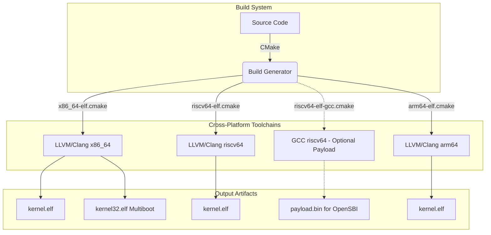

# Building Bharat-OS

Bharat-OS primarily uses **LLVM/Clang** + **LLD** for cross-arch reproducibility, with an optional **riscv64-unknown-elf-gcc** flow for Shakti/OpenSBI firmware packaging. Build scripts work identically on Windows, WSL, Linux, macOS, and BSD.



---

## Prerequisites

| Tool        | Version | Purpose                          |
| ----------- | ------- | -------------------------------- |
| CMake       | ≥ 3.20  | Build system generator           |
| Clang + LLD | ≥ 16    | C compiler + linker (bare-metal) |
| Ninja       | any     | Fast build backend               |
| QEMU        | any     | Hardware emulator for testing    |

### Install on Windows (PowerShell as Administrator)

```powershell
winget install -e --id Kitware.CMake
winget install -e --id LLVM.LLVM
winget install -e --id Ninja-build.Ninja
winget install -e --id SoftwareFreedomConservancy.QEMU
```

> Restart your terminal after installation so tools appear in `PATH`.

### Install on Ubuntu / Debian / WSL

```bash
sudo apt update
sudo apt install -y cmake ninja-build clang lld qemu-system-x86 qemu-system-misc
```

### Install on Arch Linux

```bash
sudo pacman -S cmake ninja clang lld qemu-desktop
```

### Install on macOS (Homebrew)

```bash
brew install cmake ninja llvm qemu
export PATH="$(brew --prefix llvm)/bin:$PATH"   # add to ~/.zshrc
```

### Install on FreeBSD / NetBSD / OpenBSD

```bash
# FreeBSD
pkg install cmake ninja llvm qemu-system-x86_64

# OpenBSD
pkg_add cmake ninja llvm qemu
```

---

## How the Build System Works

All compiler and linker settings are isolated in **CMake toolchain files** under `cmake/toolchains/`.
Setting `CMAKE_SYSTEM_NAME=Generic` in the toolchain file is what prevents CMake from injecting host-OS-specific flags (MSVC import libs on Windows, macOS rpaths, etc.). This is the same pattern used by Zephyr, seL4, and other bare-metal kernel projects.

```
cmake/toolchains/
  x86_64-elf.cmake   ← x86_64 bare-metal (QEMU)
  riscv64-elf.cmake      ← RISC-V 64-bit bare-metal (Clang/LLD)
  riscv64-elf-gcc.cmake  ← RISC-V 64-bit bare-metal (GCC/OpenSBI payload flow)
  arm64-elf.cmake        ← ARM64 bare-metal (compile validation)
```

---

## Building (All Platforms)

### Option A — Convenience scripts (Recommended)

**Linux / macOS / WSL / BSD (bash)**

```bash
chmod +x tools/build.sh

# Build x86_64
./tools/build.sh x86_64

# Build and boot in QEMU
./tools/build.sh x86_64 --run

# Clean build + QEMU
./tools/build.sh x86_64 --clean --run

# Build RISC-V 64-bit
./tools/build.sh riscv64

# Build ARM64 (compile-only scaffold)
./tools/build.sh arm64

# Override boot knobs
./tools/build.sh x86_64 --boot-gui=OFF --hw=vm

# Run RISC-V with specific QEMU machine (e.g., sifive_u)
./tools/build.sh riscv64 --machine=sifive_u --run

# Build RISC-V GCC OpenSBI payload
./tools/build.sh riscv64 --payload

# Run with GDB debug server enabled
./tools/build.sh x86_64 --run --debug
```

**Windows (PowerShell 5+ or pwsh)**

```powershell
# Build x86_64
.\tools\build.ps1

# Build and boot in QEMU
.\tools\build.ps1 -Arch x86_64 -Run

# Clean build + QEMU
.\tools\build.ps1 -Arch x86_64 -Clean -Run

# Build RISC-V 64-bit
.\tools\build.ps1 -Arch riscv64

# Build ARM64 (compile-only scaffold)
.\tools\build.ps1 -Arch arm64

# Override boot knobs
.\tools\build.ps1 -Arch x86_64 -BootGui OFF -HardwareProfile vm

# Run RISC-V with specific QEMU machine
.\tools\build.ps1 -Arch riscv64 -Machine sifive_u -Run

# Build RISC-V GCC OpenSBI payload
.\tools\build.ps1 -Arch riscv64 -Payload

# Run with GDB debug server enabled
.\tools\build.ps1 -Arch x86_64 -Run -DebugQemu
```

---


### Windows 11 + WSL validation flow (recommended)

Use this sequence to verify both scripts on a Windows 11 Pro workstation:

1. **Native PowerShell check (host Windows)**

```powershell
# from repo root
.\tools\build.ps1 -Arch x86_64 -Clean
.\tools\build.ps1 -Arch riscv64 -Clean
.\tools\build.ps1 -Arch arm64 -Clean
```

2. **WSL bash check (inside Ubuntu/WSL)**

```bash
# from repo root
./tools/build.sh x86_64 --clean
./tools/build.sh riscv64 --clean
./tools/build.sh arm64 --clean
```

3. **Runtime smoke check in QEMU**

```powershell
.\tools\build.ps1 -Arch x86_64 -Run
.\tools\build.ps1 -Arch riscv64 -Run
.\tools\build.ps1 -Arch arm64 -Run
```

```bash
./tools/build.sh x86_64 --run
./tools/build.sh riscv64 --run
./tools/build.sh arm64 --run
```

> On Windows, `tools/build.ps1` expects QEMU at `C:\Program Files\qemu\` and auto-adds `C:\Program Files\LLVM\bin` to `PATH`.

---

### Validating Host-Side Tests (Windows & WSL/Linux)

Bharat-OS includes a rich suite of host-side tests for core kernel logic, integration behavior, and hardware profiles. These tests execute natively on your host machine (Windows or Linux) bypassing the need for QEMU, making them extremely fast and useful for continuous integration. They utilize statically allocated memory to prevent MSVC stack overflow issues when running under Windows natively.

**From Windows Native (PowerShell + MSVC/Clang):**
```powershell
# Configure and build the host-side test suite
cmake --preset tests-host
cmake --build --preset build-tests

# Run all tests natively
ctest --preset run-tests

# Run specifically the full integration subsystem tests
cd build-tests
ctest -R test_integration_core_subsys -V

# Run specifically the edge/embedded profile tests
ctest -R test_profile_edge -V
```

**From WSL / Linux / macOS (Bash + GCC/Clang):**
```bash
# Configure and build the host-side test suite
cmake --preset tests-host
cmake --build --preset build-tests

# Run all tests
ctest --preset run-tests

# Run specific profile tests with verbose output
cd build-tests
ctest -R test_integration_core_subsys -V
ctest -R test_profile_edge -V
```

---

### Option C — CMake Presets (cross-arch)

The repository includes `CMakePresets.json` for cross compilation and tests:

```bash
# Configure and build x86_64 kernel
cmake --preset x86_64-elf-debug
cmake --build --preset build-x86_64-kernel

# Configure and build riscv64 kernel
cmake --preset riscv64-elf-debug
cmake --build --preset build-riscv64-kernel

# Shakti-focused RISC-V profiles (Clang/LLD)
cmake --preset riscv64-shakti-e-debug && cmake --build --preset build-riscv64-shakti-e-kernel
cmake --preset riscv64-shakti-c-debug && cmake --build --preset build-riscv64-shakti-c-kernel
cmake --preset riscv64-shakti-i-debug && cmake --build --preset build-riscv64-shakti-i-kernel

# Shakti/OpenSBI-friendly GCC presets (produces payload.bin)
cmake --preset riscv64-elf-gcc-debug && cmake --build --preset build-riscv64-gcc-kernel
cmake --preset riscv64-shakti-e-gcc-debug && cmake --build --preset build-riscv64-shakti-e-gcc-kernel

# Configure and build arm64 kernel
cmake --preset arm64-elf-debug
cmake --build --preset build-arm64-kernel

# Host unit tests
cmake --preset tests-host
cmake --build --preset build-tests
ctest --preset run-tests

# Host integration and profile tests
ctest --preset run-tests -R test_integration_core_subsys
ctest --preset run-tests -R test_profile_edge
```

### Option B — Raw CMake commands

Same commands work on every platform:

```bash
# x86_64
cmake -S . -B build/x86_64 \
      -DCMAKE_TOOLCHAIN_FILE=cmake/toolchains/x86_64-elf.cmake \
      -G Ninja

cmake --build build/x86_64 --target kernel.elf

# RISC-V 64-bit
cmake -S . -B build/riscv64 \
      -DCMAKE_TOOLCHAIN_FILE=cmake/toolchains/riscv64-elf.cmake \
      -G Ninja

cmake --build build/riscv64 --target kernel.elf
```

On **Windows**, use the same commands from PowerShell — CMake finds Clang automatically from `C:\Program Files\LLVM\bin`. If Clang is not on `PATH`, pass the compiler explicitly:

```powershell
cmake -S . -B build/x86_64 `
      -DCMAKE_TOOLCHAIN_FILE=cmake/toolchains/x86_64-elf.cmake `
      -DCMAKE_C_COMPILER="C:/Program Files/LLVM/bin/clang.exe" `
      -G Ninja
```

---

## Running in QEMU

```bash
# x86_64 — serial output to terminal
qemu-system-x86_64 -kernel build/x86_64/kernel.elf \
    -m 256M -nographic -serial mon:stdio -no-reboot

# RISC-V 64-bit
qemu-system-riscv64 -machine virt \
    -kernel build/riscv64/kernel.elf \
    -m 256M -nographic -serial mon:stdio -no-reboot
```

> Press **Ctrl+A then X** to quit QEMU.

---

## Build Output

| File                      | Description                                 |
| ------------------------- | ------------------------------------------- |
| `build/<arch>/kernel.elf` | Bare-metal ELF image, loadable by GRUB/QEMU |

---

## Supported Architectures

| Arch      | Status                                     | QEMU Machine                        |
| --------- | ------------------------------------------ | ----------------------------------- |
| `x86_64`  | ✅ Active                                  | `qemu-system-x86_64 -kernel`        |
| `riscv64` | ✅ Cross-compile validated (incl. Shakti RV64 profile) | `qemu-system-riscv64 -machine virt` |
| `arm64`   | ✅ Cross-compile validated (runtime pending) | N/A                                 |


---

## Portability Matrix

Bharat-OS exclusively relies on LLVM/Clang and LLD (version 16+) for bare-metal compilation. This strategy ensures cross-compilation stability and avoids conflicts seen with standard C libraries.

| Architecture | Target Triple         | Compiler | Linker | Status      |
| ------------ | --------------------- | -------- | ------ | ----------- |
| `x86_64`     | `x86_64-elf`          | Clang 16+| LLD 16+| Active      |
| `riscv64`    | `riscv64-elf`         | Clang 16+| LLD 16+| Validated   |
| `arm64`      | `aarch64-elf`         | Clang 16+| LLD 16+| Validated (build) |

---

## Running the AI Governor in User Space

During early bring-up, the AI Governor operates as an isolated user-space process. It uses the capability-based IPC model (specifically the Lockless URPC messaging spine or Synchronous Endpoint IPC) to analyze telemetry from the microkernel and suggest configuration tuning.

To run the AI governor in user space during development or testing:

1. **Build the subsystem:** The governor is located in `subsys/src/ai_governor.c`. Ensure it is built using the same bare-metal toolchain provided in `cmake/toolchains/`. (Note: A testing wrapper can also be built as a standalone binary on the host to simulate telemetry).
2. **Execute integration tests:** Run the tests located in the `tests/` directory (e.g., `test_ai_governor`) to verify IPC message formatting and URPC ring behavior before booting the full kernel image in QEMU.
3. **Boot in Emulator:** Once built into the root filesystem image (pending storage subsystem availability), the microkernel will spawn the AI governor as a capability-restricted task upon boot.


---


## Shakti toolchain and OpenSBI packaging

For Shakti boards, install the Shakti RISC-V toolchain (recommended prebuilt installer) and expose binaries in `PATH`:

```bash
# example: toolchain paths from shakti-tools installer
export PATH=$PATH:/opt/shakti/riscv64/bin:/opt/shakti/riscv64/riscv64-unknown-elf/bin
which riscv64-unknown-elf-gcc
which riscv64-unknown-elf-objcopy
```

Build Bharat-OS payload artifacts for OpenSBI:

```bash
cmake --preset riscv64-shakti-e-gcc-debug
cmake --build --preset build-riscv64-shakti-e-gcc-kernel
# outputs kernel.elf + kernel.payload.bin
```

Package with OpenSBI (example):

```bash
# in opensbi checkout
make PLATFORM=generic FW_PAYLOAD_PATH=/workspace/Bharat-OS/build-riscv64-shakti-e-gcc/kernel/kernel.elf
# or use payload.bin in board-specific flash/image pipeline
```

At runtime OpenSBI passes `(hartid, fdt_ptr)` to Bharat-OS `_start` / `kernel_main` on RISC-V.

---

## Troubleshooting

**`clang not found` (CMake error)**
→ Install LLVM (see above). On macOS, also run `export PATH="$(brew --prefix llvm)/bin:$PATH"`.

**`ld.lld not found`**
→ Install `lld`. On Ubuntu: `sudo apt install lld`. On macOS: included with Homebrew LLVM.

**QEMU: `-nographic` freezes**
→ Press Ctrl+A then X to exit. Or use `-serial stdio` without `-nographic` to open a separate window.

**Windows: `ninja` not found by CMake**
→ Install Ninja via winget (see above) or set path: `$env:Path += ";C:\path\to\ninja"`.


## Boot-time configuration

You can tune early boot behavior without source edits:

- `BHARAT_BOOT_GUI` (`ON`/`OFF`): enables boot-to-GUI handoff metadata.
- `BHARAT_BOOT_HW_PROFILE` (`generic`, `desktop`, `server`, `vm`, `laptop`): picks hardware profile compile definitions for boot policy and defaults.

These are wired through both build scripts and raw CMake cache entries.
