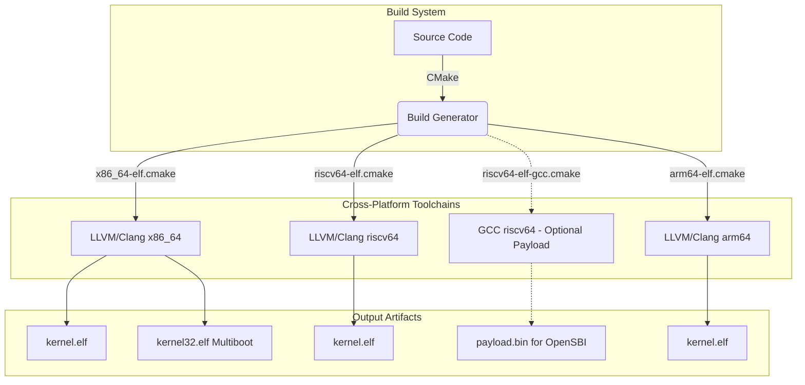

# Building Bharat-OS

Bharat-OS primarily uses **LLVM/Clang** + **LLD** for cross-arch reproducibility, with an optional **riscv64-unknown-elf-gcc** flow for Shakti/OpenSBI firmware packaging. Build scripts work identically on Windows, WSL, Linux, macOS, and BSD.



---

## Prerequisites & Environment Preparation

Before building Bharat-OS, you need to set up your development environment. We support Windows, WSL, Linux, macOS, and BSD. We also provide a complete setup script for **Coding Agent Environments** (e.g., Jules, Codex).

Please see the comprehensive **[Environment Preparation Guide](docs/ENV_PREP.md)** to install all necessary tools (`cmake`, `clang`, `lld`, `qemu`, `gcc`, `python3`, etc.) for your specific platform.

---

## How the Build System Works

All compiler and linker settings are isolated in **CMake toolchain files** under `cmake/toolchains/`.
Setting `CMAKE_SYSTEM_NAME=Generic` in the toolchain file is what prevents CMake from injecting host-OS-specific flags (MSVC import libs on Windows, macOS rpaths, etc.). This is the same pattern used by Zephyr, seL4, and other bare-metal kernel projects.

```
cmake/toolchains/
  x86_64-elf.cmake   ← x86_64 bare-metal (QEMU)
  riscv64-elf.cmake      ← RISC-V 64-bit bare-metal (Clang/LLD)
  riscv64-elf-gcc.cmake  ← RISC-V 64-bit bare-metal (GCC/OpenSBI payload flow)
  arm64-elf.cmake        ← ARM64 bare-metal (compile validation)
```

---

## Architecture-Specific Build Guides

Bharat-OS supports multiple architectures, each with specific build flows, run commands, and testing procedures.

For detailed instructions on how to build, run in QEMU, run SDK builds, and execute tests for a specific architecture, please refer to the corresponding guide:

- **[Building for x86_64](docs/BUILD_X86_64.md)**
- **[Building for RISC-V 64-bit](docs/BUILD_RISCV64.md)**
- **[Building for ARM64](docs/BUILD_ARM64.md)**

---

## Testing & SDK Development

### Validating Host-Side Tests (Windows & WSL/Linux)

Bharat-OS includes a rich suite of host-side tests for core kernel logic, integration behavior, and hardware profiles. These tests execute natively on your host machine (Windows or Linux) bypassing the need for QEMU, making them extremely fast and useful for continuous integration. They utilize statically allocated memory to prevent MSVC stack overflow issues when running under Windows natively.

**From Windows Native (PowerShell + MSVC/Clang):**
```powershell
# Configure and build the host-side test suite
cmake --preset tests-host
cmake --build --preset build-tests

# Run all tests natively
ctest --preset run-tests

# Run specifically the full integration subsystem tests
cd build-tests
ctest -R test_integration_core_subsys -V

# Run specifically the edge/embedded profile tests
ctest -R test_profile_edge -V
```

**From WSL / Linux / macOS (Bash + GCC/Clang):**
```bash
# Configure and build the host-side test suite
cmake --preset tests-host
cmake --build --preset build-tests

# Run all tests
ctest --preset run-tests

# Run specific profile tests with verbose output
cd build-tests
ctest -R test_integration_core_subsys -V
ctest -R test_profile_edge -V
```

### SDK Development (Planned)

Support for building a standalone SDK for the target architectures, including headers and pre-compiled libraries for user-space development, is currently planned.

This will enable developers to link their C/C++ applications directly against the Bharat-OS POSIX compat layer or native capability interfaces, packaging their applications into a payload alongside the core kernel.

Future updates to the architecture guides will detail SDK packaging commands, test payloads, and user-space compilation instructions.

---

### CMake Presets (cross-arch)

The repository includes `CMakePresets.json` for cross compilation and tests:

```bash
# Configure and build x86_64 kernel
cmake --preset x86_64-elf-debug
cmake --build --preset build-x86_64-kernel

# Configure and build riscv64 kernel
cmake --preset riscv64-elf-debug
cmake --build --preset build-riscv64-kernel

# Shakti-focused RISC-V profiles (Clang/LLD)
cmake --preset riscv64-shakti-e-debug && cmake --build --preset build-riscv64-shakti-e-kernel
cmake --preset riscv64-shakti-c-debug && cmake --build --preset build-riscv64-shakti-c-kernel
cmake --preset riscv64-shakti-i-debug && cmake --build --preset build-riscv64-shakti-i-kernel

# Shakti/OpenSBI-friendly GCC presets (produces payload.bin)
cmake --preset riscv64-elf-gcc-debug && cmake --build --preset build-riscv64-gcc-kernel
cmake --preset riscv64-shakti-e-gcc-debug && cmake --build --preset build-riscv64-shakti-e-gcc-kernel

# Configure and build arm64 kernel
cmake --preset arm64-elf-debug
cmake --build --preset build-arm64-kernel

# Host unit tests
cmake --preset tests-host
cmake --build --preset build-tests
ctest --preset run-tests

# Host integration and profile tests
ctest --preset run-tests -R test_integration_core_subsys
ctest --preset run-tests -R test_profile_edge
```


## Build Output

| File                      | Description                                 |
| ------------------------- | ------------------------------------------- |
| `build/<arch>/kernel.elf` | Bare-metal ELF image, loadable by GRUB/QEMU |

---

## Supported Architectures

| Arch      | Status                                     | QEMU Machine                        |
| --------- | ------------------------------------------ | ----------------------------------- |
| `x86_64`  | ✅ Active                                  | `qemu-system-x86_64 -kernel`        |
| `riscv64` | ✅ Cross-compile validated (incl. Shakti RV64 profile) | `qemu-system-riscv64 -machine virt` |
| `arm64`   | ✅ Cross-compile validated (runtime pending) | N/A                                 |


---

## Portability Matrix

Bharat-OS exclusively relies on LLVM/Clang and LLD (version 16+) for bare-metal compilation. This strategy ensures cross-compilation stability and avoids conflicts seen with standard C libraries.

| Architecture | Target Triple         | Compiler | Linker | Status      |
| ------------ | --------------------- | -------- | ------ | ----------- |
| `x86_64`     | `x86_64-elf`          | Clang 16+| LLD 16+| Active      |
| `riscv64`    | `riscv64-elf`         | Clang 16+| LLD 16+| Validated   |
| `arm64`      | `aarch64-elf`         | Clang 16+| LLD 16+| Validated (build) |

---

## Running the AI Governor in User Space

During early bring-up, the AI Governor operates as an isolated user-space process. It uses the capability-based IPC model (specifically the Lockless URPC messaging spine or Synchronous Endpoint IPC) to analyze telemetry from the microkernel and suggest configuration tuning.

To run the AI governor in user space during development or testing:

1. **Build the subsystem:** The governor is located in `subsys/src/ai_governor.c`. Ensure it is built using the same bare-metal toolchain provided in `cmake/toolchains/`. (Note: A testing wrapper can also be built as a standalone binary on the host to simulate telemetry).
2. **Execute integration tests:** Run the tests located in the `tests/` directory (e.g., `test_ai_governor`) to verify IPC message formatting and URPC ring behavior before booting the full kernel image in QEMU.
3. **Boot in Emulator:** Once built into the root filesystem image (pending storage subsystem availability), the microkernel will spawn the AI governor as a capability-restricted task upon boot.


---


## Troubleshooting

**`clang not found` (CMake error)**
→ Install LLVM (see above). On macOS, also run `export PATH="$(brew --prefix llvm)/bin:$PATH"`.

**`ld.lld not found`**
→ Install `lld`. On Ubuntu: `sudo apt install lld`. On macOS: included with Homebrew LLVM.

**QEMU: `-nographic` freezes**
→ Press Ctrl+A then X to exit. Or use `-serial stdio` without `-nographic` to open a separate window.

**Windows: `ninja` not found by CMake**
→ Install Ninja via winget (see above) or set path: `$env:Path += ";C:\path\to\ninja"`.


## Boot-time configuration

You can tune early boot behavior without source edits:

- `BHARAT_BOOT_GUI` (`ON`/`OFF`): enables boot-to-GUI handoff metadata.
- `BHARAT_BOOT_HW_PROFILE` (`generic`, `desktop`, `server`, `vm`, `laptop`): picks hardware profile compile definitions for boot policy and defaults.

These are wired through both build scripts and raw CMake cache entries.
