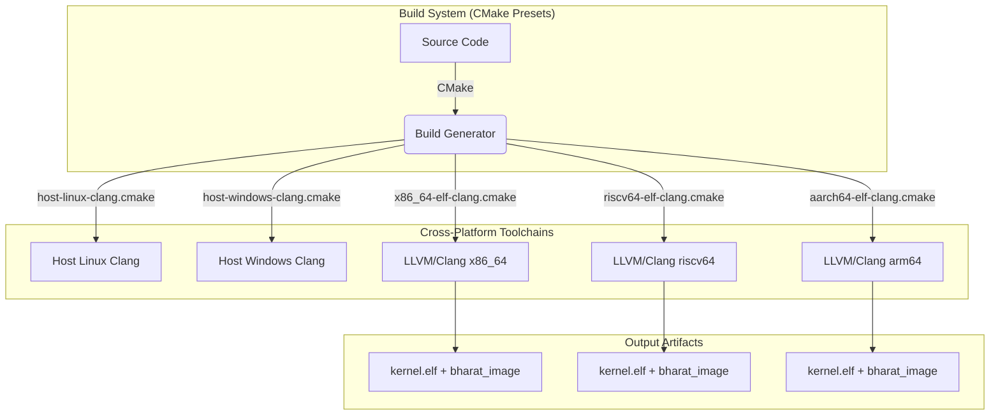

# Building Bharat-OS

Bharat-OS utilizes a modern CMake Presets (`CMakePresets.json`) based workflow, allowing identical configuration and compilation paths on Windows, WSL, Linux, macOS, and BSD. We build entirely with **LLVM/Clang** + **LLD** for cross-arch reproducibility.



---

## Prerequisites & Environment Preparation

Before building Bharat-OS, you need to set up your development environment.

- CMake 3.20+
- Ninja or Make
- Clang & LLD (`llvm`, `clang`, `lld`)
- QEMU (for running the kernel)
- `yq` (Optional, used by the build wrappers `build.sh`/`build.ps1` to parse `build_config.yml`)

Please see the comprehensive **[Environment Preparation Guide](docs/ENV_PREP.md)** for platform-specific instructions.

---

## How the Build System Works

All compiler and linker settings are isolated in **CMake toolchain files** under `cmake/toolchains/`. Target generation is mapped out via profiles in `CMakePresets.json`.

We provide simple wrapper scripts (`build.sh` and `build.ps1`) that parse the target `build_config.yml` configuration and execute the underlying `cmake --preset` engine.

At configure time, component selection is enforced by `cmake/modules/BharatComponentPolicy.cmake`.
The wrapper scripts normalize and pass:

- `BHARAT_DEVICE_PROFILE`
- `BHARAT_PERSONALITY_PROFILE`
- `BHARAT_TARGET_BOARD`

If `profile`, `personality`, or `board` contain comma-separated values in `build_config.yml`,
only the first value is consumed for CMake cache inputs.

### Helper Scripts (Recommended)

Edit `build_config.yml` to define your target composition (e.g. arch, UI on/off, profile mapping). Then use the wrapper:

```bash
# Linux/Mac/WSL
# Build the default_dev profile
./build.sh default_dev

# Build and run immediately in QEMU
./build.sh default_dev --run
```

```powershell
# Windows
# Build the default_dev profile
.\build.ps1 default_dev

# Build and run
.\build.ps1 default_dev -Run
```

### Manual CMake Presets

You can bypass the YAML wrapper and invoke the raw presets directly:

```bash
# View available presets
cmake --list-presets

# Configure for x86_64 dev target on Linux host
cmake --preset linux-x86_64-dev-debug

# Build the target image and dependencies
cmake --build --preset linux-x86_64-dev-debug

# Configure for ARM64 GUI target
cmake --preset arm64-gui
cmake --build --preset arm64-gui

# Configure for RISC-V GUI target
cmake --preset riscv64-gui
cmake --build --preset riscv64-gui
```

---

## Testing & SDK Development

### Validating Host-Side Tests (Windows & WSL/Linux)

Bharat-OS separates purely host-isolated unit tests from kernel self-tests. The host tests execute natively on your host machine (Windows or Linux) without QEMU, making them fast and suitable for CI.

**Running host tests from the preset:**
```bash
# Configure the host profile (Linux example)
cmake --preset linux-host-debug
cmake --build --preset linux-host-debug

# Run all test runners
ctest --preset linux-host-debug
```

For Windows:
```powershell
cmake --preset windows-hosttools-debug
cmake --build --preset windows-hosttools-debug
ctest --preset windows-hosttools-debug
```

To run just the CMake component-policy host check:
```bash
ctest --preset linux-host-debug -R test_component_policy_matrix
```

### Profile and Image Bundling

During build execution, CMake groups your selected targets into bundles:
- `bharat_services_bundle`: All compiled user-space daemon libraries.
- `bharat_apps_bundle`: Leaf applications selected by your current `profiles/*.cmake` file.
- `bharat_initramfs`: A mock tar packaging the root filesystem payloads.
- `bharat_image`: The overarching target tying `kernel.elf` to the final bundled manifest.


## Build Output

| File                      | Description                                 |
| ------------------------- | ------------------------------------------- |
| `build/<arch>/kernel.elf` | Bare-metal ELF image, loadable by GRUB/QEMU |

---

## Supported Architectures

| Arch      | Status                                     | QEMU Machine                        |
| --------- | ------------------------------------------ | ----------------------------------- |
| `x86_64`  | ✅ Active                                  | `qemu-system-x86_64 -kernel`        |
| `riscv64` | ✅ Cross-compile validated (incl. Shakti RV64 profile) | `qemu-system-riscv64 -machine virt` |
| `arm64`   | ✅ Cross-compile validated (runtime pending) | N/A                                 |


---

## Portability Matrix

Bharat-OS exclusively relies on LLVM/Clang and LLD (version 16+) for bare-metal compilation. This strategy ensures cross-compilation stability and avoids conflicts seen with standard C libraries.

| Architecture | Target Triple         | Compiler | Linker | Status      |
| ------------ | --------------------- | -------- | ------ | ----------- |
| `x86_64`     | `x86_64-elf`          | Clang 16+| LLD 16+| Active      |
| `riscv64`    | `riscv64-elf`         | Clang 16+| LLD 16+| Validated   |
| `arm64`      | `aarch64-elf`         | Clang 16+| LLD 16+| Validated (build) |

---

## Running the AI Governor in User Space

During early bring-up, the AI Governor operates as an isolated user-space process. It uses the capability-based IPC model (specifically the Lockless URPC messaging spine or Synchronous Endpoint IPC) to analyze telemetry from the microkernel and suggest configuration tuning.

To run the AI governor in user space during development or testing:

1. **Build the subsystem:** The governor is located in `subsys/src/ai_governor.c`. Ensure it is built using the same bare-metal toolchain provided in `cmake/toolchains/`. (Note: A testing wrapper can also be built as a standalone binary on the host to simulate telemetry).
2. **Execute integration tests:** Run the tests located in the `tests/` directory (e.g., `test_ai_governor`) to verify IPC message formatting and URPC ring behavior before booting the full kernel image in QEMU.
3. **Boot in Emulator:** Once built into the root filesystem image (pending storage subsystem availability), the microkernel will spawn the AI governor as a capability-restricted task upon boot.


---


## Troubleshooting

**`clang not found` (CMake error)**
→ Install LLVM (see above). On macOS, also run `export PATH="$(brew --prefix llvm)/bin:$PATH"`.

**`ld.lld not found`**
→ Install `lld`. On Ubuntu: `sudo apt install lld`. On macOS: included with Homebrew LLVM.

**QEMU: `-nographic` freezes**
→ Press Ctrl+A then X to exit. Or use `-serial stdio` without `-nographic` to open a separate window.

**Windows: `ninja` not found by CMake**
→ Install Ninja via winget (see above) or set path: `$env:Path += ";C:\path\to\ninja"`.


## Boot-time configuration

You can tune early boot behavior without source edits:

- `BHARAT_BOOT_GUI` (`ON`/`OFF`): enables boot-to-GUI handoff metadata.
- `BHARAT_BOOT_HW_PROFILE` (`generic`, `desktop`, `server`, `vm`, `laptop`): picks hardware profile compile definitions for boot policy and defaults.

These are wired through both build scripts and raw CMake cache entries.

### Building for Device Profiles (Automobile, Drone, Medical, Edge)

Bharat-OS supports various device profiles natively. The build scripts (`build.sh` and `build.ps1`) automatically inject the correct QEMU flags to emulate hardware-specific peripherals (like CAN buses or watchdog timers) depending on the selected profile.

**1. Automobile & EV Testing**
The CAN subsystem is enabled automatically for Automotive profiles. QEMU will be launched with a virtual Kvaser PCI CAN bus.
```bash
# Bash
./build.sh x86_64 --profile=AUTOMOBILE --run

# PowerShell
.\build.ps1 -Arch x86_64 -Profile AUTOMOBILE -Run
```

**2. Drone (UAV) Testing**
Drone firmware usually relies on specific ARM processors. Using the `DRONE` profile on `arm64` or `arm32` defaults to emulating a Cortex-A15.
```bash
# Bash
./build.sh arm64 --profile=DRONE --run

# PowerShell
.\build.ps1 -Arch arm64 -Profile DRONE -Run
```

**3. Medical Device Validation**
Medical environments require strict V&V. The `MEDICAL` profile injects a watchdog device (`i6300esb`) configured to pause on trigger, allowing you to simulate and test fault injection and safe failure states.
```bash
# Bash
./build.sh x86_64 --profile=MEDICAL --run
```

**4. Robotics & Edge Devices**
The `ROBOT` and `EDGE` profiles inject basic virtio networking to represent generic IoT or edge deployments.
```bash
./build.sh riscv64 --profile=ROBOT --run
```

### End-to-End (E2E) Test Support

For Continuous Integration (CI) and automated validation, you can pass the `--e2e` (Bash) or `-E2e` (PowerShell) flag.

When enabled:
1. It forces the system to boot in headless mode (`-nographic` / `BOOT_GUI=OFF`).
2. It redirects all serial output from the QEMU machine to a local file (`qemu_e2e.log`) instead of standard output.
3. It prevents the emulator from rebooting on a crash (`-no-reboot`).

```bash
# Bash example for automated testing
./build.sh x86_64 --profile=AUTOMOBILE --run --e2e
cat qemu_e2e.log

# PowerShell example
.\build.ps1 -Arch riscv64 -Profile MEDICAL -Run -E2e
Get-Content qemu_e2e.log
```

### GUI and Serial Console Output (`-BootGui ON`)

When `BHARAT_BOOT_GUI` is enabled (e.g. passing `-BootGui ON` to `build.ps1` or `--boot-gui=ON` to `build.sh`), QEMU is launched with a graphical window.

To ensure early kernel logs are visible during UI development, the build scripts automatically route QEMU serial output to both your host terminal and a Virtual Console (`vc`) inside the QEMU GUI using the `-serial stdio -serial vc` flags.

**Architecture specific behaviors with GUI enabled:**
- **`x86_64`:** Uses standard VGA (`-vga std`). The serial `vc` output appears natively.
- **`riscv64` & `arm64`:** These `virt` machines do not support legacy VGA. The build scripts use VirtIO GPU (`-device virtio-gpu-device` or `-device virtio-gpu-pci`). The kernel text output is displayed in a QEMU Virtual Console tab. *Note: If you are using the QEMU GTK/SDL UI, you can switch to the Virtual Console (usually via `View -> serial0` or `Ctrl-Alt-2`) to see the text logs if they don't appear immediately.*

```powershell
# Build and run with a specific preset
.\tools\build.ps1 -Preset arm64-gui -Run

# Build and run with logs routed ONLY to the QEMU window (recommended for GUI dev)
.\tools\build.ps1 -Arch arm64 -Clean -Run -SerialTarget vc

# Build and run with dual serial (Both GUI and Terminal)
.\tools\build.ps1 -Arch riscv64 -Clean -Run -SerialTarget both
```

### Serial Console Routing (`-SerialTarget`)

You can control where kernel logs are sent when running in QEMU:

- `-SerialTarget stdio` (Default): Logs go to your host terminal.
- `-SerialTarget vc`: Logs go to the QEMU GUI window (the "Serial0" tab).
- `-SerialTarget both` (or `-DualSerial`): Logs go to BOTH. The GUI window remains the primary (`Serial0`), and the terminal is secondary (`Serial1`).

> [!TIP]
> Use `-SerialTarget vc` for the most seamless GUI development experience on ARM64 and RISC-V, as it avoids cluttering your terminal and keeps everything in one window. This also bypasses common "mon:stdio" errors on Windows.

### Troubleshooting: `qemu_add_wait_object: failed`
If you see the error `could not connect serial device to character backend 'mon:stdio'` on Windows, it is likely due to terminal limitations. 

**Solution:** Use `-SerialTarget vc` to route logs exclusively to the QEMU window, bypassing the terminal's `mon:stdio` backend.

**Example Build Commands:**
```powershell
# Windows (PowerShell)
# Build and run x86_64 with GUI enabled
.\tools\build.ps1 -Arch x86_64 -Clean -Run -BootGui ON

# Build and run RISC-V with GUI enabled
.\tools\build.ps1 -Arch riscv64 -Clean -Run -BootGui ON
```

```bash
# WSL / Linux / macOS (Bash)
# Build and run ARM64 with GUI enabled
./tools/build.sh -Arch arm64 -Clean -Run -BootGui ON

# Optionally enable dual-serial output on both stdio and the virtual console
./tools/build.sh -Arch x86_64 -Clean -Run -BootGui ON -DualSerial
```
