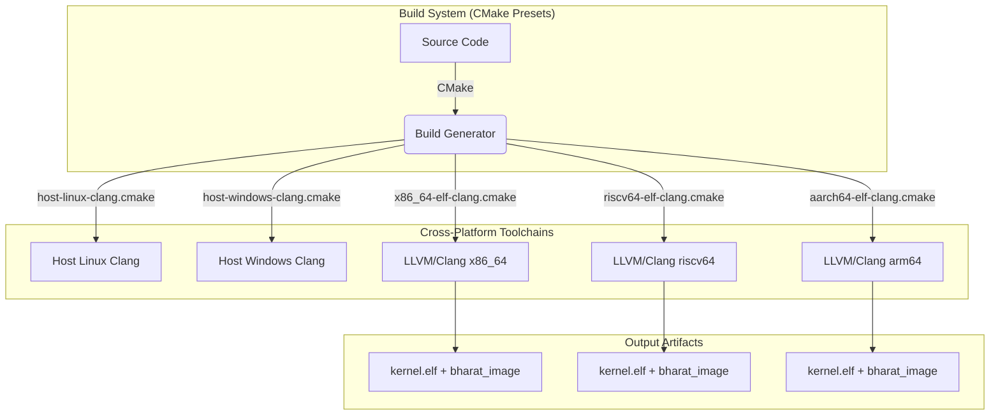

# Building Bharat-OS

Bharat-OS utilizes a modern CMake Presets (`CMakePresets.json`) based workflow, allowing identical configuration and compilation paths on Windows, WSL, Linux, macOS, and BSD. We build entirely with **LLVM/Clang** + **LLD** for cross-arch reproducibility.



---

## Prerequisites & Environment Preparation

Before building Bharat-OS, you need to set up your development environment.

- CMake 3.20+
- Ninja or Make
- Clang & LLD (`llvm`, `clang`, `lld`)
- QEMU (for running the kernel)

Note: `build.ps1` and `build.sh` are thin wrappers. The real implementation path for builds and runners is driven by `tools/build.py`.

Please see the comprehensive **[Environment Preparation Guide](docs/build/ENV_PREP.md)** for platform-specific instructions.

### QEMU runtime prerequisites (Linux)

For validated QEMU runtime bring-up (host-visible serial logs), install:

- Core build tools: `cmake`, `ninja-build`, `clang`, `lld`, `llvm`, `python3`
- QEMU system emulators:
  - `qemu-system-x86_64`
  - `qemu-system-aarch64`
  - `qemu-system-riscv64`
- `llvm-objcopy` (or compatible `objcopy`) for x86_64/arm64 image conversion paths used by the harness
- OpenSBI (`opensbi`) when your RISC-V QEMU flow requires explicit firmware handoff in your environment

On Debian/Ubuntu-family hosts, this usually maps to packages such as:

```bash
sudo apt update
sudo apt install -y \
  cmake ninja-build clang lld llvm python3 \
  qemu-system-x86 qemu-system-arm qemu-system-misc \
  opensbi
```

> Boot validation is serial-first: expected boot markers must appear in the **host terminal**.

---

## QEMU build/run flow (x86_64, arm64, riscv64)

This is the canonical developer flow for the currently validated runtime targets: **x86_64**, **arm64**, and **riscv64**.

### How boot logs are surfaced

- The serial console is the authoritative early-boot/runtime sink.
- QEMU runs in `-nographic -serial stdio` style for validation.
- A graphical framebuffer window is **not required** for the validated path.
- Success criteria are marker-driven from host terminal output.

### Expected boot markers in host terminal

The current harness validates these markers:

- `BOOT: kernel_main reached`
- `BOOT: pmm initialized`
- `BOOT: vmm initialized`
- `[BOOT] Runtime mode:`

If these markers do not appear, treat the run as failed even if QEMU launched.

### Build examples (repo-canonical commands)

```bash
# x86_64
./build.sh default_dev

# arm64
./build.sh arm64_desktop_headless

# riscv64
./build.sh riscv64_desktop_headless
```

### Run examples (recommended: QEMU E2E harness)

Recommended path is `run_qemu_e2e.sh` with explicit matrix entries:

```bash
# x86_64 + arm64 + riscv64 runtime matrix
E2E_MATRIX_MODE=explicit \
E2E_MATRIX="x86_64:mmu:desktop:linux arm64:mmu:desktop:linux riscv64:mmu:desktop:linux" \
./run_qemu_e2e.sh
```

You can also execute per-arch runs one-by-one:

```bash
E2E_MATRIX_MODE=explicit E2E_MATRIX="x86_64:mmu:desktop:linux" ./run_qemu_e2e.sh
E2E_MATRIX_MODE=explicit E2E_MATRIX="arm64:mmu:desktop:linux" ./run_qemu_e2e.sh
E2E_MATRIX_MODE=explicit E2E_MATRIX="riscv64:mmu:desktop:linux" ./run_qemu_e2e.sh
```

### How to run desktop GUI builds

`--run` now routes primary serial to host stdio and disables monitor-on-stdio conflicts, so these GUI profiles should print boot logs in your host terminal while the QEMU window is open:

```powershell
.\build.ps1 x86_64_desktop_gui --run
.\build.ps1 arm64_desktop_gui --run
.\build.ps1 riscv64_desktop_gui --run
```

```bash
./build.sh x86_64_desktop_gui --run
./build.sh arm64_desktop_gui --run
./build.sh riscv64_desktop_gui --run
```

### How to run headless builds

For a pure terminal-based experience without a QEMU graphical window (e.g., CI or remote SSH environments), use the `headless` targets:

```powershell
.\build.ps1 x86_64_desktop_headless --run
.\build.ps1 arm64_desktop_headless --run
.\build.ps1 riscv64_desktop_headless --run
```

```bash
./build.sh x86_64_desktop_headless --run
./build.sh arm64_desktop_headless --run
./build.sh riscv64_desktop_headless --run
```

### Expected behavior & Dual serial usage

- Host terminal **must show boot logs** in both headless and GUI modes. The QEMU graphical window does not replace the host terminal serial logging.
- `--dual-serial` (hyphen) may additionally show serial output in the QEMU window by adding a secondary `-serial vc` sink.
- Note: **Use `--dual-serial`, NOT `--dual_serial`.**

Examples with GUI + mirrored serial (`--dual-serial`):

```powershell
.\build.ps1 x86_64_desktop_gui --run --dual-serial
.\build.ps1 arm64_desktop_gui --run --dual-serial
.\build.ps1 riscv64_desktop_gui --run --dual-serial
```

```bash
./build.sh x86_64_desktop_gui --run --dual-serial
./build.sh arm64_desktop_gui --run --dual-serial
./build.sh riscv64_desktop_gui --run --dual-serial
```

### Troubleshooting (QEMU runtime)

- **Missing QEMU binary**
  - Symptom: log contains skip/fail indicating `qemu-system-* not found`.
  - Fix: install corresponding system emulator package(s) and confirm with `command -v qemu-system-<arch>`.
- **Missing OpenSBI (RISC-V environments that require it)**
  - Symptom: RISC-V fails before expected markers; firmware handoff errors may appear.
  - Fix: install OpenSBI and ensure your local run configuration points to valid firmware.
- **Wrong image format / objcopy issue**
  - Symptom: x86_64/arm64 runs fail before boot with image format errors.
  - Fix: install `llvm-objcopy` (or equivalent `objcopy`) and verify it is callable in PATH.
- **Legacy execution path warning**
  - Symptom: "Warning: Running legacy execution path (no target matrix entry found)."
  - Fix: Use one of the first-class targets that appear in `targets/target_matrix.json` (e.g., `x86_64_desktop_gui`).
- **Wrong flag spelling**
  - Symptom: Script rejects `--dual_serial`.
  - Fix: Always use `--dual-serial` (with a hyphen).
- **GUI window appears but host terminal is silent**
  - Symptom: QEMU starts, the GUI window loads, but the host terminal receives no logs.
  - Fix: Make sure you're using a first-class manifest target, which correctly routes primary serial to `stdio`.
- **No boot markers in host terminal**
  - Symptom: QEMU starts but none of the required markers appear.
  - Fix: use `--run-tests` for headless serial-first validation, or use `--run --dual-serial` for GUI+VC mirroring; then inspect `e2e_logs/`.
- **Timeout without panic**
  - Symptom: process times out but panic markers are absent.
  - Fix: inspect the last emitted marker in logs to identify stall stage (early boot, PMM, VMM, runtime transition).
- **Panic marker found**
  - Symptom: `[PANIC]` or fatal self-test text appears.
  - Fix: treat as runtime failure; capture full log and debug by failing stage.

### Current validated QEMU runtime status

- ✅ x86_64: validated
- ✅ arm64: validated
- ✅ riscv64: validated
- ⚠️ arm32: not yet runtime-complete (runtime marker gap)
- ⚠️ riscv32: not yet link/runtime-complete

Follow-up implementation tasks are tracked in `docs/dev/boot-console-milestone-and-followups.md`.

---

## How the Build System Works

All compiler and linker settings are isolated in **CMake toolchain files** under `cmake/toolchains/`. Target generation is mapped out via profiles in `CMakePresets.json`.

We provide simple wrapper scripts (`build.sh` and `build.ps1`) that pass configuration from the target `build_config.json` configuration and execute the underlying `cmake --preset` engine using `tools/build.py`.

At configure time, component selection is enforced by `cmake/modules/BharatComponentPolicy.cmake`.
The central script `tools/build.py` reads the desired configuration from `build_config.json` and injects variables like:

- `BHARAT_DEVICE_PROFILE`
- `BHARAT_PERSONALITY_PROFILE`
- `BHARAT_TARGET_BOARD`

### Helper Scripts (Recommended)

Edit `build_config.json` to define your target composition (e.g. arch, UI on/off, profile mapping). Then use the wrapper:

```bash
# Linux/Mac/WSL
# Build the default_dev profile (conservative, disables scaffold-heavy service groups)
./build.sh default_dev

# Build the experimental services profile (enables scaffold-heavy experimental services)
./build.sh experimental_services

# Build and run immediately in QEMU
./build.sh default_dev --run
```

```powershell
# Windows

# --- x86_64 ---
# Build and run x86_64 with GUI
.\build.ps1 default_dev --run
# Build and run x86_64 without GUI (Headless)
.\build.ps1 default_dev --run-tests

# --- ARM64 ---
# Build and run ARM64 with GUI
.\build.ps1 arm64_desktop_gui --run
# Build and run ARM64 without GUI (Headless)
.\build.ps1 arm64_desktop_headless --run-tests

# --- RISCV64 ---
# Build and run RISCV64 with GUI
.\build.ps1 riscv64_desktop_gui --run
# Build and run RISCV64 without GUI (Headless)
.\build.ps1 riscv64_desktop_headless --run-tests

# --- ARM32 ---
# Build and run ARM32 without GUI (Edge profile)
.\build.ps1 arm32_edge_mpu --run-tests
```

### 🚨 Migration Guide: Legacy Flags Removed

The build system has been unified around `tools/build.py` using canonical `argparse` arguments. **Legacy PowerShell and shell flags (like `-Arch`, `-Run`, `-Clean`, `-BootGui`, `-DualSerial`) are no longer supported.** The wrappers do not translate flags; they strictly forward to `build.py`.

| Old Syntax (Deprecated) | New Syntax (Canonical) | Notes |
| :--- | :--- | :--- |
| `.\build.ps1 -Arch x86_64 -Run` | `.\build.ps1 default_dev --run` | Arch, board, and profile are now bundled into named configurations in `build_config.json`. |
| `.\build.ps1 -Arch riscv64 -Clean -Run` | `.\build.ps1 riscv64_desktop_headless --clean --run-tests` | |
| `.\build.ps1 -Arch arm64 -Profile MEDICAL` | `.\build.ps1 arm64_medical_debug` | |
| `.\build.ps1 -Arch x86_64 -BootGui ON` | `.\build.ps1 x86_64_laptop_debug --run` | Use a configuration that specifies `"gui": true` in the JSON manifest. |
| `.\build.ps1 -Arch x86_64 -DualSerial` | `.\build.ps1 default_dev --run --dual-serial` | |
| `./build.sh -Arch x86_64 -E2e` | `./build.sh default_dev --run-tests` | |

If you need a specific combination of architecture, profile, and features that does not exist in `build_config.json`, simply add a new block to the JSON file.

### Manual CMake Presets

You can bypass the YAML wrapper and invoke the raw presets directly:

```bash
# View available presets
cmake --list-presets

# Configure for x86_64 dev target on Linux host
cmake --preset linux-x86_64-dev-debug

# Build the target image and dependencies
cmake --build --preset linux-x86_64-dev-debug

# Configure for ARM64 GUI target
cmake --preset arm64-gui
cmake --build --preset arm64-gui

# Configure for RISC-V GUI target
cmake --preset riscv64-gui
cmake --build --preset riscv64-gui
```

---

## Testing & SDK Development

### Validating Host-Side Tests (Windows & WSL/Linux)

Bharat-OS separates purely host-isolated unit tests from kernel self-tests. The host tests execute natively on your host machine (Windows or Linux) without QEMU, making them fast and suitable for CI.

**Running host tests from the preset:**
```bash
# Configure the host profile (Linux example)
cmake --preset linux-host-debug
cmake --build --preset linux-host-debug

# Run all test runners
ctest --preset linux-host-debug
```

For Windows:
```powershell
cmake --preset windows-hosttools-debug
cmake --build --preset windows-hosttools-debug
ctest --preset windows-hosttools-debug
```

To run just the CMake component-policy host check:
```bash
ctest --preset linux-host-debug -R test_component_policy_matrix
```

### Profile and Image Bundling

During build execution, CMake groups your selected targets into bundles:
- `bharat_services_bundle`: All compiled user-space daemon libraries.
- `bharat_apps_bundle`: Leaf applications selected by your current `profiles/*.cmake` file.
- `bharat_initramfs`: A mock tar packaging the root filesystem payloads.
- `bharat_image`: The overarching target tying `kernel.elf` to the final bundled manifest.


## Build Output

| File                      | Description                                 |
| ------------------------- | ------------------------------------------- |
| `build/<arch>/kernel.elf` | Bare-metal ELF image, loadable by GRUB/QEMU |

---

## Supported Architectures

| Arch      | Status                                     | QEMU Machine                        |
| --------- | ------------------------------------------ | ----------------------------------- |
| `x86_64`  | ✅ Active                                  | `qemu-system-x86_64 -machine q35`   |
| `arm64`   | ✅ Active                                  | `qemu-system-aarch64 -machine virt` |
| `riscv64` | ✅ Active                                  | `qemu-system-riscv64 -machine virt` |
| `arm32`   | ⚠️ Incomplete runtime markers              | `qemu-system-arm -machine virt`     |
| `riscv32` | ⚠️ Incomplete link/runtime bring-up        | `qemu-system-riscv32 -machine virt` |


---

## Portability Matrix

Bharat-OS exclusively relies on LLVM/Clang and LLD (version 16+) for bare-metal compilation. This strategy ensures cross-compilation stability and avoids conflicts seen with standard C libraries.

| Architecture | Target Triple         | Compiler | Linker | Status      |
| ------------ | --------------------- | -------- | ------ | ----------- |
| `x86_64`     | `x86_64-elf`          | Clang 16+| LLD 16+| Active      |
| `arm64`      | `aarch64-elf`         | Clang 16+| LLD 16+| Active      |
| `riscv64`    | `riscv64-elf`         | Clang 16+| LLD 16+| Active      |
| `arm32`      | `armv7a-none-eabi`    | Clang 16+| LLD 16+| Partial (runtime gap) |
| `riscv32`    | `riscv32-elf`         | Clang 16+| LLD 16+| Partial (link/runtime gap) |

---

## Running the AI Governor in User Space

During early bring-up, the AI Governor operates as an isolated user-space process. It uses the capability-based IPC model (specifically the Lockless URPC messaging spine or Synchronous Endpoint IPC) to analyze telemetry from the microkernel and suggest configuration tuning.

To run the AI governor in user space during development or testing:

1. **Build the subsystem:** The governor is located in `subsys/src/ai_governor.c`. Ensure it is built using the same bare-metal toolchain provided in `cmake/toolchains/`. (Note: A testing wrapper can also be built as a standalone binary on the host to simulate telemetry).
2. **Execute integration tests:** Run the tests located in the `tests/` directory (e.g., `test_ai_governor`) to verify IPC message formatting and URPC ring behavior before booting the full kernel image in QEMU.
3. **Boot in Emulator:** Once built into the root filesystem image (pending storage subsystem availability), the microkernel will spawn the AI governor as a capability-restricted task upon boot.


---


## Troubleshooting

**`clang not found` (CMake error)**
→ Install LLVM (see above). On macOS, also run `export PATH="$(brew --prefix llvm)/bin:$PATH"`.

**`ld.lld not found`**
→ Install `lld`. On Ubuntu: `sudo apt install lld`. On macOS: included with Homebrew LLVM.

**QEMU: `-nographic` freezes**
→ Press Ctrl+A then X to exit. Or use `-serial stdio` without `-nographic` to open a separate window.

**Windows: `ninja` not found by CMake**
→ Install Ninja via winget (see above) or set path: `$env:Path += ";C:\path\to\ninja"`.


## Boot-time configuration

You can tune early boot behavior without source edits:

- `BHARAT_BOOT_GUI` (`ON`/`OFF`): enables boot-to-GUI handoff metadata.
- `BHARAT_BOOT_HW_PROFILE` (`generic`, `desktop`, `server`, `vm`, `laptop`): picks hardware profile compile definitions for boot policy and defaults.

These are wired through both build scripts and raw CMake cache entries.

### Building for Device Profiles (Automobile, Drone, Medical, Edge)

Bharat-OS supports various device profiles natively. The build scripts (`build.sh` and `build.ps1`) automatically inject the correct QEMU flags to emulate hardware-specific peripherals (like CAN buses or watchdog timers) depending on the selected profile configured in `build_config.json`.

**1. Automobile & EV Testing**
The CAN subsystem is enabled automatically for Automotive profiles. QEMU will be launched with a virtual Kvaser PCI CAN bus.
```bash
# Bash
./build.sh arm64_automobile_debug --run

# PowerShell
.\build.ps1 arm64_automobile_debug --run
```

**2. Drone (UAV) Testing**
Drone firmware usually relies on specific ARM processors. Using the `DRONE` profile on `arm64` or `arm32` defaults to emulating a Cortex-A15.
```bash
# Bash
./build.sh arm32_drone_debug --run

# PowerShell
.\build.ps1 arm32_drone_debug --run
```

**3. Medical Device Validation**
Medical environments require strict V&V. The `MEDICAL` profile injects a watchdog device (`i6300esb`) configured to pause on trigger, allowing you to simulate and test fault injection and safe failure states.
```bash
# Bash
./build.sh arm64_medical_debug --run
```

**4. Robotics & Edge Devices**
The `ROBOT` and `EDGE` profiles inject basic virtio networking to represent generic IoT or edge deployments.
```bash
./build.sh riscv32_robot_debug --run
```

**5. Laptops & Workstations**
The `LAPTOP` profile targets traditional PC or workstation form factors. It injects a virtio network device, as well as a virtio-tablet and virtio-keyboard to emulate typical human interface devices. For `x86_64` targets, it automatically switches the QEMU machine to `q35` and expands the memory to 1G to support ACPI and modern PC buses.
```bash
# Bash
./build.sh x86_64_laptop_debug --run

# PowerShell
.\build.ps1 x86_64_laptop_debug --run
```

### End-to-End (E2E) Test Support

For Continuous Integration (CI) and automated validation, you can pass the `--run-tests` flag.

When enabled:
1. It forces the system to boot in headless mode.
2. It runs tests in the emulator environment.
3. It prevents the emulator from rebooting on a crash.

```bash
# Bash example for automated testing
./build.sh arm64_automobile_debug --run-tests
```

For a full multi-arch and multi-profile QEMU harness, use `run_qemu_e2e.sh`.

```bash
# Default matrix (x86_64 desktop/laptop, riscv64 edge, arm64 drone)
./run_qemu_e2e.sh

# Custom matrix format: arch:profile:personality
E2E_MATRIX="x86_64:desktop:none riscv64:automobile:none" ./run_qemu_e2e.sh

# Fail if any case is skipped (useful in CI)
STRICT_QEMU=1 ./run_qemu_e2e.sh
```

Notes:
- Logs are written to `e2e_logs/` per test case.
- The harness validates boot markers (`BOOT: pmm initialized`, `BOOT: vmm initialized`, runtime mode) and fails on panic logs.

### GUI and Serial Console Output

When a build configuration has `"gui": true` in `build_config.json`, QEMU is launched with a graphical window.

To ensure early kernel logs are visible during UI development, you can use the `--dual-serial` flag to automatically route QEMU serial output to both your host terminal and a Virtual Console (`vc`) inside the QEMU GUI using the `-serial stdio -serial vc` flags.

**Architecture specific behaviors with GUI enabled:**
- **`x86_64`:** Uses standard VGA (`-vga std`). The serial `vc` output appears natively.
- **`riscv64` & `arm64`:** These `virt` machines do not support legacy VGA. The build scripts use VirtIO GPU (`-device virtio-gpu-device` or `-device virtio-gpu-pci`). Serial boot logs are routed to the host terminal; optional `--dual-serial` also mirrors serial to a QEMU Virtual Console tab (`View -> serial0` / `Ctrl-Alt-2` in GTK/SDL).

```powershell
# Build and run a GUI-enabled config
.\build.ps1 arm64_automobile_debug --run

# Build and run with dual serial (Both GUI and Terminal)
.\build.ps1 arm64_automobile_debug --run --dual-serial
```

### Troubleshooting: `qemu_add_wait_object: failed`
If you see the error `could not connect serial device to character backend 'mon:stdio'` on Windows, it is likely due to terminal limitations. 

**Solution:** Use the QEMU virtual console natively if GUI is enabled.

**Example Build Commands:**
```powershell
# Windows (PowerShell)
# Build and run x86_64 with GUI enabled
.\build.ps1 x86_64_laptop_debug --clean --run
```

---

## Multi-Architecture Build & Test Execution Plan

Use the validated runtime matrix as the baseline:

| Architecture | Preferred Build Name | Runtime validation status |
| :--- | :--- | :--- |
| **x86_64** | `default_dev` | ✅ Validated |
| **arm64** | `arm64_desktop_headless` (or `arm64_desktop_gui`) | ✅ Validated |
| **riscv64** | `riscv64_desktop_headless` (or `riscv64_desktop_gui`) | ✅ Validated |
| **arm32** | `arm32_edge_mpu` | ⚠️ Not runtime-complete |
| **riscv32** | `riscv32_edge_mmu_lite` | ⚠️ Not link/runtime-complete |

### Recommended execution strategy

1. Build with `build.sh` / `build.ps1` using a config from `build_config.json`.
2. Validate boot markers in host-terminal serial logs.
3. Prefer explicit-matrix runs via `run_qemu_e2e.sh` for regression checks.

### Quick Start Commands (Windows PowerShell)

```powershell
# x86_64
.\build.ps1 default_dev --run-tests

# arm64
.\build.ps1 arm64_desktop_headless --run-tests

# riscv64
.\build.ps1 riscv64_desktop_headless --run-tests
```
