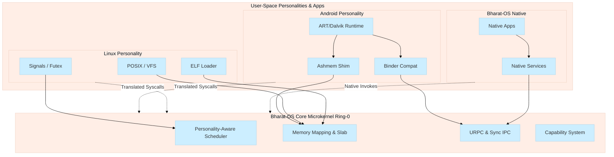
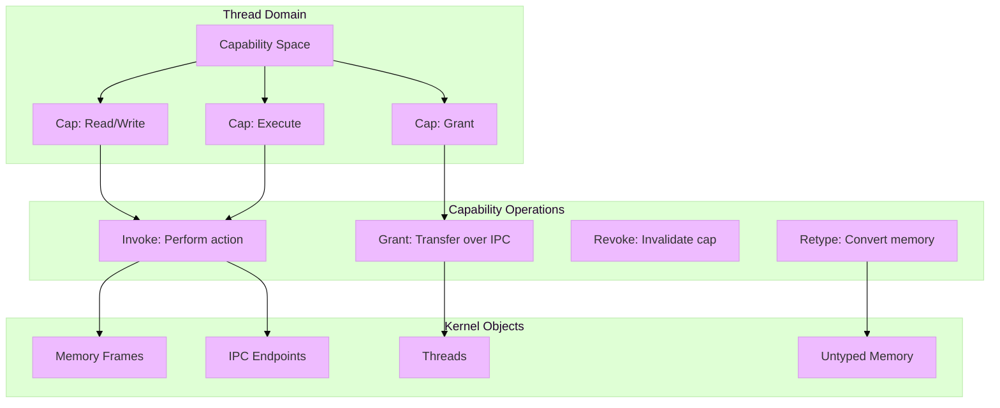
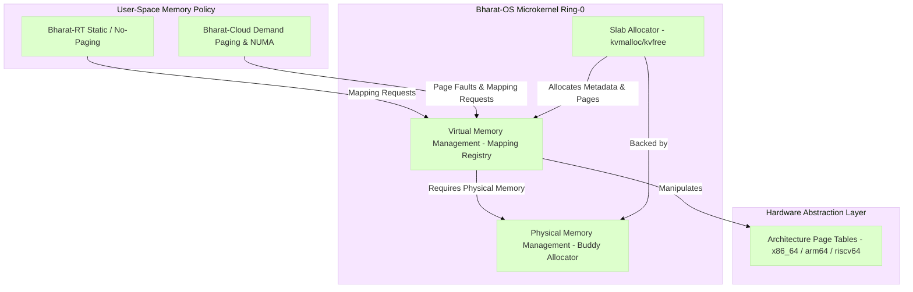
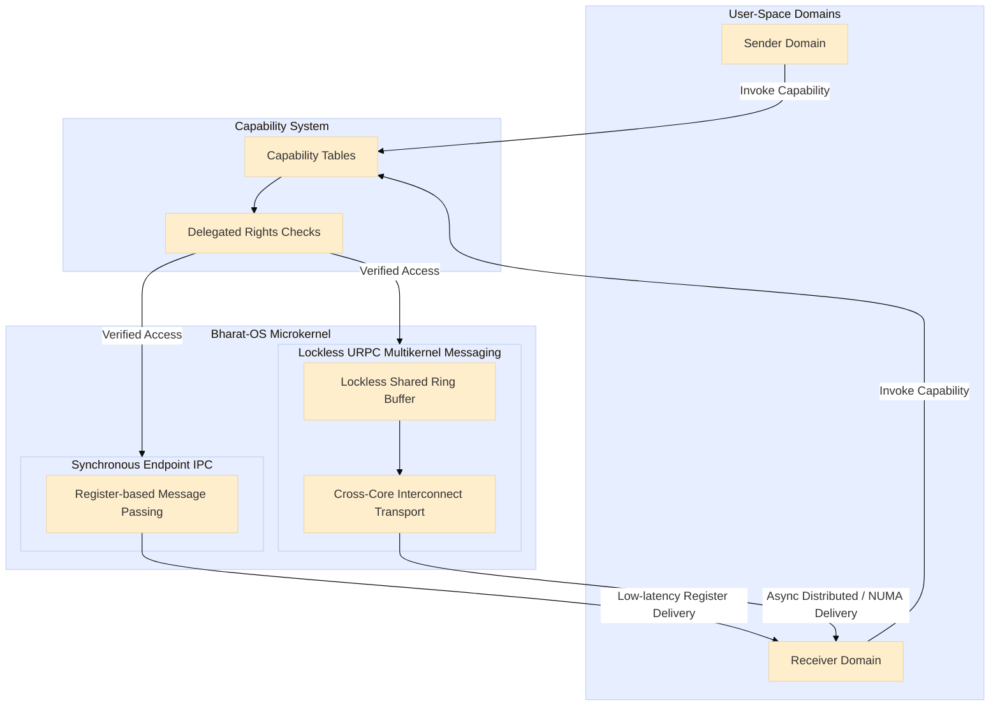
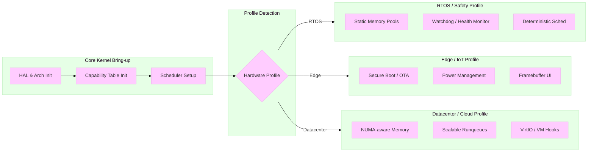
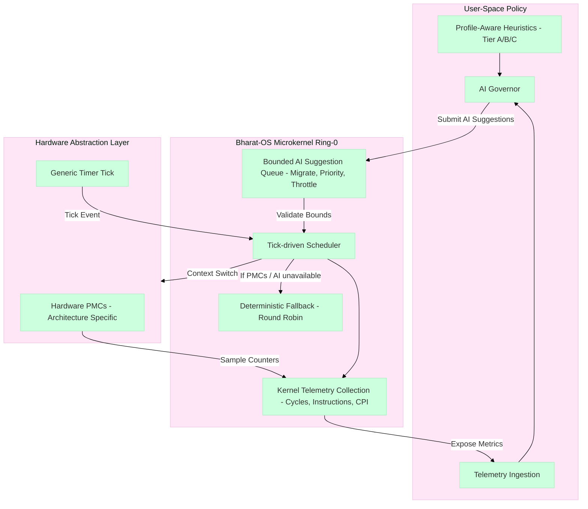

# Bharat-OS

<p align="center">
  
</p>

<p align="center">
  
</p>

<p align="center"><em>Official Bharat-OS logo and banner assets</em></p>

---

Bharat-OS is a capability-oriented microkernel project with a multikernel direction. The repository currently delivers a **bootable and testable kernel baseline** plus architecture documentation for deferred and experimental tracks.

For our detailed vision and current subsystem maturity regarding the transition to a Barrelfish-like multikernel (supporting RT, GP, and Hybrid profiles), please see the [Multikernel Vision and Maturity Document](docs/architecture/core/MULTIKERNEL_VISION.md).

## Project status at a glance

| Area | Current status | Notes |
| --- | --- | --- |
| Kernel architecture | Baseline implemented | Capability objects, syscall/uAPI surfaces, core scheduler hooks, and architecture-specific HAL paths are present for x86_64, riscv64, and arm64 builds. |
| User-space service layer | Mixed (stubs + partial implementations) | Many services currently compile as lifecycle/event-loop stubs, while networking (`netmgr`, `netstack`) and crypto include concrete module logic. |
| Filesystem & Storage | Partial scaffold | VFS kernel headers present; `services/file_system` is a compiled stub. Persistent storage (FAT/littlefs) and OTA recovery support are roadmap items. |
| Networking split (`net` -> `netmgr` + `netstack`) | In progress | `netmgr` has control-plane tables + IPC op dispatch; `netstack` includes IPv4, ARP, ICMP, UDP, socket table, and loopback/ethernet paths. |
| Build & test infrastructure | Active baseline | CMake presets/toolchains and host test integration are wired; architecture runtime maturity differs by target. |
| Distributed/multikernel scale-out | Early baseline | Messaging-first direction is reflected in subsystem and service decomposition, but many production control-plane behaviors remain roadmap items. |
| Documentation coverage | Expanded in this update | See `docs/dev/current-code-status.md` for a code-backed implementation matrix across services/subsystems. |

For architecture-level details and deferred boundaries, see `docs/architecture/` and ADRs in `docs/adr/`. For the step-by-step closure plan, see `docs/architecture/memory-gap-closure-plan.md`. For our profile-driven, capability-safe communications and networking architecture, see [`docs/architecture/network-architecture.md`](docs/architecture/network-architecture.md).
For the ARM32/RV32 EDGE-tier expansion strategy and capability matrix, see [`docs/architecture/arm32-rv32-edge-tier-plan.md`](docs/architecture/arm32-rv32-edge-tier-plan.md).
For cross-tool code-agent guidance, guardrails, and skill templates, see [`docs/ai-agents/README.md`](docs/ai-agents/README.md).

For a code-backed snapshot of what is implemented vs. stubbed right now, see [`docs/dev/current-code-status.md`](docs/dev/current-code-status.md).


## Documentation maturity model and governance

To reduce roadmap drift and keep implementation claims accurate, Bharat-OS uses a canonical four-level maturity taxonomy across roadmap/status documentation:

- **Scaffold**: buildable placeholders and TODO loops.
- **Partial**: concrete logic exists but end-to-end behavior is incomplete.
- **Baseline**: core path works for integration/developer workflows.
- **Production**: hardened and validated for reliability, security, and operations.

Primary references:

- [`docs/dev/current-code-status.md`](docs/dev/current-code-status.md) — code-backed status truth source.
- [`ROADMAP.md`](ROADMAP.md) — forward-looking plan with explicit maturity labels and discrepancy log.
- [`docs/architecture/cmake-governance-and-agent-rules.md`](docs/architecture/cmake-governance-and-agent-rules.md) — CMake structure, versioning policy, and contributor/agent rules.
- [`docs/architecture/components/kernel-subcomponents-architecture.md`](docs/architecture/components/kernel-subcomponents-architecture.md) — kernel subcomponent architecture, per-arch notes, done/todo, roadmap map.
- [`docs/architecture/components/subsystem-subcomponents-architecture.md`](docs/architecture/components/subsystem-subcomponents-architecture.md) — subsystem architecture and closure map.
- [`docs/architecture/components/services-subcomponents-architecture.md`](docs/architecture/components/services-subcomponents-architecture.md) — service-domain architecture/status map.
- [`docs/architecture/components/drivers-subcomponents-architecture.md`](docs/architecture/components/drivers-subcomponents-architecture.md) — driver architecture and arch constraints map.

We intentionally keep architecture documents forward-looking while maintaining conservative implementation status in `docs/dev/current-code-status.md`.

## Device Profiles & Use-cases

Bharat-OS targets multiple deployment classes. These profiles describe **how the current baseline maps to real devices today**, and what is planned next:

- **Mobile / Wearables (EDGE profile):** capability isolation, bounded footprint, and power-aware scheduling hooks are available now; production-grade power control policy is roadmap.
- **Robotics / Drones (EDGE + RTOS-leaning):** deterministic IPC pathways and architecture portability are present; stronger real-time admission and fault-containment depth are roadmap.
- **Network appliances / Edge gateways:** capability-mediated driver boundaries and multikernel messaging baseline are present; mature data-plane acceleration is roadmap.
- **Data-center / clustered nodes:** NUMA/multicore scaffolding and URPC primitives are present; full distributed scheduling and high-scale service orchestration are roadmap.

### High-Level Architecture

```mermaid
%%{init: {'theme': 'base', 'themeVariables': { 'fontFamily': 'arial', 'fontSize': '14px', 'primaryColor': '#0d4f40', 'edgeLabelBackground':'#ffffff'}}}%%
graph TD
    classDef default fill:#0d4f40,stroke:#0d4f40,color:#fff,rx:10px,ry:10px;

    classDef greenNode fill:#0d4f40,stroke:#1d8c6b,stroke-width:2px,color:#fff,rx:5px,ry:5px;
    classDef orangeNode fill:#874900,stroke:#f8a619,stroke-width:2px,color:#fff,rx:5px,ry:5px;
    classDef purpleNode fill:#3f3281,stroke:#6655a6,stroke-width:2px,color:#fff,rx:5px,ry:5px;
    classDef grayNode fill:#4b4d48,stroke:#868884,stroke-width:2px,color:#fff,rx:5px,ry:5px;

    classDef invisible fill:none,stroke:none,color:#999;

    subgraph US [User-space domains<br/>Policy, drivers, subsystems — isolated by capabilities]
        direction LR
        S1["<b>Subsystems</b><br/><span style='color:#75bfa9; font-size:12px'>Console, FB, Input</span>"]:::greenNode
        S2["<b>Drivers</b><br/><span style='color:#75bfa9; font-size:12px'>Net, Storage, Display</span>"]:::greenNode
        S3["<b>AI Governor</b><br/><span style='color:#f8a619; font-size:12px'>Sched hints, telemetry</span>"]:::orangeNode
        S4["<b>Memory Policy</b><br/><span style='color:#75bfa9; font-size:12px'>RT static / Cloud NUMA</span>"]:::greenNode
    end

    subgraph MK [Microkernel ring-0<br/>Trusted compute base — capability tables, IPC, VMM, scheduler]
        direction LR
        M1["<b>Capability</b><br/><span style='color:#a89cd4; font-size:12px'>invoke/grant/revoke</span>"]:::purpleNode
        M2["<b>IPC / URPC</b><br/><span style='color:#a89cd4; font-size:12px'>Sync + lockless ring</span>"]:::purpleNode
        M3["<b>VMM / PMM</b><br/><span style='color:#a89cd4; font-size:12px'>Buddy + slab alloc</span>"]:::purpleNode
        M4["<b>Scheduler</b><br/><span style='color:#a89cd4; font-size:12px'>Tick-driven + AI hooks</span>"]:::purpleNode
    end

    subgraph HL [Hardware abstraction layer<br/>Portability contracts across architectures]
        direction LR
        H1["<b>x86_64</b>"]:::grayNode
        H2["<b>arm64 / ARMv8</b>"]:::grayNode
        H3["<b>RISC-V / Shakti</b>"]:::grayNode
    end

    US -->|syscall / IPC| MK
    MK -->|HAL call| HL

    style US fill:#0d4f40,stroke:#0d4f40,color:#fff,rx:10px,ry:10px
    style MK fill:#3f3281,stroke:#3f3281,color:#fff,rx:10px,ry:10px
    style HL fill:#4b4d48,stroke:#4b4d48,color:#fff,rx:10px,ry:10px

    subgraph Legend [ ]
        direction LR
        L1["<div style='background-color:#1d8c6b; width:15px; height:15px; border-radius:3px; display:inline-block; vertical-align:middle;'></div> <span style='color:#999;'>Baseline implemented</span>"]:::invisible
        L2["<div style='background-color:#f8a619; width:15px; height:15px; border-radius:3px; display:inline-block; vertical-align:middle;'></div> <span style='color:#999;'>Partial / scaffolding</span>"]:::invisible
        L3["<div style='background-color:#999999; width:15px; height:15px; border-radius:3px; display:inline-block; vertical-align:middle;'></div> <span style='color:#999;'>Deferred / roadmap</span>"]:::invisible
    end
    style Legend fill:none,stroke:none

    HL ~~~ Legend

    linkStyle 0 stroke:#999,stroke-width:2px,color:#999
    linkStyle 1 stroke:#999,stroke-width:2px,color:#999
```





### Key Technical Pillars

* **Tiered Functionality:** The OS scales its footprint by activating specific Tiers. Small devices run **Tier A** (minimal core), while desktops and servers enable **Tiers B and C** for full POSIX and GUI support.
* **Multi-Architecture HAL:** Native support for `x86_64`, `ARMv8`, and notably **Shakti RISC-V**, ensuring performance on local semiconductor innovations.
* **Distributed IPC:** A capability-based IPC model that treats local and remote system calls through a unified messaging interface.

### Current v1 Architecture Highlights

| Feature | Summary |
| :-- | :-- |
| Verification-first microkernel | Ring-0 keeps boot flow, memory mapping, capability tables, IPC, and scheduler scaffolding; policy/services stay in isolated user-space domains. |
| Capability-based security model | No global ACL/root model in kernel; object access is capability-mediated (`invoke`, `grant`, `revoke`, `retype`) with zero-trust isolation. |
| Flexible memory model | Kernel maps/unmaps physical pages, while memory policy remains in user space (Bharat-RT static/no-paging; Bharat-Cloud demand paging + NUMA-aware path). |
| Synchronous and asynchronous IPC | Fast register-based endpoint IPC for low latency plus lockless ring-buffer URPC for cross-core multikernel messaging. |
| User-space driver model | Drivers are unprivileged; capabilities gate MMIO/IRQ access and IOMMU policy hardens DMA boundaries, enabling restartable driver domains. |
| Modular scheduler with AI hooks | Tick-driven scheduler collects telemetry and applies AI hints via ADR-008 plugin boundaries, with deterministic fallback when PMCs are unavailable. |

#### Multi-Personality Subsystem Architecture

The Bharat-OS multi-personality strategy does not bake monolithic compatibility subsystems into the core kernel. Instead, it maintains a small, verifiable, distributed kernel that exposes personality-neutral primitives (tasks, memory objects, capabilities). Layered compatibility subsystems translate these core primitives into personality-specific abstractions (Linux POSIX, Android, Windows NT).



#### Capability Model Architecture

Bharat-OS enforces security through a mathematically verifiable Capability System. There are no global Access Control Lists (ACLs), user IDs, or root privileges inside the kernel. A capability is an unforgeable, kernel-managed token that pairs an object reference with a set of permitted operations.



#### Memory Management Architecture



#### IPC & Messaging Architecture

We utilize two distinct IPC models to serve both deterministic bounds (Bharat-RT) and massive scalability (Bharat-Cloud). **Synchronous Endpoint IPC** is fast, blocking, and unbuffered for strict procedural calls. **Lockless URPC** (User-level Remote Procedure Call) is designed for cross-core, multikernel messaging, scaling across high-core-count processors without shared-kernel locks.



### Hardware Profiles & Boot Flow

Bharat-OS is intentionally profile-driven instead of forcing one heavyweight image on every board. Boot behavior and subsystem initialization are determined dynamically by the detected hardware profile.



### Device Profiles & Use-cases

Bharat-OS is intentionally profile-driven instead of forcing one heavyweight image on every board.

- **Mobile & embedded:** revocable capabilities for sensor isolation, user-space driver recovery, and Bharat-RT static allocation for deterministic latency.
- **Edge & IoT gateways:** small attack surface, real-time tuning, and hot-swappable network/USB drivers.
- **Robotics & UAVs:** mixed-criticality partitioning, dedicated-core workflows, and low-latency URPC messaging between control/perception tasks.
- **Network appliances:** isolated user-space drivers plus fast-path packet processing and restart without whole-system panic.
- **Datacenter/cloud:** multikernel-friendly scaling on many-core/NUMA systems with demand paging and policy-driven AI scheduling.

### Subsystem Model
Bharat-OS defines explicit subsystem groups to ensure scalable and tailored functionality for every device class:

* **Console Subsystem:** Serial and text console outputs for early bring-up, logging, and headless environments.
* **Framebuffer & Embedded Graphics Subsystem:** The *primary* graphics path for small devices. Framebuffers are treated as a first-class target, offering deterministic rendering and software-rendered UI without dragging in a heavy GPU compositor.
* **Input Subsystem:** Modular routing for keyboards, touch panels, rotary encoders, and GPIO buttons.
* **Heterogeneous Accelerator Subsystem:** DMA engines, DSPs, NPUs, and ISP abstractions for edge AI and multimedia tasks.
* **Embedded Device Services:** Kiosk shells, watchdog timers, OTA recovery, and lightweight local storage.
* **Filesystem & Storage Subsystem:** VFS abstraction mapping capability-based IO to block, blob, and persistent storage drivers (e.g., FAT, littlefs) necessary for stateful edge devices and OTA recovery.
* **Desktop Graphics Subsystem:** An advanced layer reserved for devices with capable hardware and full compositor needs.

### Display & GUI Strategy

Our display architecture explicitly rejects "desktop compositor or nothing". We define output subsystems in layers:

1. **Headless:** Remote management and serial outputs (Tier 0).
2. **Text console:** VGA/serial output for basic bring-up (Tier 1).
3. **Framebuffer graphics:** Simple 2D display operations and robust device driver abstractions (Tier 2).
4. **Embedded lightweight UI:** Direct-rendered widgets or lightweight toolkits tailored for kiosks and industrial panels (Tier 3).
5. **Full compositor / desktop GUI:** Accelerated environments for workstations and advanced infotainment displays (Tier 4).

---

## 🧭 Roadmap (Condensed)

The official roadmap for the multikernel migration and continuous evolution of Bharat-OS is detailed in [`ROADMAP.md`](ROADMAP.md). Highlights include:

- **Phase 1 (Multikernel Foundation & UI):** Per-CPU capability and runqueue isolation, message-based TLB shootdowns, URPC topology maps (SKB), **framebuffer core**, and **text output.**
- **Phase 2 (Device Specialization & Edge UI):** Hardware validation, AI predictive heuristics from PMC counters, **touch/key input**, and small-device UIs.
- **Phase 3 (Cloud / Datacenter):** NUMA scale-up, Zero-copy networking, DMA/accelerator orchestrations.
- **Phase 4 (Advanced UX & Vertification):** Full compositor environments and Isabelle/HOL formal verification layers.

### AI Features & Roadmap

- Current kernel scheduler tracks thread telemetry (`cycles`, `instructions`, `CPI`) and accepts AI suggestions through a bounded, testable path.
- Architecture-specific PMCs can be sampled when available; deterministic approximations are used otherwise.
- ADR-008 defines the plugin boundary so scheduler core remains portable while profile/architecture overrides evolve.
- Near-term extensions include user-space AI governors, profile-aware scheduling heuristics, and accelerator-aware placement for edge/cloud workloads.

---

## 🧠 AI-Driven Resource Management

Detailed mapping is documented in [`docs/architecture/device-profiles-and-use-cases.md`](docs/architecture/device-profiles-and-use-cases.md).

## AI Features & Roadmap

Bharat-OS keeps AI policy outside ring-0 while exposing bounded kernel mechanisms:

### Implemented baseline

- Kernel-side telemetry collection hooks and bounded AI suggestion queueing.
- Scheduler action handling for migrate/priority/throttle suggestion types.
- Capability-guarded governor control-plane endpoint.
- Architecture/profile-neutral telemetry plugin contract (with fallback behavior when PMCs are unavailable).

#### Scheduler & AI Hooks Architecture



### Roadmap

- Better telemetry quality (hardware PMC integrations per architecture).
- Per-core runqueues + richer migration policy under SMP load.
- Safety/verification hardening for AI-driven scheduling decisions.
- Clearer user-space governor lifecycle, observability, and audit reporting.

See [`docs/architecture/ai-scheduler-status-and-roadmap.md`](docs/architecture/ai-scheduler-status-and-roadmap.md) and [`docs/adr/ADR-008-ai-scheduler-plugin-contract.md`](docs/adr/ADR-008-ai-scheduler-plugin-contract.md).

#### Networking Architecture

See:
[`docs/architecture/network-architecture.md`](docs/architecture/network-architecture.md)

## Core architecture themes

- **Capability-based security:** object rights, delegation constraints, and explicit authority checks.
- **Microkernel layering:** small kernel core with user-space policy and service growth path.
- **Multikernel direction:** explicit messaging-oriented coordination across cores and eventually nodes.
- **Profile-aware composition:** RTOS/EDGE/DESKTOP profile tuning with bounded kernel mechanisms.

## Build quick start

### Prerequisites

- `cmake` (3.20+)
- Ninja or Make
- A supported LLVM/Clang cross toolchain

### Build examples

Bharat-OS uses a centralized build manifest (`build_config.json`) and the single `tools/build.py` script for all commands. You can invoke this through the root wrappers `build.sh` and `build.ps1`.

To list all available configurations:
```bash
./build.sh --list
```

**Common build commands (Linux/macOS):**
```bash
# Build the default x86_64 development profile
./build.sh default_dev

# Build and immediately run the emulator
./build.sh default_dev --run

# Clean, build, and run an arm64 edge device profile
./build.sh arm64_desktop_mmu --clean --run

# Build and run a riscv64 edge profile with headless tests
./build.sh riscv64_desktop_mmu --clean --run-tests
```

**Common build commands (Windows):**
```powershell
# Build the default x86_64 development profile
.\build.ps1 default_dev

# Build and immediately run the emulator
.\build.ps1 default_dev --run

# Clean, build, and run an arm64 edge device profile
.\build.ps1 arm64_desktop_mmu --clean --run

# Build and run a riscv64 edge profile with headless tests
.\build.ps1 riscv64_desktop_mmu --clean --run-tests
```

### 🚨 Migration Guide: Legacy Flags Removed

The build system has been unified around `tools/build.py` using canonical `argparse` arguments. **Legacy PowerShell and shell flags are no longer supported.** The wrappers do not translate flags; they strictly forward to `build.py`.

| Old Syntax (Deprecated) | New Syntax (Canonical) | Notes |
| :--- | :--- | :--- |
| `.\build.ps1 -Arch x86_64 -Run` | `.\build.ps1 default_dev --run` | Arch, board, and profile are now bundled into named configurations in `build_config.json`. |
| `.\build.ps1 -Arch riscv64 -Clean -Run` | `.\build.ps1 riscv64_desktop_mmu --clean --run` | |
| `.\build.ps1 -Arch arm64 -Profile MEDICAL` | `.\build.ps1 arm64_medical_debug` | |
| `.\build.ps1 -Arch x86_64 -BootGui ON` | `.\build.ps1 x86_64_laptop_debug --run` | Use a configuration that specifies `"gui": true` in the JSON manifest. |
| `.\build.ps1 -Arch x86_64 -DualSerial` | `.\build.ps1 default_dev --run --dual-serial` | |
| `./build.sh -Arch x86_64 -E2e` | `./build.sh default_dev --run-tests` | |

If you need a specific combination of architecture, profile, and features that does not exist in `build_config.json`, simply add a new block to the JSON file.

### Profile/personality/board-aware CMake configuration

Build composition is now resolved through centralized component policy in
`cmake/modules/BharatComponentPolicy.cmake`. Configure-time decisions use:

- `BHARAT_DEVICE_PROFILE` (for example `DESKTOP`, `AUTOMOTIVE_ECU`, `AUTOMOTIVE_INFOTAINMENT`)
- `BHARAT_PERSONALITY_PROFILE` (`NATIVE`, `LINUX`, `WINDOWS`, `MAC`)
- `BHARAT_TARGET_BOARD` (for example `qemu-virt-riscv64`, `shakti-c`)

Both wrapper scripts (`build.sh`, `build.ps1`) pass these canonical cache variables to CMake.
If a config value contains multiple comma-separated entries, only the first entry is used so
configure-time policy remains deterministic.

For manual configure:

```bash
cmake --preset linux-x86_64-dev-debug \
  -DBHARAT_DEVICE_PROFILE=AUTOMOTIVE_INFOTAINMENT \
  -DBHARAT_PERSONALITY_PROFILE=LINUX \
  -DBHARAT_TARGET_BOARD=qemu-virt-riscv64
```

Please see **[BUILD.md](BUILD.md)** for exhaustive details on presets and cross-compilation toolchains.

## Repository layout

- `kernel/` — microkernel core (MM, IPC, scheduler, HAL, capability system).
- `subsys/` — subsystem services (including AI governor bridge layer).
- `lib/` — shared user-space facing library surfaces.
- `tests/` — host-based tests for kernel/runtime components.
- `docs/` — architecture docs, ADRs, and implementation reviews.

## Research references

This project aligns with established systems research and uses those works as design guidance:

- Barrelfish multikernel model (messaging-first multicore OS design).
- seL4 capability model and verification-oriented discipline.
- L4-family microkernel separation and minimal trusted core concepts.
- AI-assisted resource management literature (policy guidance in user space, bounded kernel enforcement).

These references are informational guidance for architecture direction, not claims of feature parity.
Bharat-OS draws inspiration from and builds upon research in AI-driven systems and microkernel architectures.

### Research Inspirations

- **Barrelfish multikernel model:** treats a machine as a distributed system of cores coordinated by explicit message passing; this directly informs Bharat-OS URPC and cross-core service decomposition. ([PDF](https://sigops.org/s/conferences/sosp/2009/papers/baumann-sosp09.pdf))
- **seL4 capability model and verification-first design:** capability invocation as the primary authority path and a small trusted kernel base inform Bharat-OS object-capability isolation goals. ([PDF](https://sigops.org/s/conferences/sosp/2009/papers/klein-sosp09.pdf), [TOSEM PDF](https://trustworthy.systems/publications/nicta_full_text/7371.pdf))
- **L4 Family Microkernels:** Surveys L4 evolution, emphasizing modularity; Bharat-OS builds on L4's IPC and driver isolation principles. ([PDF](https://trustworthy.systems/publications/nicta_full_text/8988.pdf))
- **AI scheduling research:** workload-aware scheduling literature (including RL-driven resource managers) informs the long-term AI-governor and scheduler policy roadmap. ([arXiv](https://arxiv.org/abs/2403.01185), [IJMET PDF](https://iaeme.com/MasterAdmin/Journal_uploads/IJMET/VOLUME_11_ISSUE_12/IJMET_11_12_012.pdf))

For a complete bibliography and BibTeX entries, see [`docs/research_doc/papers.md`](docs/research_doc/papers.md) and [`docs/research_doc/references.bib`](docs/research_doc/references.bib).

### Phase 4 Verification Roadmap

As part of Phase 4, we plan to integrate seL4 tools for verification. Our initial focus will be on Isabelle/HOL proofs for our core IPC primitives. We are actively seeking and welcome help from other developers on this roadmap. If you have experience in formal verification or theorem proving, please join us!

## Build script hierarchy

* Root `build.sh` and `build.ps1` are the supported user-facing entrypoints.
* `tools/build.py` is the authoritative build/run implementation.
* Any shell or PowerShell scripts under `tools/` (like `tools/build.sh` and `tools/build.ps1`) are compatibility wrappers only.
* Future CLI, build, or run behavior changes must be made in `tools/build.py` only. Do not add new logic to the compatibility shims.
