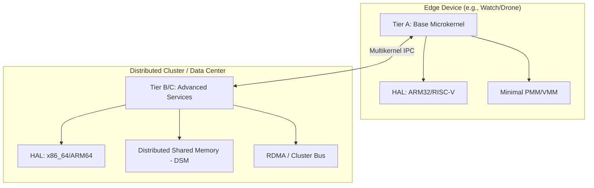
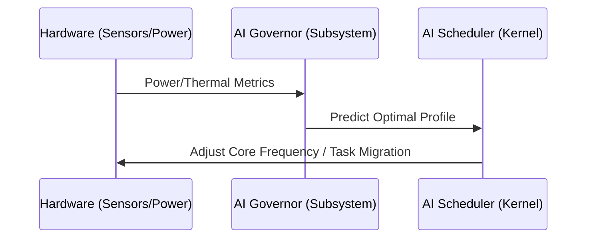

# Bharat-OS

<p align="center">
  
</p>

<p align="center">
  
</p>

<p align="center"><em>Official Bharat-OS logo and banner assets</em></p>

---

Bharat-OS is a next-generation distributed microkernel designed to scale across the entire computing spectrum—from **low-power edge devices** (watches, drones, robots) to **high-performance data centers**. It features a hardware-agnostic design with native support for indigenous architectures like **Shakti (RISC-V)**.

## 🏗️ Architecture: Distributed & Scalable

The kernel utilizes a "Multikernel" approach where different CPU cores or networked devices can operate as independent nodes while sharing a global resource view.



### Key Technical Pillars

* **Tiered Functionality:** The OS scales its footprint by activating specific Tiers. Small devices run **Tier A** (minimal core), while desktops and servers enable **Tiers B and C** for full POSIX and GUI support.
* **Multi-Architecture HAL:** Native support for `x86_64`, `ARMv8`, and notably **Shakti RISC-V**, ensuring performance on local semiconductor innovations.
* **Distributed IPC:** A capability-based IPC model that treats local and remote system calls through a unified messaging interface.

### Current v1 Architecture Highlights

| Feature | Summary |
| --- | --- |
| Verification-first microkernel | Ring-0 keeps only boot flow, memory mapping, capability tables, IPC and scheduling scaffolding; most services run in isolated user-space domains. |
| Capability-based security model | No global ACL/root model in kernel. Object access is capability-mediated (`invoke`, `grant`, `revoke`, `retype`) with zero-trust isolation. |
| Flexible memory model | Kernel only maps/unmaps physical pages while policy lives in user space: Bharat-RT favors static/no-paging determinism; Bharat-Cloud favors demand paging, NUMA-awareness, and a path toward distributed shared memory. |
| Synchronous + asynchronous IPC | Fast register-based synchronous endpoint IPC for low latency plus lockless ring-buffer URPC for cross-core multikernel messaging. |
| User-space driver model | Drivers remain unprivileged. Capabilities gate MMIO/IRQ access and IOMMU policy hardens DMA boundaries; drivers are restartable via IPC boundaries. |
| Modular scheduler with AI hooks | Tick-driven scheduler collects telemetry and applies AI hints through an architecture-neutral plugin contract (ADR-008), with deterministic fallbacks when PMCs are unavailable. |

### Device Profiles & Use-cases

Bharat-OS is intentionally profile-driven instead of forcing one heavyweight image on every board.

- **Mobile & embedded:** revocable capabilities for sensor isolation, user-space driver recovery, and Bharat-RT static allocation for deterministic latency.
- **Edge & IoT gateways:** small attack surface, real-time tuning, and hot-swappable network/USB drivers.
- **Robotics & UAVs:** mixed-criticality partitioning, dedicated-core workflows, and low-latency URPC messaging between control/perception tasks.
- **Network appliances:** isolated user-space drivers plus fast-path packet processing and restart without whole-system panic.
- **Datacenter/cloud:** multikernel-friendly scaling on many-core/NUMA systems with demand paging and policy-driven AI scheduling.

### Subsystem Model
Bharat-OS defines explicit subsystem groups to ensure scalable and tailored functionality for every device class:

* **Console Subsystem:** Serial and text console outputs for early bring-up, logging, and headless environments.
* **Framebuffer & Embedded Graphics Subsystem:** The *primary* graphics path for small devices. Framebuffers are treated as a first-class target, offering deterministic rendering and software-rendered UI without dragging in a heavy GPU compositor.
* **Input Subsystem:** Modular routing for keyboards, touch panels, rotary encoders, and GPIO buttons.
* **Heterogeneous Accelerator Subsystem:** DMA engines, DSPs, NPUs, and ISP abstractions for edge AI and multimedia tasks.
* **Embedded Device Services:** Kiosk shells, watchdog timers, OTA recovery, and lightweight local storage.
* **Desktop Graphics Subsystem:** An advanced layer reserved for devices with capable hardware and full compositor needs.

### Display & GUI Strategy

Our display architecture explicitly rejects "desktop compositor or nothing". We define output subsystems in layers:

1. **Headless:** Remote management and serial outputs (Tier 0).
2. **Text console:** VGA/serial output for basic bring-up (Tier 1).
3. **Framebuffer graphics:** Simple 2D display operations and robust device driver abstractions (Tier 2).
4. **Embedded lightweight UI:** Direct-rendered widgets or lightweight toolkits tailored for kiosks and industrial panels (Tier 3).
5. **Full compositor / desktop GUI:** Accelerated environments for workstations and advanced infotainment displays (Tier 4).

---

## 🧭 Roadmap (Condensed)

- **Phase 1 (kernel spine & core UI):** boot stability, scheduler/memory correctness, timer+interrupts, SMP bring-up, tracing/observability, **framebuffer core, simple 2D renderer, and text output.**
- **Phase 2 (device specialization & embedded UI):** edge/robotics/drone service packs, power management, secure update chain, sensor+actuator frameworks, **touch/key input, and small-device UI toolkit.**
- **Phase 3 (cloud/appliance & accelerators):** NUMA/resource isolation, high-speed networking/storage, accelerator orchestration (NPU/DSP/DMA), virtualization hooks.
- **Phase 4 (advanced UX):** richer desktop compositor and full accelerated windowing environments.

### AI Features & Roadmap

- Current kernel scheduler tracks thread telemetry (`cycles`, `instructions`, `CPI`) and accepts AI suggestions through a bounded, testable path.
- Architecture-specific PMCs can be sampled when available; deterministic approximations are used otherwise.
- ADR-008 defines the plugin boundary so scheduler core remains portable while profile/architecture overrides evolve.
- Near-term extensions include user-space AI governors, profile-aware scheduling heuristics, and accelerator-aware placement for edge/cloud workloads.

---

## 🧠 AI-Driven Resource Management

Bharat-OS integrates AI directly into the kernel's decision-making process for power and compute efficiency, crucial for small devices.



* **AI Governor:** Monitors thermal and power metrics to extend battery life on wearables and drones.
* **Predictive Scheduling:** Uses statistical models to predict task bursts and migrate workloads across the distributed cluster to prevent hot-spotting.

---

## 🛠️ Semiconductor & Board Support

The kernel is optimized for various form factors and architectures:

* **Shakti (RISC-V 32/64):** Specialized BSP for Indian-designed RISC-V processors.
* **ARM (Mobile/Edge):** Support for Raspberry Pi and generic ARMv8-A platforms.
* **Accelerator Support:** Native HAL headers for **NPU** and **GPU** offloading.

---

## 🚀 Getting Started

### Prerequisites

* `cmake` (3.20+)
* Cross-compilers: `gcc-arm-none-eabi`, `gcc-riscv64-unknown-elf`, or `clang` / `lld` (for bare-metal cross-compilation).

### Build for Shakti RISC-V

```bash
# Build the bare-metal kernel image
./tools/build.sh riscv64

# Alternatively, run on RISC-V QEMU with specific hardware (e.g. sifive_u)
./tools/build.sh riscv64 --machine=sifive_u --run
```

### Build for ARM64 (Edge/Mobile)

```bash
# Compile ARM64 kernel
./tools/build.sh arm64
```

### Build for x86_64 (Servers/Desktops)
```bash
# Build and run x86_64 kernel in QEMU
./tools/build.sh x86_64 --run
```
*(Note: Windows users can utilize the `.\tools\build.ps1` script instead)*

---

## 📂 Project Structure

* `/kernel`: Core microkernel (Memory, IPC, AI Scheduler, HAL).
* `/subsys`: Advanced layers like the **AI Governor** and user-space server compatibility stubs.
* `/lib`: Shared userspace libraries.
* `/tests`: Standalone C unit tests and host-based harness.
* `/tools`: Build helper scripts, test wrappers, and QEMU configuration tools.
* `/docs`: Architecture Decision Records (ADRs) and design documentation.

**Interested in contributing?** See [CONTRIBUTING.md](./CONTRIBUTING.md) for details on our capability-based security model or AI-native design.

## Research & References

Bharat-OS draws inspiration from and builds upon research in AI-driven systems and microkernel architectures.

### Research Inspirations

- **Barrelfish multikernel model:** treats a machine as a distributed system of cores coordinated by explicit message passing; this directly informs Bharat-OS URPC and cross-core service decomposition.
- **seL4 capability model and verification-first design:** capability invocation as the primary authority path and a small trusted kernel base inform Bharat-OS object-capability isolation goals.
- **AI scheduling research:** workload-aware scheduling literature (including RL-driven resource managers) informs the long-term AI-governor and scheduler policy roadmap.
