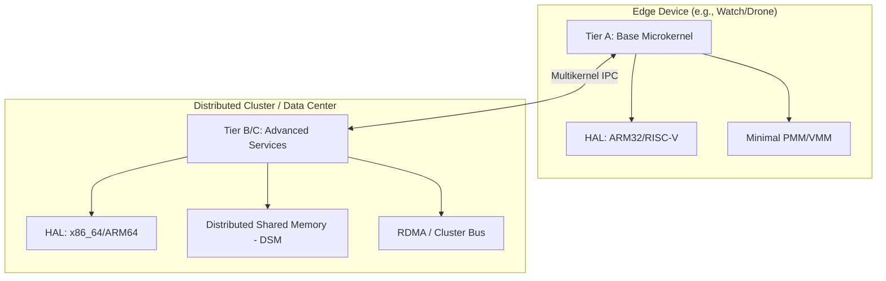
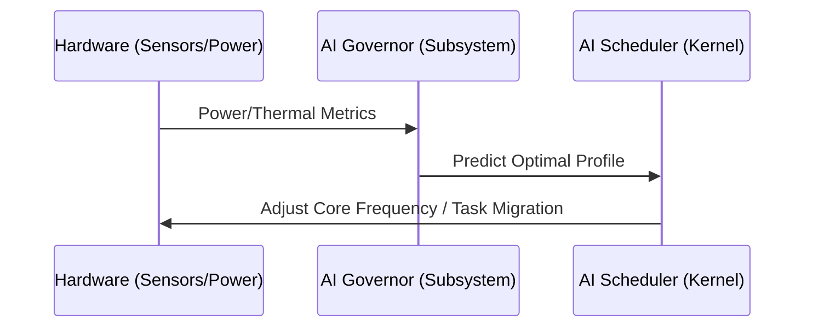

# Bharat-OS

<p align="center">
  
</p>

<p align="center">
  
</p>

<p align="center"><em>Official Bharat-OS logo and banner assets</em></p>

---

Bharat-OS is a next-generation distributed microkernel designed to scale across the entire computing spectrum—from **low-power edge devices** (watches, drones, robots) to **high-performance data centers**. It features a hardware-agnostic design with native support for indigenous architectures like **Shakti (RISC-V)**.

## 🏗️ Architecture: Distributed & Scalable

The kernel utilizes a "Multikernel" approach where different CPU cores or networked devices can operate as independent nodes while sharing a global resource view.



### Key Technical Pillars

* **Tiered Functionality:** The OS scales its footprint by activating specific Tiers. Small devices run **Tier A** (minimal core), while desktops and servers enable **Tiers B and C** for full POSIX and GUI support.
* **Multi-Architecture HAL:** Native support for `x86_64`, `ARMv8`, and notably **Shakti RISC-V**, ensuring performance on local semiconductor innovations.
* **Distributed IPC:** A capability-based IPC model that treats local and remote system calls through a unified messaging interface.

---

## 🧠 AI-Driven Resource Management

Bharat-OS integrates AI directly into the kernel's decision-making process for power and compute efficiency, crucial for small devices.



* **AI Governor:** Monitors thermal and power metrics to extend battery life on wearables and drones.
* **Predictive Scheduling:** Uses statistical models to predict task bursts and migrate workloads across the distributed cluster to prevent hot-spotting.

---

## 🛠️ Semiconductor & Board Support

The kernel is optimized for various form factors and architectures:

* **Shakti (RISC-V 32/64):** Specialized BSP for Indian-designed RISC-V processors.
* **ARM (Mobile/Edge):** Support for Raspberry Pi and generic ARMv8-A platforms.
* **Accelerator Support:** Native HAL headers for **NPU** and **GPU** offloading.

---

## 🚀 Getting Started

### Prerequisites

* `cmake` (3.20+)
* Cross-compilers: `gcc-arm-none-eabi`, `gcc-riscv64-unknown-elf`, or `clang` / `lld` (for bare-metal cross-compilation).

### Build for Shakti RISC-V

```bash
# Build the bare-metal kernel image
./tools/build.sh riscv64

# Alternatively, run on RISC-V QEMU with specific hardware (e.g. sifive_u)
./tools/build.sh riscv64 --machine=sifive_u --run
```

### Build for ARM64 (Edge/Mobile)

```bash
# Compile ARM64 kernel
./tools/build.sh arm64
```

### Build for x86_64 (Servers/Desktops)
```bash
# Build and run x86_64 kernel in QEMU
./tools/build.sh x86_64 --run
```
*(Note: Windows users can utilize the `.\tools\build.ps1` script instead)*

---

## 📂 Project Structure

* `/kernel`: Core microkernel (Memory, IPC, AI Scheduler, HAL).
* `/subsys`: Advanced layers like the **AI Governor** and user-space server compatibility stubs.
* `/lib`: Shared userspace libraries.
* `/tests`: Standalone C unit tests and host-based harness.
* `/tools`: Build helper scripts, test wrappers, and QEMU configuration tools.
* `/docs`: Architecture Decision Records (ADRs) and design documentation.

**Interested in contributing?** See [CONTRIBUTING.md](./CONTRIBUTING.md) for details on our capability-based security model or AI-native design.
