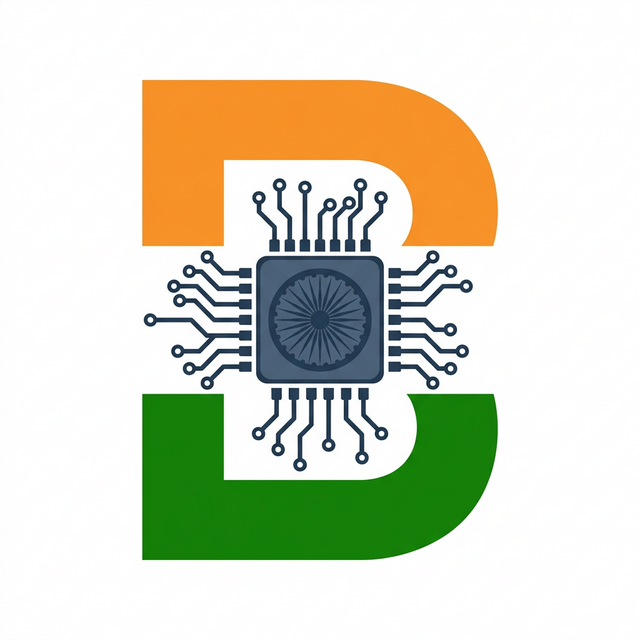
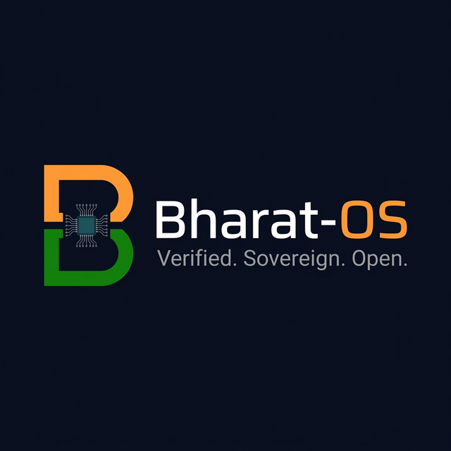
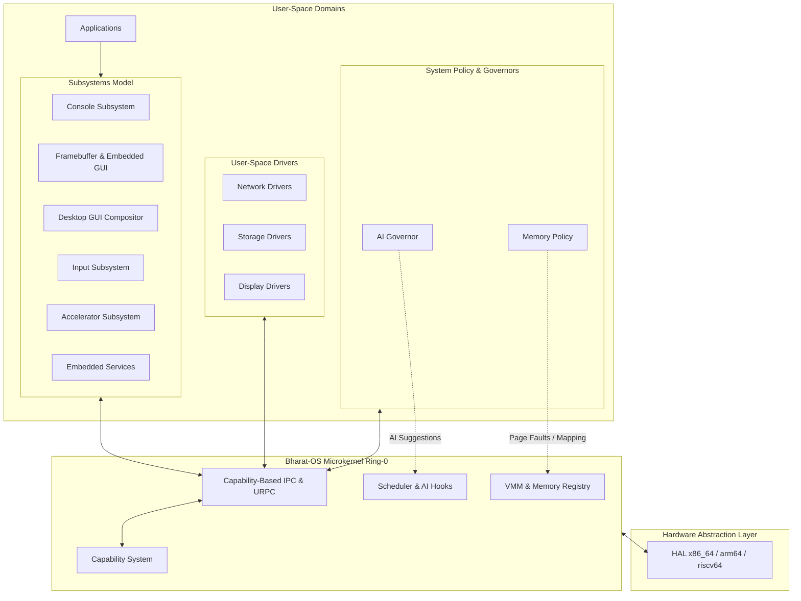
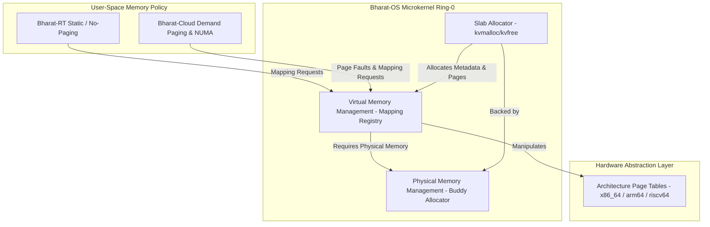
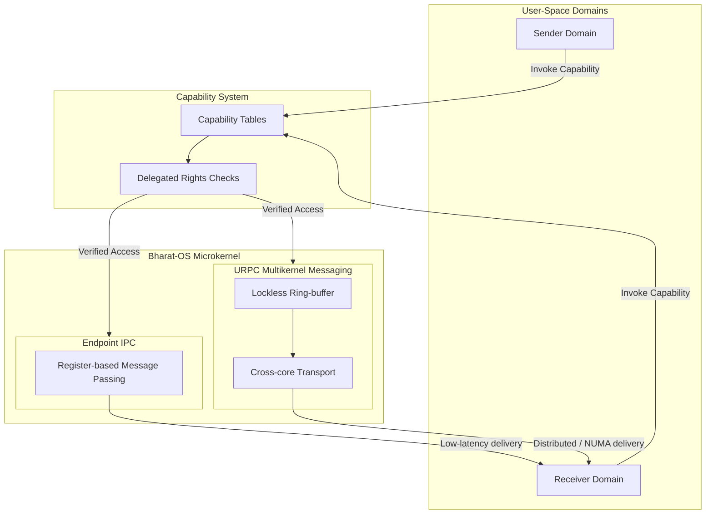
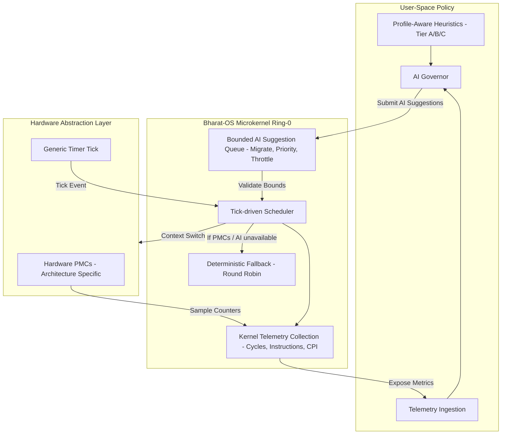

# Bharat-OS

<p align="center">
  
</p>

<p align="center">
  
</p>

<p align="center"><em>Official Bharat-OS logo and banner assets</em></p>

---

Bharat-OS is a capability-oriented microkernel project with a multikernel direction. The repository currently delivers a **bootable and testable kernel baseline** plus architecture documentation for deferred and experimental tracks.

## Project status at a glance

| Area | Current status | Notes |
| --- | --- | --- |
| Capability model and IPC baseline | Implemented baseline | Capability tables, delegated rights checks, endpoint IPC + URPC scaffolding. |
| Memory management | Partial baseline | PMM/buddy allocator and VMM mapping registry exist; full hardware page-table manager remains deferred. |
| Scheduler and AI hook points | Implemented baseline | Timer-driven scheduler path with bounded AI suggestion ingestion/processing; full SMP runqueues/context switching remain deferred. |
| Driver and HAL model | Implemented baseline | HAL contracts and driver framework scaffolding exist across x86_64, riscv64, arm64. |
| Distributed/multikernel scale-out | Early baseline | Per-core URPC matrix and multicore bootstrap hooks exist; production-grade topology and transport tuning are deferred. |

For architecture-level details and deferred boundaries, see `docs/architecture/` and ADRs in `docs/decisions/`.

## Device Profiles & Use-cases

Bharat-OS targets multiple deployment classes. These profiles describe **how the current baseline maps to real devices today**, and what is planned next:

- **Mobile / Wearables (EDGE profile):** capability isolation, bounded footprint, and power-aware scheduling hooks are available now; production-grade power control policy is roadmap.
- **Robotics / Drones (EDGE + RTOS-leaning):** deterministic IPC pathways and architecture portability are present; stronger real-time admission and fault-containment depth are roadmap.
- **Network appliances / Edge gateways:** capability-mediated driver boundaries and multikernel messaging baseline are present; mature data-plane acceleration is roadmap.
- **Data-center / clustered nodes:** NUMA/multicore scaffolding and URPC primitives are present; full distributed scheduling and high-scale service orchestration are roadmap.

### High-Level Architecture



### Key Technical Pillars

* **Tiered Functionality:** The OS scales its footprint by activating specific Tiers. Small devices run **Tier A** (minimal core), while desktops and servers enable **Tiers B and C** for full POSIX and GUI support.
* **Multi-Architecture HAL:** Native support for `x86_64`, `ARMv8`, and notably **Shakti RISC-V**, ensuring performance on local semiconductor innovations.
* **Distributed IPC:** A capability-based IPC model that treats local and remote system calls through a unified messaging interface.

### Current v1 Architecture Highlights

| Feature | Summary |
| :-- | :-- |
| Verification-first microkernel | Ring-0 keeps boot flow, memory mapping, capability tables, IPC, and scheduler scaffolding; policy/services stay in isolated user-space domains. |
| Capability-based security model | No global ACL/root model in kernel; object access is capability-mediated (`invoke`, `grant`, `revoke`, `retype`) with zero-trust isolation. |
| Flexible memory model | Kernel maps/unmaps physical pages, while memory policy remains in user space (Bharat-RT static/no-paging; Bharat-Cloud demand paging + NUMA-aware path). |
| Synchronous and asynchronous IPC | Fast register-based endpoint IPC for low latency plus lockless ring-buffer URPC for cross-core multikernel messaging. |
| User-space driver model | Drivers are unprivileged; capabilities gate MMIO/IRQ access and IOMMU policy hardens DMA boundaries, enabling restartable driver domains. |
| Modular scheduler with AI hooks | Tick-driven scheduler collects telemetry and applies AI hints via ADR-008 plugin boundaries, with deterministic fallback when PMCs are unavailable. |

#### Memory Management Architecture



#### IPC & Messaging Architecture



### Device Profiles & Use-cases

Bharat-OS is intentionally profile-driven instead of forcing one heavyweight image on every board.

- **Mobile & embedded:** revocable capabilities for sensor isolation, user-space driver recovery, and Bharat-RT static allocation for deterministic latency.
- **Edge & IoT gateways:** small attack surface, real-time tuning, and hot-swappable network/USB drivers.
- **Robotics & UAVs:** mixed-criticality partitioning, dedicated-core workflows, and low-latency URPC messaging between control/perception tasks.
- **Network appliances:** isolated user-space drivers plus fast-path packet processing and restart without whole-system panic.
- **Datacenter/cloud:** multikernel-friendly scaling on many-core/NUMA systems with demand paging and policy-driven AI scheduling.

### Subsystem Model
Bharat-OS defines explicit subsystem groups to ensure scalable and tailored functionality for every device class:

* **Console Subsystem:** Serial and text console outputs for early bring-up, logging, and headless environments.
* **Framebuffer & Embedded Graphics Subsystem:** The *primary* graphics path for small devices. Framebuffers are treated as a first-class target, offering deterministic rendering and software-rendered UI without dragging in a heavy GPU compositor.
* **Input Subsystem:** Modular routing for keyboards, touch panels, rotary encoders, and GPIO buttons.
* **Heterogeneous Accelerator Subsystem:** DMA engines, DSPs, NPUs, and ISP abstractions for edge AI and multimedia tasks.
* **Embedded Device Services:** Kiosk shells, watchdog timers, OTA recovery, and lightweight local storage.
* **Desktop Graphics Subsystem:** An advanced layer reserved for devices with capable hardware and full compositor needs.

### Display & GUI Strategy

Our display architecture explicitly rejects "desktop compositor or nothing". We define output subsystems in layers:

1. **Headless:** Remote management and serial outputs (Tier 0).
2. **Text console:** VGA/serial output for basic bring-up (Tier 1).
3. **Framebuffer graphics:** Simple 2D display operations and robust device driver abstractions (Tier 2).
4. **Embedded lightweight UI:** Direct-rendered widgets or lightweight toolkits tailored for kiosks and industrial panels (Tier 3).
5. **Full compositor / desktop GUI:** Accelerated environments for workstations and advanced infotainment displays (Tier 4).

---

## 🧭 Roadmap (Condensed)

- **Phase 1 (kernel spine & core UI):** boot stability, scheduler/memory correctness, timer+interrupts, SMP bring-up, tracing/observability, **framebuffer core, simple 2D renderer, and text output.**
- **Phase 2 (device specialization & embedded UI):** edge/robotics/drone service packs, power management, secure update chain, sensor+actuator frameworks, **touch/key input, and small-device UI toolkit.**
- **Phase 3 (cloud/appliance & accelerators):** NUMA/resource isolation, high-speed networking/storage, accelerator orchestration (NPU/DSP/DMA), virtualization hooks.
- **Phase 4 (advanced UX):** richer desktop compositor and full accelerated windowing environments.

### AI Features & Roadmap

- Current kernel scheduler tracks thread telemetry (`cycles`, `instructions`, `CPI`) and accepts AI suggestions through a bounded, testable path.
- Architecture-specific PMCs can be sampled when available; deterministic approximations are used otherwise.
- ADR-008 defines the plugin boundary so scheduler core remains portable while profile/architecture overrides evolve.
- Near-term extensions include user-space AI governors, profile-aware scheduling heuristics, and accelerator-aware placement for edge/cloud workloads.

---

## 🧠 AI-Driven Resource Management

Detailed mapping is documented in [`docs/architecture/device-profiles-and-use-cases.md`](docs/architecture/device-profiles-and-use-cases.md).

## AI Features & Roadmap

Bharat-OS keeps AI policy outside ring-0 while exposing bounded kernel mechanisms:

### Implemented baseline

- Kernel-side telemetry collection hooks and bounded AI suggestion queueing.
- Scheduler action handling for migrate/priority/throttle suggestion types.
- Capability-guarded governor control-plane endpoint.
- Architecture/profile-neutral telemetry plugin contract (with fallback behavior when PMCs are unavailable).

#### Scheduler & AI Hooks Architecture



### Roadmap

- Better telemetry quality (hardware PMC integrations per architecture).
- Per-core runqueues + richer migration policy under SMP load.
- Safety/verification hardening for AI-driven scheduling decisions.
- Clearer user-space governor lifecycle, observability, and audit reporting.

See [`docs/architecture/ai-scheduler-status-and-roadmap.md`](docs/architecture/ai-scheduler-status-and-roadmap.md) and [`docs/decisions/ADR-008-ai-scheduler-plugin-contract.md`](docs/decisions/ADR-008-ai-scheduler-plugin-contract.md).

## Core architecture themes

- **Capability-based security:** object rights, delegation constraints, and explicit authority checks.
- **Microkernel layering:** small kernel core with user-space policy and service growth path.
- **Multikernel direction:** explicit messaging-oriented coordination across cores and eventually nodes.
- **Profile-aware composition:** RTOS/EDGE/DESKTOP profile tuning with bounded kernel mechanisms.

## Build quick start

### Prerequisites

- `cmake` (3.20+)
- A supported cross toolchain such as:
  - `riscv64-unknown-elf-*`
  - `aarch64-none-elf-*`
  - `x86_64-elf-*`

### Build examples

```bash
# RISC-V
./tools/build.sh riscv64

# ARM64
./tools/build.sh arm64

# x86_64 (optionally run in QEMU)
./tools/build.sh x86_64 --run
```

Windows users can use `tools/build.ps1`.

## Repository layout

- `kernel/` — microkernel core (MM, IPC, scheduler, HAL, capability system).
- `subsys/` — subsystem services (including AI governor bridge layer).
- `lib/` — shared user-space facing library surfaces.
- `tests/` — host-based tests for kernel/runtime components.
- `docs/` — architecture docs, ADRs, and implementation reviews.

## Research references

This project aligns with established systems research and uses those works as design guidance:

- Barrelfish multikernel model (messaging-first multicore OS design).
- seL4 capability model and verification-oriented discipline.
- L4-family microkernel separation and minimal trusted core concepts.
- AI-assisted resource management literature (policy guidance in user space, bounded kernel enforcement).

These references are informational guidance for architecture direction, not claims of feature parity.
Bharat-OS draws inspiration from and builds upon research in AI-driven systems and microkernel architectures.

### Research Inspirations

- **Barrelfish multikernel model:** treats a machine as a distributed system of cores coordinated by explicit message passing; this directly informs Bharat-OS URPC and cross-core service decomposition. ([PDF](https://sigops.org/s/conferences/sosp/2009/papers/baumann-sosp09.pdf))
- **seL4 capability model and verification-first design:** capability invocation as the primary authority path and a small trusted kernel base inform Bharat-OS object-capability isolation goals. ([PDF](https://sigops.org/s/conferences/sosp/2009/papers/klein-sosp09.pdf), [TOSEM PDF](https://trustworthy.systems/publications/nicta_full_text/7371.pdf))
- **L4 Family Microkernels:** Surveys L4 evolution, emphasizing modularity; Bharat-OS builds on L4's IPC and driver isolation principles. ([PDF](https://trustworthy.systems/publications/nicta_full_text/8988.pdf))
- **AI scheduling research:** workload-aware scheduling literature (including RL-driven resource managers) informs the long-term AI-governor and scheduler policy roadmap. ([arXiv](https://arxiv.org/abs/2403.01185), [IJMET PDF](https://iaeme.com/MasterAdmin/Journal_uploads/IJMET/VOLUME_11_ISSUE_12/IJMET_11_12_012.pdf))

For a complete bibliography and BibTeX entries, see [`docs/papers.md`](docs/papers.md) and [`docs/references.bib`](docs/references.bib).

### Phase 4 Verification Roadmap

As part of Phase 4, we plan to integrate seL4 tools for verification. Our initial focus will be on Isabelle/HOL proofs for our core IPC primitives. We are actively seeking and welcome help from other developers on this roadmap. If you have experience in formal verification or theorem proving, please join us!
