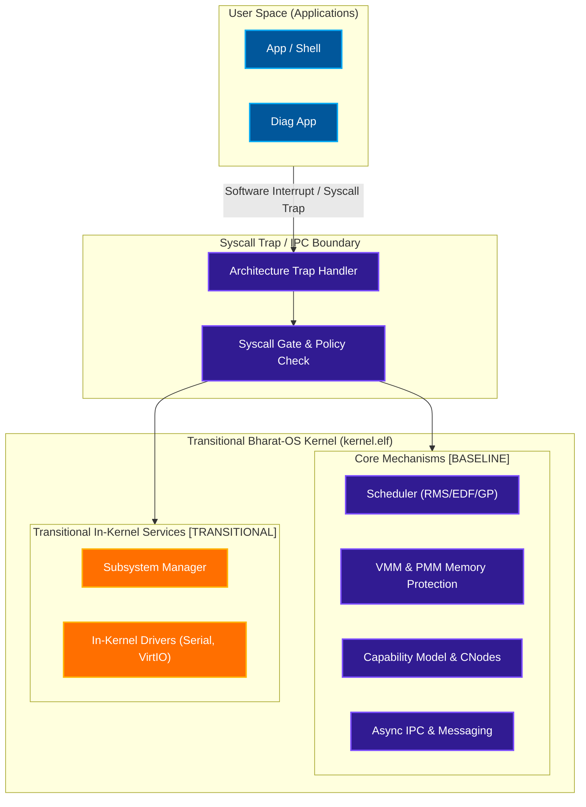
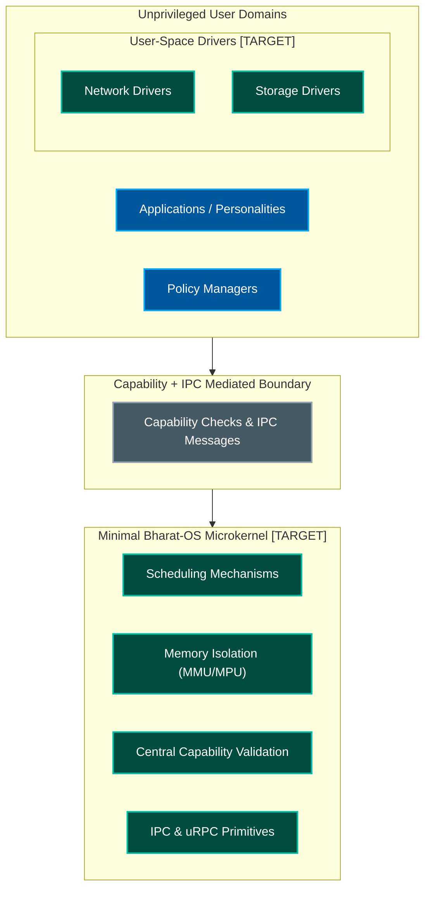
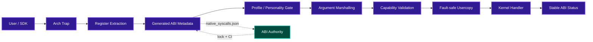

# <p align="center">🔮 Bharat-OS</p>

<p align="center">
  <strong>A Next-Generation, Verification-Oriented Capability Microkernel</strong>
</p>

<p align="center">
  
  
  
</p>

---

## 🧭 Why Bharat-OS?

Bharat-OS is a secure, high-performance, real-time operating system designed from first principles. It targets critical infrastructure domains including **Automotive (ADAS/ECUs)**, **Aerospace**, **Digital Cockpits**, and **Industrial Control Systems**.

### Core Pillars
1. **Verification-Oriented Capability System:** Designed for mathematically sound object-level access control and uncompromised security.
2. **Small Stable Kernel Mechanisms:** Minimal ring-0 core focusing strictly on scheduling, memory protection, capability validation, and IPC. High-level policies belong in services.
3. **Multi-Personality Runtimes:** Natively runs multiple execution runtimes (NATIVE, LINUX, ANDROID, WINDOWS) unprivileged in user space.
4. **Profile-Driven Composition:** Dynamic build-time composition using CMake profiles (TINY, EMBEDDED, GP, RT) to support diverse hardware targets.

---

## 🟢 Current Project Status

We enforce strict governance to ensure that code, build graphs, and documentation derive from the same single source of truth. Below is the dynamically generated component maturity status:

<!-- START MATURITY TABLE -->

| Component Name | Maturity Level | Evidence / Verification Path | Key Blockers / Remarks |
|---|---|---|---|
| Native Syscall Boundary | 🟢 **BASELINE** | `quality/tests/test_trap_syscall.c` | None |
| Unified 12-Byte Usercopy & Exception Table | 🟢 **BASELINE** | `core/arch/x86/x86_64/usercopy.c, docs/architecture/exception-table-contract.md` | None |
| Metadata-Driven ABI Lock | 🟢 **BASELINE** | `tools/abi/syscall_abi.py` | None |
| Architecture Layer Linter | 🟢 **BASELINE** | `tools/lint/check_layer_references.py` | None |
| CMake Target-Dependency Linter | 🟢 **BASELINE** | `tools/lint/check_cmake_dependencies.py` | None |
| Network Manager (netmgr) | 🟡 **PARTIAL** | `core/services/netmgr` | Production blocking receive |
| Process Manager (process_mgr) | ⚪ **SCAFFOLD** | `core/services/process_manager` | Real ELF execution loading |
| Virtual Memory Manager (vm_mgr) | ⚪ **SCAFFOLD** | `core/services/vm_manager` | On-demand page-pool orchestration |

<!-- END MATURITY TABLE -->

---

## 🎨 Architectural Hierarchy

Bharat-OS uses a layered, unprivileged execution paradigm. To maintain strict truthfulness, our architecture is illustrated across its current transitional state, its target state, and its syscall trust boundary.

### 1. Current Implementation (TRANSITIONAL)
*This represents today's runtime reality. High-level subsystems are statically linked into the kernel executable for bring-up, but remain modular to prepare for full separation.*


```mermaid
graph TD
    classDef baseline fill:#311b92,stroke:#7c4dff,stroke-width:2px,color:#fff;
    classDef transitional fill:#ff6f00,stroke:#ffb300,stroke-width:2px,color:#fff;
    classDef userspace fill:#01579b,stroke:#03a9f4,stroke-width:2px,color:#fff;

    subgraph Userspace ["User Space (Applications)"]
        App1["App / Shell"]:::userspace
        App2["Diag App"]:::userspace
    end

    subgraph TrapGate ["Syscall Trap / IPC Boundary"]
        Trap["Architecture Trap Handler"]:::baseline
        Gate["Syscall Gate & Policy Check"]:::baseline
    end

    subgraph KernelImage ["Transitional Bharat-OS Kernel (kernel.elf)"]
        direction TB
        subgraph CoreMech ["Core Mechanisms [BASELINE]"]
            Sched["Scheduler (RMS/EDF/GP)"]:::baseline
            MM["VMM & PMM Memory Protection"]:::baseline
            CapTable["Capability Model & CNodes"]:::baseline
            IPCMsg["Async IPC & Messaging"]:::baseline
        end
        subgraph TransServices ["Transitional In-Kernel Services [TRANSITIONAL]"]
            SubsysMgr["Subsystem Manager"]:::transitional
            Drivers["In-Kernel Drivers (Serial, VirtIO)"]:::transitional
        end
    end

    Userspace -->|Software Interrupt / Syscall Trap| Trap
    Trap --> Gate
    Gate --> CoreMech
    Gate --> TransServices
```

### 2. Target Architecture (TARGET)
*This represents our production architectural goal: a minimal microkernel with user-space driver isolation and capability-mediated services.*


```mermaid
graph TD
    classDef target fill:#004d40,stroke:#00bfa5,stroke-width:2px,color:#fff;
    classDef boundary fill:#455a64,stroke:#90a4ae,stroke-width:2px,color:#fff;
    classDef unpriv fill:#01579b,stroke:#03a9f4,stroke-width:2px,color:#fff;

    subgraph Userspace ["Unprivileged User Domains"]
        App["Applications / Personalities"]:::unpriv
        Pol["Policy Managers"]:::unpriv
        subgraph UnprivDrivers ["User-Space Drivers [TARGET]"]
            UD1["Network Drivers"]:::target
            UD2["Storage Drivers"]:::target
        end
    end

    subgraph CapBoundary ["Capability + IPC Mediated Boundary"]
        CapIPC["Capability Checks & IPC Messages"]:::boundary
    end

    subgraph Microkernel ["Minimal Bharat-OS Microkernel [TARGET]"]
        direction LR
        S["Scheduling Mechanisms"]:::target
        M["Memory Isolation (MMU/MPU)"]:::target
        C["Central Capability Validation"]:::target
        I["IPC & uRPC Primitives"]:::target
    end

    Userspace --> CapBoundary
    CapBoundary --> Microkernel
```

### 3. Syscall Trust Boundary (NATIVE SYSCALL BOUNDARY)
*Our metadata-driven syscall dispatch enforces a strict security perimeter, incorporating contract verification and fault-safe user-copying.*


```mermaid
flowchart LR
    classDef step fill:#311b92,stroke:#7c4dff,stroke-width:2px,color:#fff;
    classDef authority fill:#004d40,stroke:#00bfa5,stroke-width:2px,color:#fff;

    A["User / SDK"]:::step --> B["Arch Trap"]:::step
    B --> C["Register Extraction"]:::step
    C --> D["Generated ABI Metadata"]:::step
    D --> E["Profile / Personality Gate"]:::step
    E --> F["Argument Marshalling"]:::step
    F --> G["Capability Validation"]:::step
    G --> H["Fault-safe Usercopy"]:::step
    H --> I["Kernel Handler"]:::step
    I --> J["Stable ABI Status"]:::step

    D -. "native_syscalls.json" .-> K["ABI Authority"]:::authority
    K -. "lock + CI" .-> D
```

---

## 🗂️ Repository Directory Map

Bharat-OS utilizes a structured, zone-based repository organization. All components reside in explicit functional zones:

```text
├── core/                    # Kernel and core runtime mechanisms
│   ├── arch/                # Architecture-specific trap, boot, and GPR memory helpers
│   ├── boot/                # Boot adapters (FDT, UEFI, Multiboot2, OpenSBI)
│   ├── hal/                 # Hardware Abstraction Layer (CPU, Timer, Interrupts)
│   ├── kernel/              # Minimal microkernel mechanisms (MM, Sched, Cap, Trap)
│   ├── lib/                 # Standalone core helper libraries (base string, status)
│   ├── drivers/             # Modular device driver registry and transitional drivers
│   ├── services/            # Unprivileged core platform services (network, storage)
│   ├── stacks/              # Reusable protocol stacks (CAN, network, UI, vehicle)
│   └── personalities/       # Target compatibility personalities (Native, Linux, Android)
├── interface/               # Unified contracts, SDK headers, and UAPI
│   ├── contracts/           # Single-source-of-truth metadata (native_syscalls.json)
│   ├── include/             # Stable public headers (rights, syscall numbers)
│   └── sdk/                 # SDK runtime bindings and interfaces
├── experience/              # User-space applications and demonstration workloads
│   └── user/                # Interactive shells, diagnostics, and SDK sample apps
├── quality/                 # Test suites, static configurations, and benchmarking
│   └── tests/               # Broad end-to-end, host-based, and unit tests
├── delivery/                # Target configurations and release packaging
│   ├── status/              # Components maturity manifest (components.yaml)
│   └── targets/             # QEMU configurations, maturity matrices, and presets
└── tools/                   # Build orchestrators, ABI checkers, and validators
```

---

## 🚀 Build & Run Quick Start

We provide fully standardized wrapper scripts for WSL/Linux, macOS, and Windows.

### Prerequisites (WSL/Linux/Ubuntu)
```bash
sudo apt update && sudo apt install -y \
  python3 cmake ninja-build clang lld llvm qemu-system-x86 qemu-system-misc
```

### Daily Build Recipes (WSL/Linux/macOS)
```bash
# Configure, build, package, and launch x86_64 in headless QEMU (smoke test)
./build.sh all --target-yaml delivery/targets/qemu/x86_64_desktop_headless.yaml --smoke

# Run the complete RISC-V 64-bit platform
./build.sh all --target-yaml delivery/targets/qemu/riscv64_desktop_headless.yaml --smoke

# Run the complete platform test suite
python3 tools/run_qemu_matrix.py --headless --smoke
```

---

## 🏷️ Device Profiles & Deep Use-Cases

Bharat-OS targets specific, profile-driven safety and execution models. Read our deep-dive architecture use-cases here:

* **Autonomous Driving & ADAS:** [ADAS Use-case](docs/vision/adas-autonomous-driving.md)
* **Industrial & Robotic Controllers:** [Industrial Use-case](docs/use-cases/industrial-control.md)
* **Aerospace Flight Computers:** [Aerospace Use-case](docs/use-cases/aerospace-systems.md)
* **Digital Cockpit & Infotainment:** [Digital Cockpit Use-case](docs/use-cases/digital-cockpit-infotainment.md)
* **Gateway ECUs:** [Gateway Use-case](docs/use-cases/gateway-ecus.md)
* **AI-Driven Resource Management:** [AI-Driven Scheduling](docs/research/ai-driven-resource-management.md)

---

## 🛡️ Research & Verification References

- **Formal Verification Foundations:** See [Verification Scope](docs/architecture/verification-scope.md) and [ADR on ML Isolation](docs/adr/ADR-005-ml-stays-out-of-ring-0.md).
- **Exception Table Specification:** Read [Exception Table Contract](docs/architecture/exception-table-contract.md).
- **Project Structure Status:** Read [Project Structure Migration Status](docs/dev/project-structure-migration-status.md).
