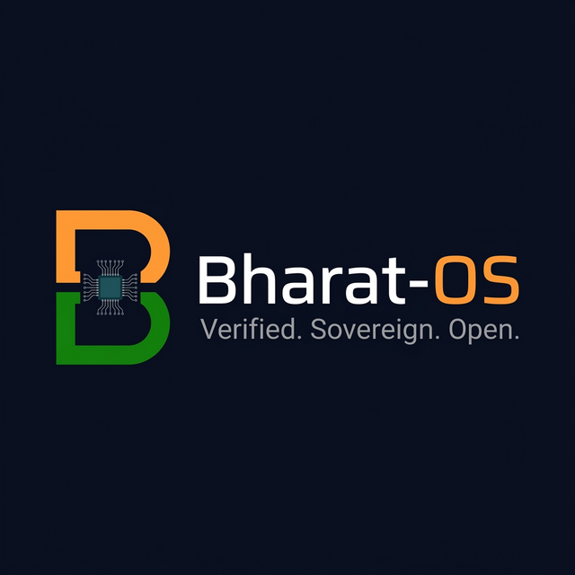
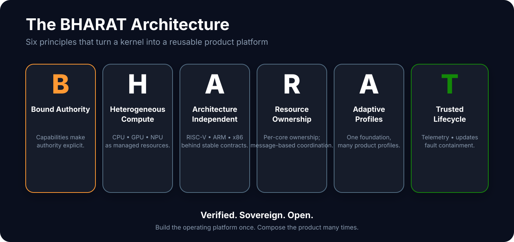
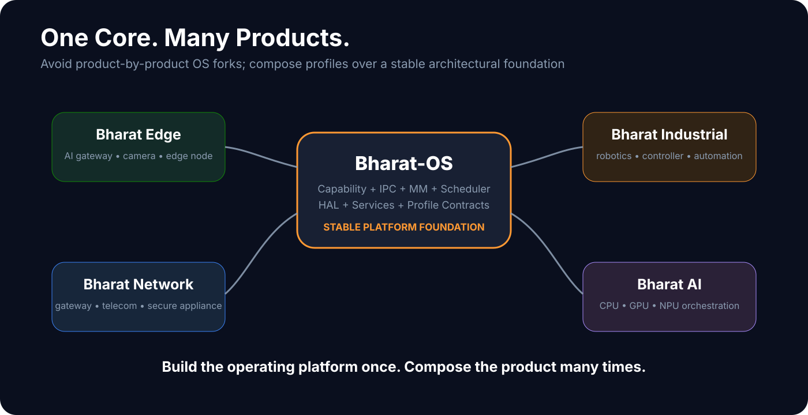
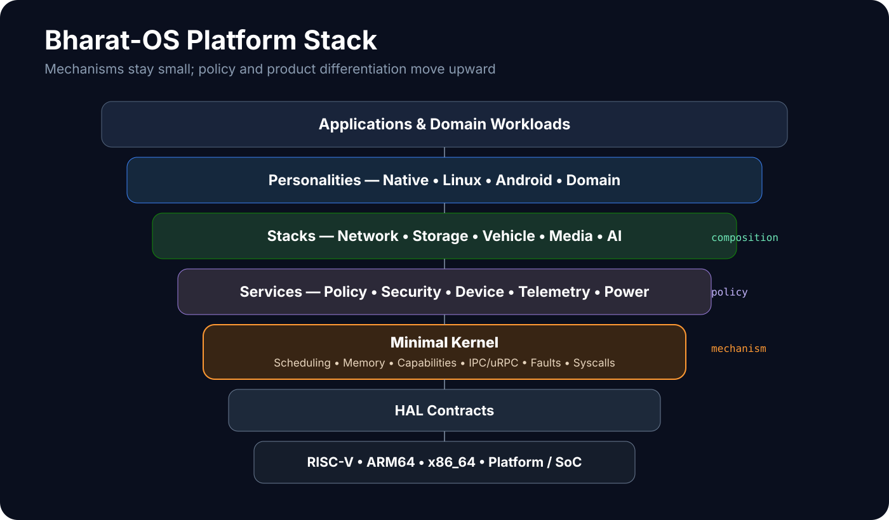
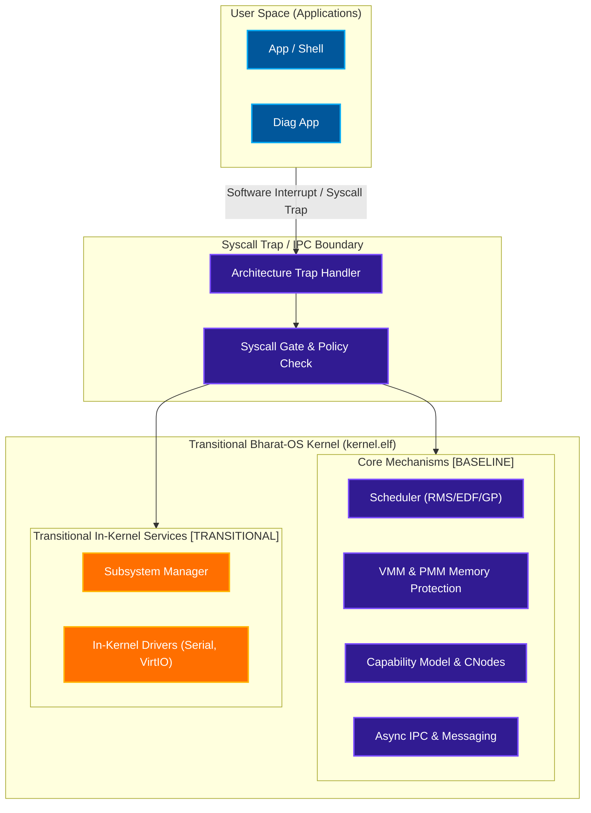
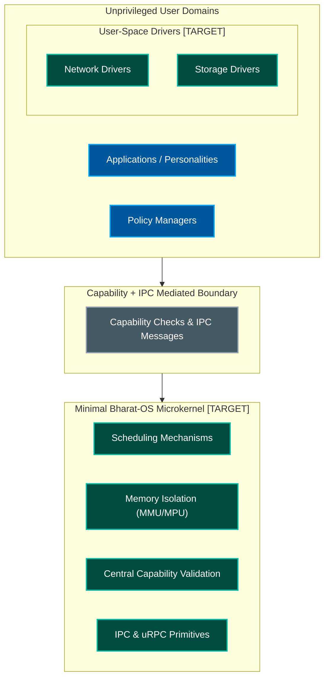
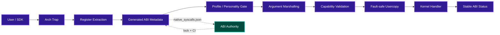

<p align="center">
  
</p>

<p align="center">
  
  
  
</p>

<p align="center">
  <strong>A capability-secure, composable operating platform for software-defined edge systems.</strong>
</p>

<p align="center">
  <strong>Verified. Sovereign. Open.</strong>
</p>

<p align="center">
  <em>Build the operating platform once. Compose the product many times.</em>
</p>

---

## 🧭 Why Bharat-OS?

Computing at the edge is changing. Modern systems increasingly combine CPUs, GPUs, NPUs, high-speed networking, sensors, real-time workloads, and continuously updated software.

Building these products today often requires stitching together a legacy OS or RTOS, proprietary vendor BSPs, separate accelerator runtimes, security components, isolated networking stacks, telemetry agents, update systems, and hundreds of product-specific patches:

```text
Linux / RTOS
   +
vendor BSP
   +
vendor GPU runtime
   +
vendor NPU runtime
   +
security daemon
   +
network services
   +
OTA mechanism
   +
custom process supervisor
   +
custom telemetry
   +
product-specific scheduler tuning
   +
hundreds of device-specific patches
```

Bharat-OS explores a different model: **make the operating platform itself reusable.**

Instead of creating separate, unrelated device-specific forks, Bharat-OS separates core system mechanisms from unprivileged policies:
- A small, mechanism-focused kernel provides scheduling, memory protection, capability validation, and IPC.
- High-level platform orchestration and security decisions live in unprivileged services.
- Domain-specific functionality is composed cleanly through reusable stacks and compatibility runtimes (personalities).
- Hardware differences are isolated behind clean architecture layers, HAL contracts, and platform drivers.

The goal is not to write a separate OS fork for every new device. **The goal is one stable architectural foundation from which many distinct products can be composed.**

---

## 🛡️ The BHARAT Architecture

The core of Bharat-OS is built upon six foundational pillars that form the BHARAT acronym:

<p align="center">
  
</p>

### B — Bound Authority
Access is capability-mediated. Every operation's authority explicitly identifies the target object, specific rights, scope, and lifetime rather than depending on ambient or broad supervisor privilege.
*(Note: Complete, system-wide capability enforcement across all async IPC paths is an ongoing target architecture under active hardening; our transitional image currently uses boot-time configurations as we close these gates.)*

### H — Heterogeneous Compute
Bharat-OS treats CPUs, GPUs, NPUs, DSPs, high-speed NICs, and domain accelerators as first-class managed resources rather than isolated or opaque peripherals. The platform strictly enforces a clean architectural separation:
* **Kernel:** Focuses strictly on deterministic execution mechanisms, queue registers, memory isolation, and IPC/uRPC primitives.
* **Drivers:** Handle unprivileged low-level device and register control.
* **Services:** Manage accelerator placement, scheduling policy, failover governance, power, and thermal decisions.
* **Runtime:** Handles high-level analytical models, graph compilation, and unprivileged execution backends.

### A — Architecture Independent
Stable, unified HAL and trap boundaries separate common operating mechanisms from ISA-specific and SoC-specific implementations.

```text
                 Bharat-OS
                     │
                    HAL
              ┌──────┼───────┐
              │      │       │
           RISC-V   ARM64   x86-64
              │      │       │
              └──── Platform / SoC
```

### R — Resource Ownership
Mutable kernel and platform resources must have explicit single-cpu owners. Cross-core state manipulation and scheduling actions are strictly coordinated through fixed-size, allocation-free, by-value command rings (uRPC/MPSC) rather than arbitrary remote lock mutations:

```text
CPU 0                     CPU 1
┌─────────────┐          ┌─────────────┐
│ Runqueue 0  │          │ Runqueue 1  │
│ CPU0 owns   │          │ CPU1 owns   │
└──────┬──────┘          └──────┬──────┘
       │                         │
       └──── commands / uRPC ────┘
```
*(Note: Per-core scheduler ownership, bounded TLB shootdown hardening, and PMM ownership are P0 architectural invariants actively being locked and verified in our current roadmap to guarantee fault isolation.)*

### A — Adaptive Profiles
A single architectural foundation allows you to select and load different unprivileged services, power-management policies, and protocol stacks for different product classes without contaminating the core build or spawning divergent kernel source forks.

### T — Trusted Lifecycle
Product trust extends far beyond secure boot. Continuous runtime health telemetry, fault containment, secure unprivileged updates (A/B rollbacks), and long-term security maintenance are integrated directly into the platform architecture to ensure edge devices remain securely operable for years.

---

## 📦 One Core. Many Products.

Bharat-OS is designed for efficient, profile-driven composition. Different unprivileged policies, protocol stacks, and services are composed over a stable, unified kernel mechanism foundation:

<p align="center">
  
</p>

| Profile | Focus & Initial Emphasis |
|---|---|
| **Bharat Edge** | Secure edge gateways, unprivileged AI inference, connectivity, and continuous health telemetry. |
| **Bharat Network** | Unprivileged routing, secure high-throughput storage, isolated network protocol paths. |
| **Bharat Industrial** | Deterministic robotic execution, unprivileged sensor/actuator polling, industrial controllers. |
| **Bharat AI** | Safe unprivileged CPU/GPU/NPU orchestration, model-graph isolation, unprivileged compute backends. |
| **Bharat Safety (Future)** | Planned high-assurance profiles targeting specialized functional safety models. |
| **Bharat Automotive (Future)** | Planned profile targeting mixed-criticality unprivileged automotive domain isolation. |

*Note: Profiles denote strategic product and design directions. Code-level composition is configured via build-time preset configurations; check the current project status for available platform components.*

---

## 🏛️ Platform Architecture

Bharat-OS defines a strict, layered architectural model where policies move upward and hardware details are cleanly isolated below:

<p align="center">
  
</p>

1. **Applications & Domain Workloads:** Unprivileged, isolated domain applications and user services.
2. **Personalities:** Expose compatibility or domain interfaces (such as Native, Linux, or Android runtimes) unprivileged in user space, isolating guest environments from kernel internals.
3. **Stacks:** Reusable platform middleware and protocol stacks (Network, Storage, Vehicle, Media, AI).
4. **Services:** Core unprivileged platform services managing system-wide policy, security, devices, telemetry, and power decisions.
5. **Minimal Kernel:** Ring-0 core strictly containing mechanism-focused scheduling, memory isolation, capability validation, and IPC/uRPC primitives.
6. **HAL & Hardware Contracts:** Clean abstractions separating common kernel execution from ISA and platform differences (RISC-V, ARM64, x86_64).

---

## 🟢 Engineering Maturity — Evidence, Not Claims

We enforce strict, evidence-based governance to ensure that code, build graphs, and documentation derive from the same single source of truth. Below is the dynamically generated component maturity status:

### Maturity Legend
* 🟢 **BASELINE:** Implemented, verified, and backed by automated baseline testing or formal design evidence.
* 🟡 **PARTIAL:** Working functional path exists, but production-critical or blocking work remains.
* 🟠 **TRANSITIONAL:** Temporary implementation or scaffolding used during active architecture migration.
* ⚪ **SCAFFOLD:** Structural interface exists; runtime behavior remains incomplete.
* 🔵 **TARGET:** Planned architectural destination; not yet available in current runtime execution.

<!-- START MATURITY TABLE -->

| Component Name | Maturity Level | Evidence / Verification Path | Key Blockers / Remarks |
|---|---|---|---|
| Native Syscall Boundary | 🟢 **BASELINE** | `quality/tests/test_trap_syscall.c` | None |
| Unified 12-Byte Usercopy & Exception Table | 🟢 **BASELINE** | `core/arch/x86/x86_64/usercopy.c, docs/architecture/exception-table-contract.md` | None |
| Metadata-Driven ABI Lock | 🟢 **BASELINE** | `tools/abi/syscall_abi.py` | None |
| Architecture Layer Linter | 🟢 **BASELINE** | `tools/lint/check_layer_references.py` | None |
| CMake Target-Dependency Linter | 🟢 **BASELINE** | `tools/lint/check_cmake_dependencies.py` | None |
| Network Manager (netmgr) | 🟡 **PARTIAL** | `core/services/netmgr` | Production blocking receive |
| Process Manager (process_mgr) | ⚪ **SCAFFOLD** | `core/services/process_manager` | Real ELF execution loading |
| Virtual Memory Manager (vm_mgr) | ⚪ **SCAFFOLD** | `core/services/vm_manager` | On-demand page-pool orchestration |

<!-- END MATURITY TABLE -->

---

## 🎨 Architecture Reality: Current, Transitional and Target

To maintain complete architectural honesty, our engineering layers are explicitly mapped across our transitional state, target state, and native syscall boundaries.

### 1. Current Implementation (TRANSITIONAL)
*This represents today's runtime reality. High-level subsystems are statically linked into the kernel executable for bring-up, but remain modular to prepare for full unprivileged separation.*


```mermaid
graph TD
    classDef baseline fill:#311b92,stroke:#7c4dff,stroke-width:2px,color:#fff;
    classDef transitional fill:#ff6f00,stroke:#ffb300,stroke-width:2px,color:#fff;
    classDef userspace fill:#01579b,stroke:#03a9f4,stroke-width:2px,color:#fff;

    subgraph Userspace ["User Space (Applications)"]
        App1["App / Shell"]:::userspace
        App2["Diag App"]:::userspace
    end

    subgraph TrapGate ["Syscall Trap / IPC Boundary"]
        Trap["Architecture Trap Handler"]:::baseline
        Gate["Syscall Gate & Policy Check"]:::baseline
    end

    subgraph KernelImage ["Transitional Bharat-OS Kernel (kernel.elf)"]
        direction TB
        subgraph CoreMech ["Core Mechanisms [BASELINE]"]
            Sched["Scheduler (RMS/EDF/GP)"]:::baseline
            MM["VMM & PMM Memory Protection"]:::baseline
            CapTable["Capability Model & CNodes"]:::baseline
            IPCMsg["Async IPC & Messaging"]:::baseline
        end
        subgraph TransServices ["Transitional In-Kernel Services [TRANSITIONAL]"]
            SubsysMgr["Subsystem Manager"]:::transitional
            Drivers["In-Kernel Drivers (Serial, VirtIO)"]:::transitional
        end
    end

    Userspace -->|Software Interrupt / Syscall Trap| Trap
    Trap --> Gate
    Gate --> CoreMech
    Gate --> TransServices
```

### 2. Target Architecture (TARGET)
*This represents our production architectural goal: a minimal microkernel with unprivileged user-space driver isolation and capability-mediated services.*


```mermaid
graph TD
    classDef target fill:#004d40,stroke:#00bfa5,stroke-width:2px,color:#fff;
    classDef boundary fill:#455a64,stroke:#90a4ae,stroke-width:2px,color:#fff;
    classDef unpriv fill:#01579b,stroke:#03a9f4,stroke-width:2px,color:#fff;

    subgraph Userspace ["Unprivileged User Domains"]
        App["Applications / Personalities"]:::unpriv
        Pol["Policy Managers"]:::unpriv
        subgraph UnprivDrivers ["User-Space Drivers [TARGET]"]
            UD1["Network Drivers"]:::target
            UD2["Storage Drivers"]:::target
        end
    end

    subgraph CapBoundary ["Capability + IPC Mediated Boundary"]
        CapIPC["Capability Checks & IPC Messages"]:::boundary
    end

    subgraph Microkernel ["Minimal Bharat-OS Microkernel [TARGET]"]
        direction LR
        S["Scheduling Mechanisms"]:::target
        M["Memory Isolation (MMU/MPU)"]:::target
        C["Central Capability Validation"]:::target
        I["IPC & uRPC Primitives"]:::target
    end

    Userspace --> CapBoundary
    CapBoundary --> Microkernel
```

### 3. Syscall Trust Boundary (NATIVE SYSCALL BOUNDARY)
*Our metadata-driven syscall dispatch enforces a strict security perimeter, incorporating contract verification and fault-safe user-copying.*


```mermaid
flowchart LR
    classDef step fill:#311b92,stroke:#7c4dff,stroke-width:2px,color:#fff;
    classDef authority fill:#004d40,stroke:#00bfa5,stroke-width:2px,color:#fff;

    A["User / SDK"]:::step --> B["Arch Trap"]:::step
    B --> C["Register Extraction"]:::step
    C --> D["Generated ABI Metadata"]:::step
    D --> E["Profile / Personality Gate"]:::step
    E --> F["Argument Marshalling"]:::step
    F --> G["Capability Validation"]:::step
    G --> H["Fault-safe Usercopy"]:::step
    H --> I["Kernel Handler"]:::step
    I --> J["Stable ABI Status"]:::step

    D -. "native_syscalls.json" .-> K["ABI Authority"]:::authority
    K -. "lock + CI" .-> D
```

---

## 🏷️ Device Profiles & Deep Use-Cases

Bharat-OS targets specific, profile-driven execution models. While functional safety certifiability (Automotive ADAS, Aerospace, Medical) is a long-term architectural destination, our current practical engineering focus is on unprivileged secure edge, network, and AI appliances:

* **Autonomous Driving & ADAS:** [ADAS Use-case](docs/vision/adas-autonomous-driving.md)
* **Industrial & Robotic Controllers:** [Industrial Use-case](docs/use-cases/industrial-control.md)
* **Aerospace Flight Computers:** [Aerospace Use-case](docs/use-cases/aerospace-systems.md)
* **Digital Cockpit & Infotainment:** [Digital Cockpit Use-case](docs/use-cases/digital-cockpit-infotainment.md)
* **Gateway ECUs:** [Gateway Use-case](docs/use-cases/gateway-ecus.md)
* **AI-Driven Resource Management:** [AI-Driven Scheduling](docs/research/ai-driven-resource-management.md)

---

## 🗂️ Repository Directory Map

Bharat-OS utilizes a structured, zone-based repository organization. All components reside in explicit functional zones:

```text
├── core/                    # Kernel and core runtime mechanisms
│   ├── arch/                # Architecture-specific trap, boot, and GPR memory helpers
│   ├── boot/                # Boot adapters (FDT, UEFI, Multiboot2, OpenSBI)
│   ├── hal/                 # Hardware Abstraction Layer (CPU, Timer, Interrupts)
│   ├── kernel/              # Minimal microkernel mechanisms (MM, Sched, Cap, Trap)
│   ├── lib/                 # Standalone core helper libraries (base string, status)
│   ├── drivers/             # Modular device driver registry and transitional drivers
│   ├── services/            # Unprivileged core platform services (network, storage)
│   ├── stacks/              # Reusable protocol stacks (CAN, network, UI, vehicle)
│   └── personalities/       # Target compatibility personalities (Native, Linux, Android)
├── interface/               # Unified contracts, SDK headers, and UAPI
│   ├── contracts/           # Single-source-of-truth metadata (native_syscalls.json)
│   ├── include/             # Stable public headers (rights, syscall numbers)
│   └── sdk/                 # SDK runtime bindings and interfaces
├── experience/              # User-space applications and demonstration workloads
│   └── user/                # Interactive shells, diagnostics, and SDK sample apps
├── quality/                 # Test suites, static configurations, and benchmarking
│   └── tests/               # Broad end-to-end, host-based, and unit tests
├── delivery/                # Target configurations and release packaging
│   ├── status/              # Components maturity manifest (components.yaml)
│   └── targets/             # QEMU configurations, maturity matrices, and presets
└── tools/                   # Build orchestrators, ABI checkers, and validators
```

---

## 🚀 Build & Run Quick Start

We provide fully standardized wrapper scripts for WSL/Linux, macOS, and Windows.

### Prerequisites (WSL/Linux/Ubuntu)
```bash
sudo apt update && sudo apt install -y \
  python3 cmake ninja-build clang lld llvm qemu-system-x86 qemu-system-misc
```

### Daily Build Recipes (WSL/Linux/macOS)
```bash
# Configure, build, package, and launch x86_64 in headless QEMU (smoke test)
./build.sh all --target-yaml delivery/targets/qemu/x86_64_desktop_headless.yaml --smoke

# Run the complete RISC-V 64-bit platform
./build.sh all --target-yaml delivery/targets/qemu/riscv64_desktop_headless.yaml --smoke

# Run the complete platform test suite
python3 tools/run_qemu_matrix.py --headless --smoke
```

---

## 🛡️ Research & Verification References

- **Formal Verification Foundations:** See [Verification Scope](docs/architecture/verification-scope.md) and [ADR on ML Isolation](docs/adr/ADR-005-ml-stays-out-of-ring-0.md).
- **Exception Table Specification:** Read [Exception Table Contract](docs/architecture/exception-table-contract.md).
- **Project Structure Status:** Read [Project Structure Migration Status](docs/dev/project-structure-migration-status.md).

---

## 🤝 Contributing / License

For information on how to contribute to the project, please refer to our [Contributing Guide](CONTRIBUTING.md).

This project is licensed under the [MIT License](LICENSE). All brand and visual assets are licensed under [CC BY 4.0](delivery/assets/branding/brand-guide.md#asset-license).
