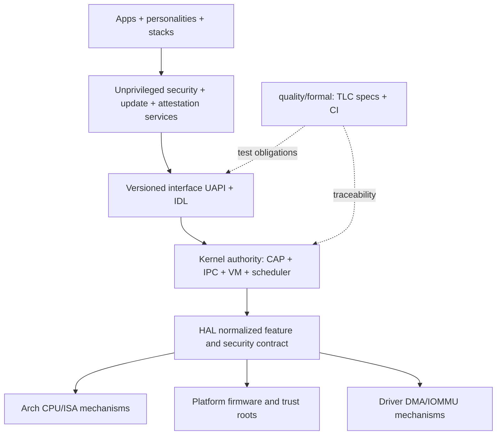

# Proposed architecture roadmap addendum: trust and verification spine
Status: PROPOSED, aligned to canonical live tree `core/`, `interface/`, `quality/`, `docs/` on developer branch; attached older folder-structure draft uses pre-migration root names.

## Core architecture contract
**Apps / personalities / stacks** → **unprivileged security, update and attestation services** → **versioned `interface/uapi` and `interface/idl`** → **kernel capability, IPC, VM and scheduling mechanisms** → **HAL neutral feature and trust-evidence contracts** → **arch primitives + platform/firmware trust + drivers**.

A hardware CPU feature is not a kernel authority. Capability possession and object state authorize operations; hardware tagging, CHERI pointer bounds, page protections, IOMMU and confidential guest features enforce orthogonal layers. User-space and remote cores cannot self-declare privileged principal identity, trust evidence or enabled hardware protection.

## Suggested canonical paths
```
docs/architecture/security/assurance-matrix.md
docs/architecture/security/sel4-semantic-delta.md
docs/architecture/security/hardware-capability-vs-authority.md
docs/architecture/security/confidential-guest-contract.md
docs/architecture/security/pqc-update-policy.md
docs/adr/ADR-VERIFY-001-verification-first.md
quality/formal/README.md
quality/formal/capability/{CapLifecycle.tla,MC.cfg}
quality/formal/ipc/{EndpointTransfer.tla,MC.cfg}
quality/formal/tlb/{Shootdown.tla,MC.cfg}
quality/tests/security/
core/hal/include/hal/hal_security_features.h     # proposed; avoid duplicate source of truth
core/services/security/attestation/               # proposed unprivileged policy
core/services/security/update/                    # proposed unprivileged lifecycle
```
No bulk directory moves. `core/arch/` owns ISA enablement; `core/platform/` owns real board/firmware evidence; HAL owns normalized detection and failure contracts; kernel owns mechanism only; services decide policy, verification of OTA payloads and attestation acceptance. New Rust services use the same versioned `interface` ABI.

## Invariants to machine-check
C1: authority granted to a child is subset of parent; C2: owner-core-only mutation, cross-core intent by message; C3: unique generation and epoch semantics prevent stale object use (including wrap handling); C4: completed revocation denies all descendants and in-flight invocations have a declared ordering; C5: transfer atomicity or compensating rollback; I1: IPC accepts only authorized endpoint/transfer; I2: queued messages have explicit revocation/receive semantics; T1: no reclamation before all required shootdown completion or safe aspace isolation; T2: ACK is bound to request, generation, and target. Distinguish safety from bounded completion and fairness assumptions.

## Assurance profiles
`BASELINE_SOFTWARE` is mandatory for all five target architectures. `HARDENED_ARM64_MTE`, `EXPERIMENTAL_CHERI_RV64`, `CONF_GUEST_*`, `PQC_UPDATE_*` are separate opt-in build/boot claims. `MMU_FULL`, `MMU_LITE`, `MPU` and `GP`, `RT`, `MIX` remain independent profile axes; unavailable functionality returns explicit unsupported status. Formal model parameters include core count, CSpace bounds, mailbox capacity and timeout/failure transitions.

## Diagram


## PR discipline
Every proposed security feature has state (design/scaffold/partial/baseline/hardware-validated), threat model, unsupported handling, acceptance test and claim-evidence links. Update `ROADMAP.md`, `docs/architecture/README.md`, `docs/architecture/verification-scope.md`, and source contracts in the same PR. Do not assert certification or complete proof from model checking alone.
