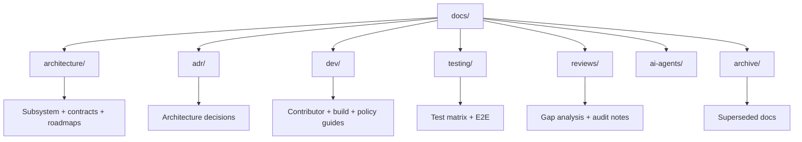

# Bharat-OS Documentation

This directory is the canonical documentation hub for Bharat-OS.

## Documentation Information Architecture

## Source-of-Truth Precedence

| Priority | Source | Why it wins |
|---|---|---|
| 1 | Accepted ADRs (`docs/adr/`) | Records explicit design decisions. |
| 2 | Contracts (`docs/architecture/contracts/`) | Defines stable interfaces/boundaries. |
| 3 | Subsystem architecture docs | Defines implementation direction. |
| 4 | Reviews / plans | Tracks gaps and execution details. |

## Directory Map

| Area | Purpose | Entry Point |
|---|---|---|
| `architecture/` | Core architecture, contracts, subsystems, profile plans | [`docs/architecture/README.md`](architecture/README.md) |
| `adr/` | Architecture Decision Records lifecycle + index | [`docs/adr/README.md`](adr/README.md) |
| `dev/` | Developer workflows, tooling, governance docs | [`docs/dev/developer_guidelines.md`](dev/developer_guidelines.md) |
| `testing/` | E2E and run-matrix guidance | [`docs/testing/run-matrix.md`](testing/run-matrix.md) |
| `ai-agents/` | Agent guardrails and templates | [`docs/ai-agents/README.md`](ai-agents/README.md) |
| `reviews/` | Gap assessments and architecture audits | [`docs/reviews/gap_analysis/latest_gap_analysis.md`](reviews/gap_analysis/latest_gap_analysis.md) |
| `archive/` | Historical/superseded material | [`docs/archive/README.md`](archive/README.md) |

## Standard Document Contract

Each Markdown document under `docs/` should include:

1. YAML frontmatter (`title`, `status`, `owner`, `last_updated`, `tags`, `see_also`).
2. Clear section hierarchy (`## Context`, `## Design/Decision`, `## Risks/Consequences`, `## References`) where applicable.
3. Explicit links to related docs via `see_also`.

## Status Vocabulary

| Status | Meaning |
|---|---|
| `Draft` | In progress, not yet accepted as baseline. |
| `Proposed` | Ready for review/decision. |
| `Accepted` / `Active` | Current approved baseline. |
| `Superseded` | Replaced by a newer authoritative doc. |

## Quick Start

- New contributors: start with [`docs/dev/developer_guidelines.md`](dev/developer_guidelines.md).
- Architecture deep dive: start with [`docs/architecture/README.md`](architecture/README.md).
- Decisions and rationale: use [`docs/adr/README.md`](adr/README.md).
- Validation pathways: use [`docs/testing/e2e-testing.md`](testing/e2e-testing.md).
