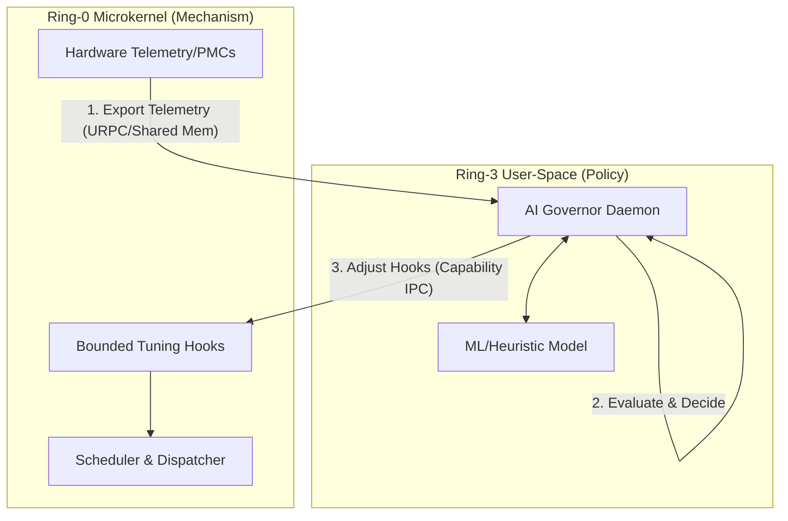

# ADR-005: ML Heuristics Kept Out of Ring-0

## Status

Accepted

## Context

Early architectural iterations proposed "AI-Native OS Scheduling," where Machine Learning Reinforcement Learning models (RL agents) were embedded completely inside the microkernel (Ring-0) to dynamically tune scheduling, paging, and I/O logic.

## Decision

**ML must stay entirely out of Ring-0.**
While the OS supports AI-aware tuning, we architecturally enforce a strict separation of Mechanism vs. Policy:

- **Mechanism (Ring-0)**: The microkernel exports rich hardware telemetry, performance counters, and bounded policy tuning hooks (e.g., setting a CPU timeslice coefficient or page eviction threshold).
- **Policy (Ring-3 User-Space)**: ML heuristic daemons (RL agents) run as unprivileged tasks in user-space. They observe the telemetry and invoke capabilities to adjust the bounded tuning hooks.

## Consequences

### Positive

- **Determinism**: Kernel code must be deterministic, bounded, verifiable, and simple to recover from failure. An AI black box directly inside the kernel scheduler would render the system unpredictable under load and impossible to debug.
- **Security**: The TCB remains extremely small. If the ML daemon crashes or behaves erratically, the kernel simply bounds the tuning knobs to safe defaults or restarts the daemon.
- **Formal Verification**: It preserves the mathematical verifiability of the core kernel.

### Negative

- **Latency**: Passing telemetry data out to Ring-3 and invoking a capability back into Ring-0 imposes minor latency compared to an unsafe, in-line Ring-0 function call.

## Implementation Details: Capability-Mediated IPC & Telemetry

To realize this decision, the AI Governor communicates with the microkernel via the established **Capability-based IPC Model**:

1. **Telemetry Acquisition**: Real-time telemetry (such as IPC latency, cache miss rates, and CPU usage, encapsulated in `kernel_telemetry_t`) is exposed to the user-space AI Governor via shared memory ring buffers or capability-mediated read endpoints. This avoids the cost of traditional syscall polling.
2. **Heuristic Evaluation**: The governor computes a penalty score using lightweight, configurable heuristics (prioritizing stable execution and boot reliability before engaging complex ML models).
3. **Suggestions via URPC**: When a threshold is met (e.g., high IPC latency indicating poor NUMA placement), the governor constructs an `ai_suggestion_t` message (e.g., `AI_ACTION_MIGRATE_TASK`) and transmits it via the **Lockless URPC messaging spine** (`mk_send_message`).
4. **Kernel Actuation**: The kernel receives this payload (≤ 64 bytes for the fast path) on a dedicated "Scheduler Control Endpoint." Because the interaction is guarded by capability tokens (`capability_t`), the kernel safely acts on the tuning recommendation without compromising strict isolation or deterministic execution.
