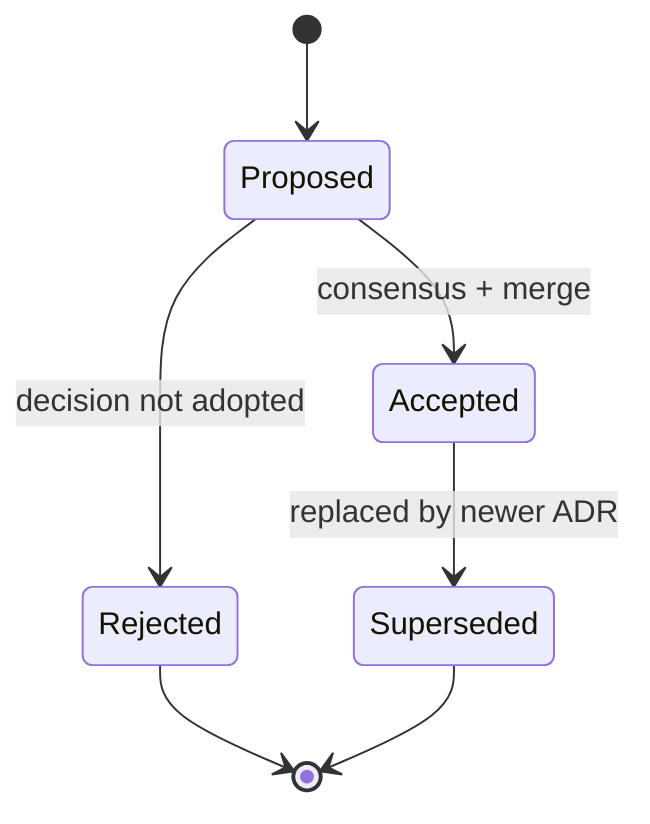

# ADR Guide and Index

`docs/adr/` is the canonical location for Bharat-OS Architecture Decision Records.

## ADR Lifecycle

## ADR Template Contract

Use this minimum structure for all new ADRs:

| Section | Required | Notes |
|---|---|---|
| Frontmatter | Yes | `title`, `status`, `owner`, `last_updated`, `tags`, optional `see_also`. |
| Context | Yes | What problem or force requires a decision? |
| Decision | Yes | The chosen approach, stated clearly. |
| Consequences | Yes | Trade-offs, risks, and follow-up work. |
| References | Recommended | Links to related ADRs / architecture contracts. |

## Naming Rules

- Preferred pattern: `ADR-XXX-short-title.md`.
- Legacy files with alternate numbering are retained for traceability.
- Do not renumber historical ADRs after merge.

## ADR Index

### Numbered ADRs

| ADR | Title | File |
|---|---|---|
| ADR-001 | Microkernel vs Hybrid | [`ADR-001-microkernel-vs-hybrid.md`](ADR-001-microkernel-vs-hybrid.md) |
| ADR-002 | Capability Model | [`ADR-002-capability-model.md`](ADR-002-capability-model.md) |
| ADR-003 | Multikernel Messaging | [`ADR-003-multikernel-messaging.md`](ADR-003-multikernel-messaging.md) |
| ADR-004 | Linux Personality First | [`ADR-004-linux-personality-first.md`](ADR-004-linux-personality-first.md) |
| ADR-005 | ML Stays Out of Ring 0 | [`ADR-005-ml-stays-out-of-ring-0.md`](ADR-005-ml-stays-out-of-ring-0.md) |
| ADR-006 | NUMA Awareness | [`ADR-006-numa-awareness.md`](ADR-006-numa-awareness.md) |
| ADR-007 | Experimental Scope | [`ADR-007-experimental-scope.md`](ADR-007-experimental-scope.md) |
| ADR-008 | Distributed VM Monitor and VM Spaces | [`008-distributed-vm-monitor-and-vm-spaces.md`](008-distributed-vm-monitor-and-vm-spaces.md) |
| ADR-008 | AI Scheduler Plugin Contract | [`ADR-008-ai-scheduler-plugin-contract.md`](ADR-008-ai-scheduler-plugin-contract.md) |
| ADR-009 | SDK Libc Strategy | [`009-sdk-libc-strategy.md`](009-sdk-libc-strategy.md) |
| ADR-009 | Documentation Status and Claims | [`ADR-009-documentation-status-and-claims.md`](ADR-009-documentation-status-and-claims.md) |
| ADR-010 | Distributed Kernel Ownership | [`ADR-010-distributed-kernel-ownership.md`](ADR-010-distributed-kernel-ownership.md) |
| ADR-011 | Structured Kernel Panic and Diagnostics | [`ADR-011-structured-kernel-panic-and-diagnostics.md`](ADR-011-structured-kernel-panic-and-diagnostics.md) |
| ADR-012 | CAN Subsystem Architecture | [`ADR-012-can-subsystem-architecture.md`](ADR-012-can-subsystem-architecture.md) |
| ADR-012 | Interrupt Controller Evolution | [`ADR-012-interrupt-controller-evolution.md`](ADR-012-interrupt-controller-evolution.md) |
| ADR-013 | Multikernel Memory Protection Architecture | [`ADR-013-multikernel-memory-protection-architecture.md`](ADR-013-multikernel-memory-protection-architecture.md) |
| ADR-014 | Library Layering and Data Structures | [`ADR-014-library-layering-and-data-structures.md`](ADR-014-library-layering-and-data-structures.md) |
| ADR-015 | Documentation Information Architecture | [`ADR-015-documentation-information-architecture.md`](ADR-015-documentation-information-architecture.md) |

### Functional ADR Extensions

| Topic | File |
|---|---|
| Allocation classes | [`ADR-allocation-classes.md`](ADR-allocation-classes.md) |
| Boot/runtime contract | [`ADR-boot-runtime-contract.md`](ADR-boot-runtime-contract.md) |
| Build presets by memory profile | [`ADR-build-presets-for-memory-profiles.md`](ADR-build-presets-for-memory-profiles.md) |
| Cross-core thread handoff | [`ADR-001-cross-core-thread-handoff.md`](ADR-001-cross-core-thread-handoff.md) |
| Memory core vs advanced VM split | [`ADR-memory-core-vs-advanced-vm-split.md`](ADR-memory-core-vs-advanced-vm-split.md) |
| Memory HAL unification | [`ADR-memory-hal-unification.md`](ADR-memory-hal-unification.md) |
| Memory profile gating | [`ADR-memory-profile-gating.md`](ADR-memory-profile-gating.md) |
