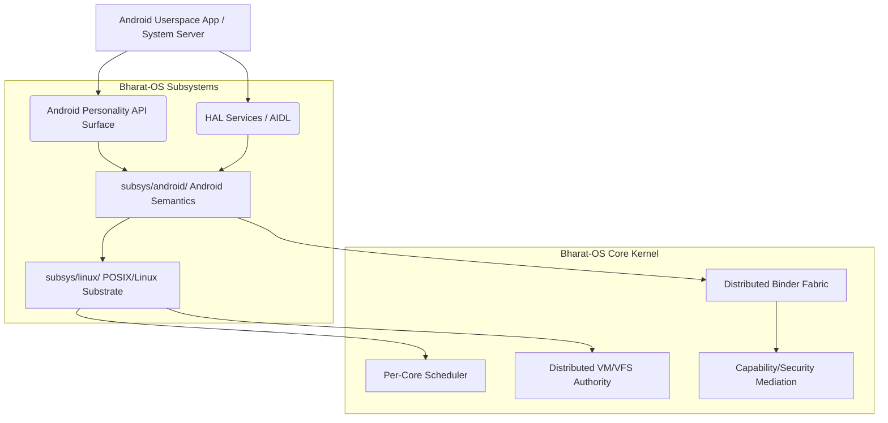
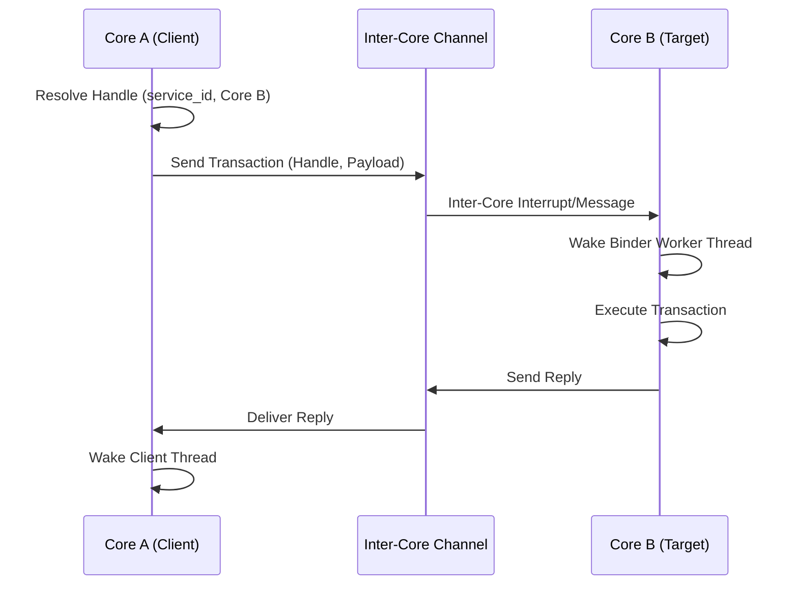
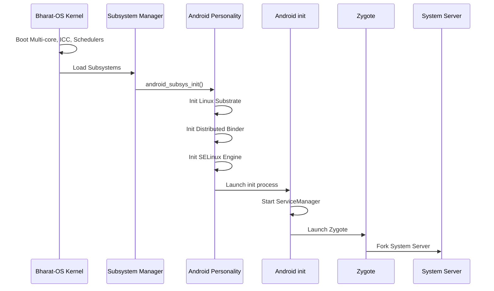

# Android Personality Architecture on Bharat-OS

## Goals and Non-Goals

**Goals**
*   Provide an **Android-compatible execution environment** as a personality subsystem on top of Bharat-OS multikernel primitives.
*   Preserve Android's user-visible semantics (process model, threads, Binder IPC, shared memory, SELinux policies, HAL interfaces, boot sequence).
*   Map Android's execution expectations to Bharat-OS's **per-core, message-based, and shard-aware** distributed kernel architecture without introducing global monolithic locks or data structures.
*   Rebuild Binder as a **distributed IPC fabric** suitable for multikernel deployments.
*   Leverage existing `subsys/linux/` POSIX-like implementations for baseline file, memory, and thread operations, extending them where Android requires specific behavior (e.g., Zygote COW semantics, Binder).

**Non-Goals**
*   Porting Android or Linux as a monolithic entity into the Bharat-OS kernel.
*   Creating a single, global kernel lock or global process/thread/runqueue tables.
*   Sharing raw memory pointers for distributed kernel objects across cores without capability and ownership checks.
*   Routing all Android services or Binder transactions through a single coordinator core.

## Relationship to the Multikernel Model

The Android personality is built as a **distributed compatibility subsystem** (`subsys/android/`) that wraps and extends `subsys/linux/`. It does not dictate kernel topology. Instead of shared-memory monolithic state, it enforces a two-level model:

1.  **Local Core Agents:** Each core manages its local thread table, local VM mappings cache, local wait queues, local Binder worker pool shard, and local scheduler.
2.  **Distributed Logical Objects:** "Processes," "Binder Services," and "File Handles" are **logical object IDs**, not directly shared in-memory C structs. These objects specify a `home_core`, `replica/cache state`, `capabilities/security label`, and `routing metadata`. State mutations are performed via message passing to the authoritative `home_core`.

### Component Boundary



## Per-Core Object Ownership Model

Global state is eliminated in favor of single-home ownership:

*   **Logical IDs:** Object identity is handled by globally unique IDs (e.g., a capability slot or generation ID), not memory addresses.
*   **Home-Core Authority:** Every process, memory mapping, or service has a designated "home core."
*   **Message-Based Mutation:** Other cores read locally replicated metadata. If they need to mutate an object, they must pass a message to the home core.

```mermaid
flowchart LR
    subgraph Core 0 (Home Core)
        A[Process Metadata]
        B[Binder Proc State]
        C[Credentials/Signals]
        D[Main MM Authority]
    end

    subgraph Core 1
        E[Thread 1] -. Message Passing .-> A
        E -. Cache Fault .-> D
    end

    subgraph Core 2
        F[Thread 2] -. Message Passing .-> A
    end
```

## Process Home-Core Model

Android processes are **single-home by default**, but threads can run on any core.

*   The process's main metadata (`task_struct` equivalent), main memory management (MM) authority, credentials, and signal state live strictly on the home core.
*   Child threads may migrate or be spawned on remote cores, but they must interact with process-global state via cross-core messages or capability-checked object IDs.
*   This ensures consistent semantics for `fork/clone`, `/proc` introspection, and SELinux subject labeling without locking bottlenecks.

## Binder-as-Distributed-IPC Model

Binder is fundamentally rebuilt from a global character device into a **distributed Binder fabric**.

*   **No Global Driver Queue:** Replaced with a **local binder node manager** per core and a **global logical service namespace**.
*   **Object IDs:** Binder handles are not raw pointers but `binder_handle = {service_id, home_core, generation, rights}`.
*   **Transaction Flow:**
    1.  Client on Core A invokes a Binder transaction.
    2.  Local front-end resolves the target handle to a `service_id` and a target `home_core`.
    3.  If remote, the payload is packaged as an inter-core message.
    4.  The remote core schedules a Binder worker thread in the target process.
    5.  The synchronous reply returns via the same distributed channel.



## Scheduler Contract for Android Personality

The Android personality does not use a single global runqueue. Instead, it maintains the Bharat-OS **per-core scheduler** but adds a distributed policy translation layer to fulfill Android's scheduling expectations.

*   **Local Runqueues:** Thread states and ready queues remain strictly per-core.
*   **Android Hints:** The personality translates Android priority/nice values and scheduling classes (e.g., UI/foreground, background, media pipeline) into Bharat-OS scheduling hints.
*   **Binder Priority Inheritance:** Priority propagation crosses core boundaries. The transaction message carries the caller's priority metadata, and the target core temporarily inherits this priority while executing the Binder worker.
*   **Service Placement:** Critical services like `system_server`, `surfaceflinger`, and `audioserver` are pinned to preferred clusters to ensure responsiveness.

## Memory Model: Zygote, Fork, COW, and Shared Buffers

Android relies heavily on Zygote for fast application startup via `fork()` and Copy-On-Write (COW).

*   **MM Authority:** Memory mapping authority belongs to the process's home core.
*   **Zygote/COW:** To support `fork` from Zygote efficiently, logical address space identity is decoupled from physical page ownership. COW state is tracked at the memory-object level, allowing fast page-sharing metadata creation.
*   **Shared Memory (Data Plane):** Large data payloads (Camera frames, Audio streams, Graphics buffers) do **not** flow through Binder message payloads. Instead, they use capability-backed shared memory regions (e.g., Ashmem, DMA-Buf replacements, FMQ).

```mermaid
flowchart LR
    A[Camera HAL (Core 1)] -->|Control (Binder)| B[Camera Service (Core 0)]
    A -->|Data (Shared FMQ Ring)| C[SurfaceFlinger (Core 2)]
    B -->|Control (Binder)| C
```

## SELinux / Security Mediation Model

Android requires strict MAC enforcement (SELinux).

*   **Distributed Label Enforcement:** Tasks, Binder transactions, and memory objects carry security labels/SIDs.
*   **Mediation:** Capability checks occur on the local fast-path using a cached policy. Cache misses trigger a remote authority lookup.
*   **Service Domains:** `init`-spawned services are correctly transitioned into their expected security domains during subsystem startup.

## HAL / Service Placement Model

Hardware Abstraction Layers (HALs) isolate the framework from drivers.

*   **Hardware Locality:** Driver services and their associated HAL endpoints are placed on the core or cluster physically closest to the hardware interrupt path.
*   **Stable Framework View:** The Android framework communicates with HALs via stable AIDL interfaces over the distributed Binder fabric, unaware of the underlying multi-core topology.
*   **Bulk Transport:** Sensor events or display buffers utilize hardware-local shared memory rings, minimizing cross-core memory coherence traffic.

## Boot Flow

The system bootstrap sequence transitions seamlessly from the multikernel to the Android personality:



## Phased Implementation Roadmap

*   **Phase 0 — Personality Framework & Ownership:** Define personality registration, task personality tags, logical IDs, and capability hooks.
*   **Phase 1 — Linux-Compatible Substrate:** Document and stub `clone`/thread models, futexes, `mmap` contracts, `epoll`, and signal/credential basics required by Android.
*   **Phase 2 — Distributed Binder:** Implement Binder object ID formats, local endpoints, cross-core transports, and priority inheritance metadata.
*   **Phase 3 — Zygote & Process Model:** Implement `fork`/COW via home-core authority, thread migration, and `/proc` facades.
*   **Phase 4 — Distributed SELinux:** Add task/service labeling and distributed policy enforcement.
*   **Phase 5 — Android HAL Bridge:** Host AIDL HAL services near hardware interrupts and provide FMQ shared channels.
*   **Phase 6 — Performance Polish:** Co-scheduling for Binder chains, zero-copy buffer improvements, and ICC doorbell optimizations.

## Risks, Assumptions, and Test Strategy

*   **Risk:** Emulating Zygote's COW across cores without distributed TLB shootdown bottlenecks.
    *   *Mitigation:* Keep Zygote forks local to clusters when possible, or rely on capability-based read-only mapping propagation.
*   **Risk:** Binder Priority Inversion across cores.
    *   *Mitigation:* Ensure the ICC layer passes priority metadata, allowing the target scheduler to preempt lower-priority tasks immediately upon message receipt.
*   **Test Strategy:**
    *   *Unit Tests:* Ensure logical IDs and handle resolution do not leak memory or raw pointers.
    *   *Integration Tests:* Spin up multiple cores, execute cross-core Binder transactions, and assert that priority metadata and reply paths function correctly.
    *   *Stress Tests:* Verify distributed COW sharing and shared-memory teardown paths under memory pressure.
