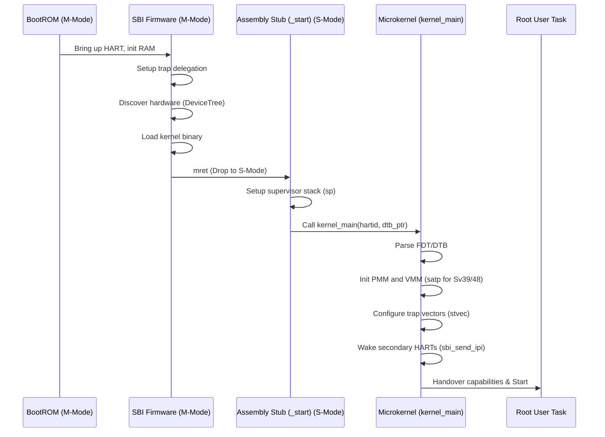

# Boot Flow: RISC-V (64-bit)

## Overview

Unlike x86, RISC-V enforces strict privilege levels (M-Mode, S-Mode, U-Mode). The Bharat-OS microkernel operates strictly in Supervisor Mode (S-Mode), offloading machine-level hardware initialization to the Supervisor Binary Interface (SBI) firmware.

## Sequence

1. **Hardware / BootROM (M-Mode)**: Initial silicon brings up the primary HART (Hardware Thread), initializes RAM, and jumps to the SBI firmware.
2. **SBI Firmware (OpenSBI / RustSBI) (M-Mode)**:
   - Sets up trap delegation so traps pass immediately down to the OS.
   - Discovers the hardware topology (DeviceTree).
   - Loads the Bharat-OS kernel binary into memory.
   - Issues an `mret` instruction, dropping privileges to S-Mode and jumping to the kernel's `_start`.
3. **Assembly Stub (`_start`) (S-Mode)**:
   - Sets up the supervisor stack (`sp`).
   - Captures the HART ID (`a0`) and DeviceTree pointer (`a1`) passed implicitly by the firmware.
   - Calls the C-level `kernel_main(hartid, dtb_ptr)`.
4. **Microkernel Initialization (`kernel_main`)**:
   - Parses the Flattened Device Tree (FDT or DTB) to map memory and MMIO devices.
   - Initializes the PMM and VMM, configuring the `satp` register for Sv39/Sv48 paging.
   - Configures S-Mode trap vectors (`stvec`).
   - Uses `sbi_send_ipi` `ecall` to wake up secondary HARTs (Multicore Boot).
   - Starts the Root User Task.
5. **Root Task Handover**: The capability system takes over execution, proceeding similarly to x86.

## Shakti BSP baseline (E/C/I class)

Current code includes a board-profile baseline used during early S-mode bring-up:

- `BHARAT_RISCV_SOC_PROFILE` selects `qemu-virt`, `shakti-e`, `shakti-c`, or `shakti-i` at configure time.
- `hal_init()` resolves a profile-specific BSP descriptor (UART/PLIC/CLINT/DRAM ranges) and stores it as active board config.
- `kernel_main(hartid, fdt_ptr)` now consumes OpenSBI boot arguments and passes them to HAL boot-info tracking.

This is intentionally a transition layer while full DTB parsing and page-table-backed MMIO mapping are completed.
