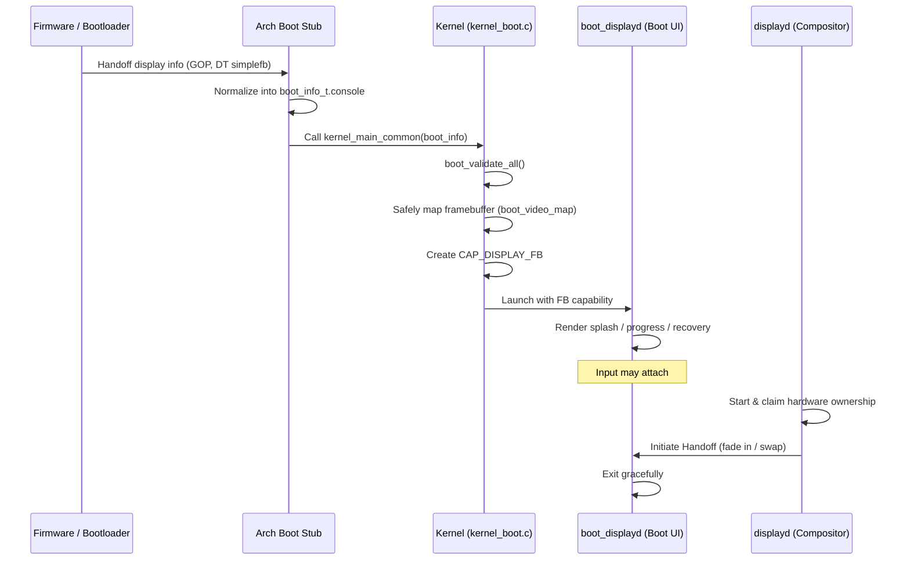

# Boot Display Architecture

**Bharat-OS boot graphics is a user-space, capability-mediated, machine-discovered subsystem that selects the best available display path at boot, while preserving text/serial fallback and keeping GUI policy out of the kernel.**

## 1. Design Goal

The system should answer one question at boot:
**"What is the best display path this machine supports right now?"**

Boot UI is a discovered capability, not a kernel feature and not just an architecture feature.
- **Architecture layer** provides CPU/MMU/cache/IRQ primitives.
- **Machine/board layer** describes available display hardware and firmware handoff.
- **Kernel** exposes resources and capabilities.
- **Boot display service** in user space renders the early UI.
- **Later display stack** takes over for embedded UI or desktop compositor.

---

## 2. Target Architecture (6-Layer Model)

### Layer A — Boot firmware / bootloader
Provides preinitialized framebuffers, mode information, device trees, ACPI tables, and simplefb/GOP-like handoffs.

### Layer B — Architecture layer
Provides primitive memory, caching, DMA, and interrupt support. Does not define GUI policy.

### Layer C — Machine / board layer
This is where truth lives. The board/machine layer describes if a display exists, if firmware provided a framebuffer, if early simplefb is possible, or if complex modesetting is needed.

### Layer D — Kernel resource handoff
The kernel parses boot display info, safely maps framebuffers, creates capability objects for them, and hands them off to a trusted user-space service. It keeps serial/text fallbacks alive.

### Layer E — `boot_displayd` user-space service
Small trusted service owning early graphics. Responsible for splash screens, progress bars, boot status text, and early recovery UIs. No hard requirement on GPU acceleration.

### Layer F — Final display stack
A richer stack (`displayd`, `compositor`) takes over for kiosk UIs, embedded shells, desktop compositors, GPU acceleration, and advanced input.

---

## 3. Runtime Boot UI Policy

The system uses a runtime decision engine picking the best available path across system profiles and hardware availability.

### Rule
`resolved_mode = min(requested_profile_mode, machine_max_supported_mode, build_enabled_mode);`

Preferences:
1. firmware framebuffer if valid
2. simple display controller early init
3. deferred graphics startup
4. text/serial fallback

---

## 4. Hardware Selection Logic

The machine layer probes paths and returns scores:
- firmware framebuffer: 90
- simplefb from DT: 80
- board early LCD init: 70
- deferred virtio-gpu: 50
- text mode: 20
- serial only: 10

The highest scoring valid path allowed by policy/profile is chosen.

---

## 5. Security Model

Early display service is trusted but bounded.
`boot_displayd` receives:
- Framebuffer capability
- Optional input capability
- Optional log/event endpoint

It does **not** get arbitrary MMIO or arbitrary DMA.

---

## 6. Handoff Lifecycle

### Stage 1 — Early boot
Firmware/board gives display info. The architecture-specific boot stub normalizes this into the canonical `boot_info_t` (specifically `boot_console_info_t`). The `kernel_main_common` flow (`boot_validate_all`, `boot_mode_resolve`) validates the structure and safely maps the framebuffer before creating the `CAP_DISPLAY_FB` capability and launching `boot_displayd`.

### Stage 2 — Boot UI active
Splash, progress, recovery rendered by `boot_displayd`. Input may attach if permitted by the current boot mode (e.g. `BOOT_MODE_NORMAL` vs `BOOT_MODE_RECOVERY`).

### Stage 3 — Final display service starts
`displayd` (the main compositor) starts and claims hardware ownership.

### Stage 4 — Boot display handoff
`displayd` reuses the same path (surface fade in) or replaces the path (reprograms hardware and swaps surface). `boot_displayd` exits.

---

## 7. Memory and MMU Rules

- Uncached or write-combine mappings for framebuffers.
- Explicit flush/invalidate helpers per arch.
- Avoid normal cached mappings unless proven safe.
- Physical contiguous framebuffers.
- DMA/display rules route through IOMMU/SMMU if available.

---

## 8. Phased Implementation Plan

- **Phase 0:** Architecture doc and contracts (Headers, UI state machine).
- **Phase 1:** x86_64 first (UEFI GOP, capabilities, `boot_displayd`).
- **Phase 2:** ARM64 (DT simple framebuffer, early board simplefb).
- **Phase 3:** RISC-V64 (DT simple framebuffer, virtio-gpu deferred).
- **Phase 4:** ARM32 and RISC-V32 (embedded UI path).
- **Phase 5:** Final handoff system (`boot_displayd` to `displayd`).
- **Phase 6:** Polish and hardening (crash-safe fallback, conversions).
