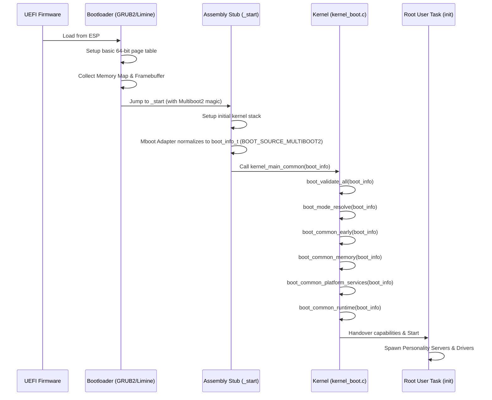

# Boot Flow: x86_64

## Overview

The x86_64 architecture is highly legacy-encumbered. Bharat-OS targets modern UEFI systems and relies on a Multiboot2-compliant bootloader (e.g., GRUB2 or Limine) to handle the initial switch to long mode.

## Sequence

1. **UEFI Firmware**: Initializes the hardware, maps standard ACPI tables, and loads the bootloader from the ESP (EFI System Partition).
2. **Bootloader (GRUB2/Limine)**:
   - Reads the ELF64 Bharat-OS kernel binary.
   - Searches for the `MULTIBOOT2_HEADER_MAGIC` embedded in the kernel image.
   - Sets up a basic 64-bit page table mapping the first few MBs of memory.
   - Collects the Memory Map (E820/UEFI GetMemoryMap) and Framebuffer details.
   - Jumps to the kernel entry point (`_start` in assembly).
3. **Assembly Stub (`_start`)**:
   - Sets up the initial kernel stack.
   - Captures the magic value and multiboot info pointer.
   - An architecture-specific boot source adapter parses the Multiboot2 tags and populates the canonical `boot_info_t` structure, normalizing physical memory regions and framebuffer details.
   - Calls the generic, C-level `kernel_main_common(boot_info)`.
4. **Microkernel Initialization (`kernel_boot.c`)**:
   - `boot_validate_all(boot_info)` validates the standardized structure.
   - Initializes the Physical Memory Manager (`mm_pmm_init`) and Virtual Memory Manager (`vmm_init`).
   - Initializes the local APIC and core interrupt vectors (`idt_init` via HAL).
   - `boot_mode_resolve(boot_info)` determines the boot profile (`BOOT_MODE_NORMAL`, `BOOT_MODE_DIAGNOSTIC`, etc.) and transitions to `boot_common_runtime`.
   - Starts the Idle Task and spawns the Root User Task (`init`).
5. **Root Task Handover**: The kernel gives the Root Task a capability encompassing all remaining physical memory, devices, and I/O ports. The Root Task then begins spawning Personality Servers and Drivers.
