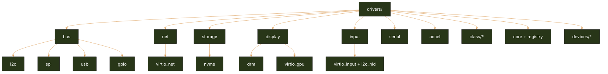

# Drivers Subcomponents Architecture (Repository-Aligned Status + Roadmap)

This document maps driver domains to the **current `drivers/` folder tree** and captures concrete convergence tasks.

## Current repository-aligned driver map

## Alignment with `folder_structure.md`

| Target bucket (folder_structure) | Current paths present | Alignment | Notes |
| --- | --- | --- | --- |
| `drivers/bus/` | `drivers/bus/{i2c,spi,usb,gpio,cluster_bus}` | Strong | Good base layout. |
| `drivers/net/` | `drivers/net/virtio_net` | Partial | Only virtio path is visible; physical NIC coverage pending. |
| `drivers/block/` + `drivers/storage/` | both exist (`block/virtio_blk`, `storage/nvme`) | Partial | Overlap indicates unresolved taxonomy between block vs storage. |
| `drivers/display/` | `drivers/display/{drm,virtio_gpu}` | Strong | Matches direction. |
| `drivers/input/` | `drivers/input/{virtio_input,i2c_hid}` | Strong | Matches direction. |
| `drivers/serial/` | multiple UART families | Strong | Good arch/vendor spread. |
| `drivers/accel/` | present but minimal | Scaffold | Control plane exists; hardware backends limited. |
| `drivers/class/*` | `class/{can,sensor,motor,actuator}` | Partial | Useful, but class-vs-bus boundary needs policy clarity. |

## Driver status matrix

| Driver domain | Current status | Evidence in tree | Next structural action | Roadmap linkage |
| --- | --- | --- | --- | --- |
| Bus drivers | Partial | `drivers/bus/*` populated | Add PCIe host + robust discovery glue for x86/arm64/riscv64. | Phase 1 |
| Network drivers | Partial | `drivers/net/virtio_net` | Add physical NIC implementations and capability-safe queue provisioning. | Phase 3 |
| Storage/block drivers | Partial | `drivers/block/virtio_blk`, `drivers/storage/nvme` | Decide canonical split (`block` frontend vs `storage` transport) and document ownership. | Phase 2, Phase 3 |
| Display drivers | Partial | `drivers/display/drm`, `virtio_gpu` | Promote from boot/display to compositor-ready path and memory fencing rules. | Phase 2, Phase 4 |
| Accelerator drivers | Scaffold | `drivers/accel/`, `drivers/devices/fpga_mgr` | Implement map/unmap lifecycle, IOMMU integration, and URPC queue contracts. | Phase 3 |
| Device classes | Partial | `drivers/class/{can,sensor,motor,actuator}` | Ensure class drivers delegate transport specifics to `bus/*` implementations. | Phase 2 |

## Coding tasks identified

1. **Resolve block/storage duplication:** publish a `drivers/block` vs `drivers/storage` contract and migrate one implementation path to avoid dual registration logic.
2. **Promote discovery stack:** add PCI/ACPI/FDT-aware bus discovery adapters for real hardware in addition to virtio-centric workflows.
3. **Class-driver contract hardening:** define class-driver registration + probing interfaces in `drivers/include/drivers/*` and require bus-agnostic class APIs.
4. **Accelerator maturity:** create common queue, fence, and DMA map APIs under `drivers/accel/` to remove per-device ad hoc flows.
