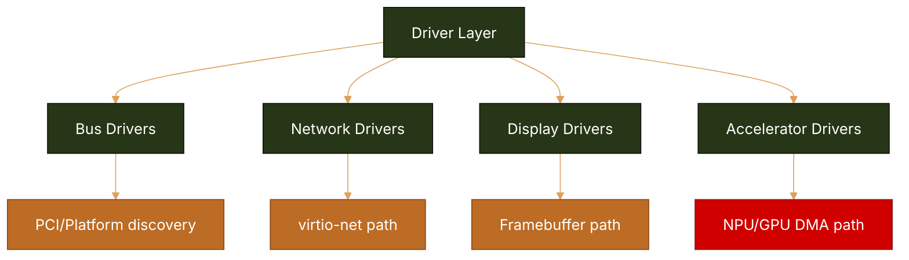
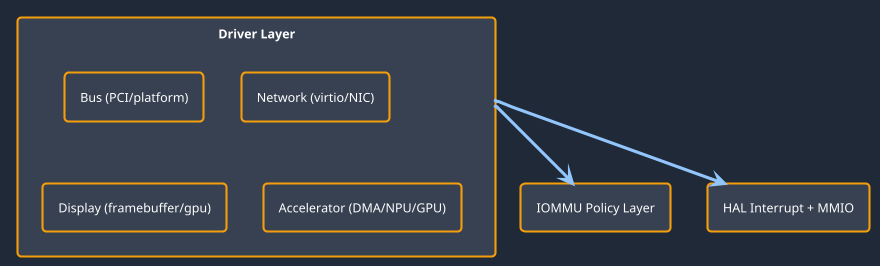

# Drivers Subcomponents Architecture (Status + Roadmap Mapping)

This document captures driver-layer decomposition with architecture concerns, current status, and next-step closure.

## Mermaid (driver architecture)

## PlantUML (driver layering)

## Driver status matrix

| Driver domain | Arch considerations | Current status | Done | To do | Roadmap linkage |
| --- | --- | --- | --- | --- | --- |
| Bus discovery and platform plumbing | x86 ACPI/PCI, arm64/riscv FDT paths | Partial | Baseline discovery hooks and driver entry points exist. | Improve validation depth and richer platform compatibility tests. | Phase 1 |
| Network drivers (virtio/NIC path) | x86/arm64/riscv virt platforms | Partial | Netstack integration path and adapter scaffolding exist. | Complete fast path, stability tests, and policy enforcement. | Phase 3 |
| Display drivers | Boot framebuffer across profiles | Partial | Boot display + framebuffer baseline path present. | Compositor-era pipeline and acceleration maturation. | Phase 2, Phase 4 |
| Accelerator drivers | DMA, NPU, GPU isolation | Scaffold | Manager and architecture intent documented. | Real map/unmap lifecycle, zero-copy pipelines, IOMMU depth. | Phase 3 |
| Storage drivers | Edge and cloud profile backends | Scaffold/Partial | Service and architecture contracts exist. | NVMe/flash maturity and recovery workflows. | Phase 2, Phase 3 |
