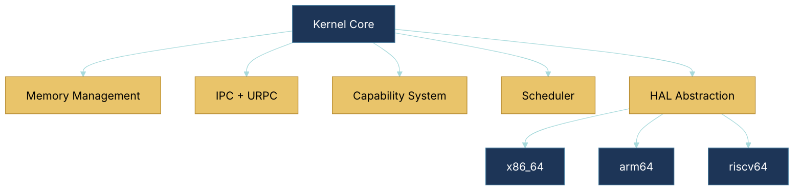
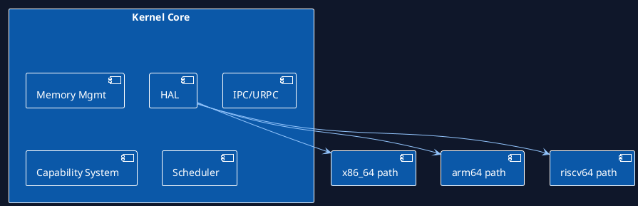

# Kernel Subcomponents Architecture (Status + Roadmap Mapping)

This document decomposes kernel subcomponents, architecture coverage, implementation status, and roadmap alignment.

## Themed Mermaid view

## Themed PlantUML view

## Subcomponent status and architecture detail

| Subcomponent | x86_64 | arm64 | riscv64 | Current status | What is done | What is next | Roadmap linkage |
| --- | --- | --- | --- | --- | --- | --- | --- |
| Memory management (PMM/VMM + MMU ops) | Present | Present | Present | Partial | Baseline page-table path and MMU interfaces exist. | TLB shootdown ack semantics, huge-page lifecycle, heap hardening. | Phase 1, Phase 3 |
| IPC/URPC | Present | Present | Present | Partial | Endpoint + URPC primitives in baseline direction. | Backpressure/failure handling, cross-node transport. | Phase 1, Phase 3 |
| Capability core | Present | Present | Present | Partial | Grant/delegate/revoke model direction in place. | Temporal/expiry controls, stronger policy proofs/audits. | Phase 1, Phase 4 |
| Scheduler + RT hooks | Present | Present | Present | Partial | Per-core scheduling direction and policy hooks. | Admission control depth (EDF/RMS), bounded AI influence. | Phase 1, Phase 2 |
| HAL contracts | Maturest | Active | Active | Partial | Multi-arch abstraction and bring-up paths exist. | Arch parity closure, validation depth, stronger platform tests. | Phase 1, Phase 3 |

## Implementation rule

- Keep architecture docs forward-looking.
- Keep implementation claims conservative and synchronized with `docs/current-code-status.md` and `ROADMAP.md`.
