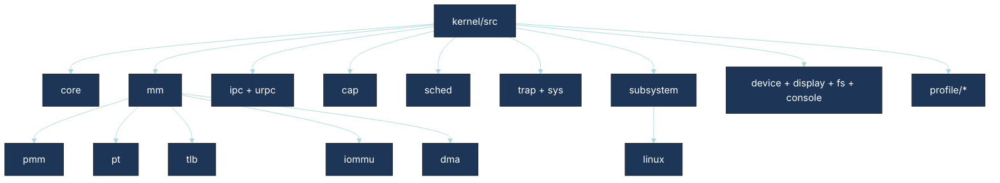

# Kernel Subcomponents Architecture (Repository-Aligned Status + Roadmap)

This document decomposes kernel subcomponents according to the **current `kernel/src` tree** and maps closure tasks.

## Repository-aligned kernel map

## Alignment with `folder_structure.md`

| Target kernel intent | Current paths present | Alignment | Notes |
| --- | --- | --- | --- |
| Minimal mechanism-focused core | `core`, `sched`, `mm`, `ipc`, `cap`, `trap`, `sys` | Strong | Core mechanisms are clearly represented. |
| Keep policy out of kernel | `kernel/src/profile/*`, `kernel/src/subsystem/linux` | Partial | Some profile/personality-like concerns still reside under kernel tree. |
| Capability + IPC primitives | `cap`, `ipc`, `urpc` | Strong | Matches architecture direction. |
| Memory authority and isolation | `mm/{vm,pt,pmm,dma,iommu,tlb}` | Strong | Good decomposition for MM evolution. |
| Hardware abstraction usage | via `hal/*` and arch paths | Partial | HAL tree still includes arch-specific directories, conflicting with strict abstraction guidance. |

## Kernel status matrix

| Subcomponent | Current status | Evidence in tree | Next structural action | Roadmap linkage |
| --- | --- | --- | --- | --- |
| Memory management | Partial | `kernel/src/mm/*` broad coverage | Complete huge-page lifecycle, TLB shootdown protocol proof tests, IOMMU authority boundaries. | Phase 1, Phase 3 |
| IPC + URPC | Partial | `kernel/src/ipc`, `kernel/src/urpc` | Unify backpressure/error contracts and cross-node routing semantics. | Phase 1, Phase 3 |
| Capability core | Partial | `kernel/src/cap` | Add formal derivation/revocation invariant checks in host tests. | Phase 1, Phase 4 |
| Scheduler | Partial | `kernel/src/sched` | Improve admission control + deterministic RT isolation proofs. | Phase 1, Phase 2 |
| Trap/syscall path | Partial | `kernel/src/trap`, `kernel/src/sys` | Tighten ABI surface to `uapi/` and remove internal header leakage. | Phase 1 |
| Subsystem/personality hooks | Partial | `kernel/src/subsystem/linux`, `kernel/src/profile/*` | Move policy-heavy profile logic toward `services/` or `personalities/` where possible. | Phase 2, Phase 4 |

## Coding tasks identified

1. **Kernel profile extraction audit:** evaluate each `kernel/src/profile/*` module for migration to `services/` (policy) vs retention in kernel (mechanism).
2. **Subsystem boundary cleanup:** define strict interfaces between `kernel/src/subsystem/linux` and `personalities/compat/linux` to avoid duplication.
3. **Capability correctness tests:** expand host-side invariant suites for grant/delegate/revoke edge cases.
4. **MM + IOMMU contract tests:** add integration tests validating DMA map/unmap, revoke ordering, and TLB synchronization.
