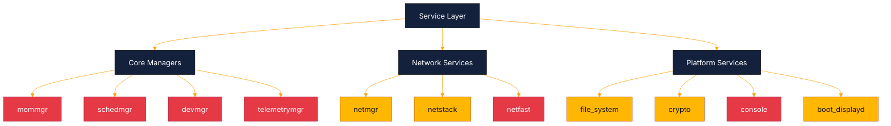
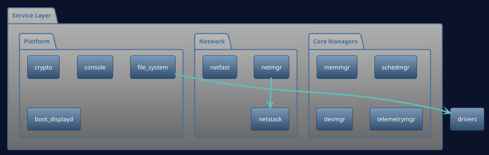

# Services Subcomponents Architecture (Status + Roadmap Mapping)

This document maps service domains to their current implementation maturity and roadmap closure path.

## Mermaid (service domain map)

## PlantUML (service groups)

## Service status matrix

| Service area | Current status | Done | To do | Roadmap linkage |
| --- | --- | --- | --- | --- |
| Core managers (`coremgr`, `memmgr`, `schedmgr`, `devmgr`, `storagemgr`, `faultmgr`, `telemetrymgr`) | Scaffold-heavy | Build wiring and service boundaries exist. | Implement stable event loops, IPC contracts, policy engines, and lifecycle integration. | Phase 1, Phase 2 |
| Naming/orchestration (`init`, `namesvc`, `servicemgr`) | Scaffold/Partial | Bootstrap and registry basics exist. | Production-ready capability-safe registration/discovery and orchestration control flow. | Phase 1 |
| Network (`netmgr`, `netstack`, `netfast`, legacy `net`) | Partial | Control-plane tables and protocol modules exist for net split. | Security enforcement, fast-path integration, daemon loop hardening, TCP/depth closure. | Phase 1, Phase 3 |
| Platform (`file_system`, `crypto`, `console`, `boot_displayd`) | Partial/Scaffold | VFS and crypto service skeleton plus boot display baseline exist. | Durable storage backend, full IPC transport, richer console/UX/runtime integration. | Phase 2, Phase 3 |
