# Services Subcomponents Architecture (Repository-Aligned Status + Roadmap)

This document maps the service layer to the **current repository structure** and highlights consolidation work needed to align with `docs/architecture/folder_structure.md`.

## Current repository-aligned service map

```mermaid
%%{init: {'theme':'base','themeVariables':{'primaryColor':'#14213d','primaryTextColor':'#ffffff','lineColor':'#fca311','fontFamily':'Inter'}}}%%
graph TB
    SV[services/] --> CORE[services/core/*]
    SV --> SYSTEM[services/system/*]
    SV --> DEVICE[services/device/*]
    SV --> NETWORK[services/network/* + net*]
    SV --> LEGACY[legacy flat managers]

    CORE --> INIT[core/init]
    CORE --> DEVMGR2[core/devmgr]
    CORE --> SUBSYSMGR[core/subsysmgr]

    SYSTEM --> CONSOLE[system/console]
    SYSTEM --> FS[system/filesystem]
    SYSTEM --> BOOTD[system/boot_displayd]
    SYSTEM --> DIAG[system/diag]
    SYSTEM --> SHELL[system/shell]

    DEVICE --> ACCELMGR[device/accelmgr]
    DEVICE --> INPUTMGR[device/inputmgr]
    DEVICE --> ACTUATOR[device/actuator_mgr]

    NETWORK --> NETMGR2[network/netmgr]
    NETWORK --> NETSTACK2[network/netstack]
    NETWORK --> NETMGR1[netmgr]
    NETWORK --> NETSTACK1[netstack]
    NETWORK --> NETFAST[netfast]

    LEGACY --> COREMGR[coremgr]
    LEGACY --> DEVMGR1[devmgr]
    LEGACY --> MEMMGR[memmgr]
    LEGACY --> SCHEDMGR[schedmgr]
    LEGACY --> TELEMETRY[telemetrymgr]
    LEGACY --> STORAGEMGR[storagemgr]
    LEGACY --> SERVICEMGR[servicemgr]
```

## Alignment with `folder_structure.md`

| Target bucket (folder_structure) | Current paths present | Alignment | Notes |
| --- | --- | --- | --- |
| `services/core/` | `services/core/init`, `services/core/devmgr`, `services/core/subsysmgr` | Partial | New hierarchy exists, but legacy flat managers still active in parallel. |
| `services/system/` | `services/system/console`, `boot_displayd`, `filesystem`, `diag`, `shell`, `footprintd` | Strong | Matches target intent. |
| `services/security/` | `services/security/crypto` | Partial | Crypto exists; keystore/identity services are not yet separated. |
| `services/device/` | `services/device/accelmgr`, `inputmgr`, `actuator_mgr` | Strong | Good separation for device policy managers. |
| `services/network/` | `services/network/netmgr`, `services/network/netstack` | Partial | Duplicate legacy net daemons remain (`services/netmgr`, `services/netstack`, `services/netfast`). |

## Service status matrix (implementation + structure)

| Service area | Current status | Evidence in tree | Next structural action | Roadmap linkage |
| --- | --- | --- | --- | --- |
| Core management | Partial | both `services/core/*` and flat `services/*mgr` | Converge all managers under `services/core/` with compatibility shims for include paths. | Phase 1 |
| Naming and orchestration | Partial | `services/namesvc`, `services/servicemgr`, `services/core/init` | Consolidate registry + orchestration contracts into a single `core/` namespace. | Phase 1 |
| Network control/data plane | Partial | parallel `services/network/*` and top-level `net*` services | Select canonical location (`services/network/*`) and deprecate duplicates. | Phase 1, Phase 3 |
| Platform-facing system services | Partial | `services/system/filesystem`, `console`, `boot_displayd` | Tighten IPC contracts and phase out ad-hoc direct couplings. | Phase 2 |
| Security services | Scaffold/Partial | `services/security/crypto` only | Add keystore, attestation, and policy service boundaries. | Phase 2, Phase 4 |

## Coding tasks identified

1. **Service tree consolidation:** move flat managers (`services/coremgr`, `services/devmgr`, `services/memmgr`, `services/schedmgr`, `services/storagemgr`, `services/telemetrymgr`) behind canonical `services/core/*` modules.
2. **Duplicate network path cleanup:** keep `services/network/netmgr` and `services/network/netstack` as canonical; convert `services/netmgr`, `services/netstack`, `services/netfast` into wrappers or remove after migration.
3. **Security boundary completion:** split `services/security/crypto` responsibilities into crypto provider vs key management service and define explicit IPC IDs in `idl/services/`.
4. **Header/API normalization:** update `services/include/services/*` headers to avoid stale include paths during migration.
