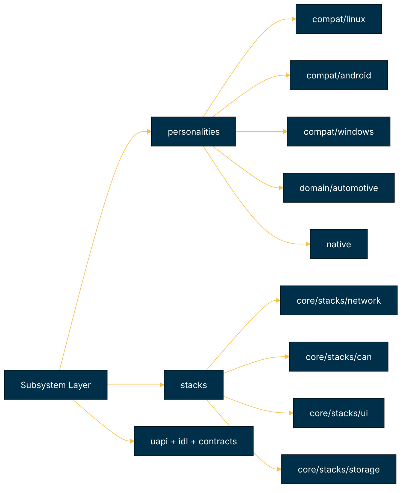

# Subsystem Subcomponents Architecture (Repository-Aligned Status + Roadmap)

This document tracks subsystem-level decomposition against the current repository layout (`core/personalities/`, `core/stacks/`, and core/kernel/service subsystem touchpoints).

## Repository-aligned subsystem view

## Alignment with `folder_structure.md`

| Target subsystem area | Current paths present | Alignment | Notes |
| --- | --- | --- | --- |
| `core/personalities/compat/*` | linux/android/windows present | Strong | Matches structure well. |
| `core/personalities/domain/*` | automotive present | Strong | Domain layering exists. |
| `core/personalities/common` | present | Strong | Shared utility bucket exists. |
| `core/stacks/*` composed subsystems | network/can/ui/storage present | Partial | Good start; ownership boundaries to core/services/drivers need tighter contracts. |
| Explicit contract boundary (`interface/uapi/`, `interface/idl/`) | both present | Partial | Needs stronger usage enforcement from implementations. |

## Subsystem status matrix

| Subcomponent | Current status | Evidence in tree | Next structural action | Roadmap linkage |
| --- | --- | --- | --- | --- |
| Linux personality | Partial | `core/personalities/compat/linux` + `core/kernel/src/subsystem/linux` | Reduce cross-layer duplication and centralize syscall adaptation ownership. | Phase 4 |
| Android personality | Partial | `core/personalities/compat/android` | Expand binder/runtime compatibility and ABI tests. | Phase 4 |
| Windows compatibility | Partial | `core/personalities/compat/windows` | Extend API coverage and behavioral parity tests. | Phase 4 |
| Automotive domain | Partial | `core/personalities/domain/automotive` | Align with CAN + actuator service flows and deterministic fault policy. | Phase 2 |
| Stack composition layer | Partial | `core/stacks/network`, `core/stacks/can`, `core/stacks/ui`, `core/stacks/storage` | Clarify which APIs are stack-internal vs exposed through `interface/uapi/idl`. | Phase 1, Phase 3 |
| Contract surfaces | Partial | `interface/uapi/*`, `interface/idl/{services,monitor,runtime}` | Enforce versioned interfaces in CI and prevent ad hoc private structs. | Phase 1 |

## Coding tasks identified

1. **Personality/subsystem deduplication:** reconcile linux subsystem hooks between kernel and `core/personalities/compat/linux`.
2. **Stack contract hardening:** add versioned IDL definitions for stack-facing interfaces currently expressed as internal headers.
3. **Subsystem ownership matrix:** document and enforce for each domain (core/kernel/core/services/core/stacks/personalities) to stop feature overlap.
4. **Compatibility test expansion:** add conformance suites for android/windows compatibility layers.
