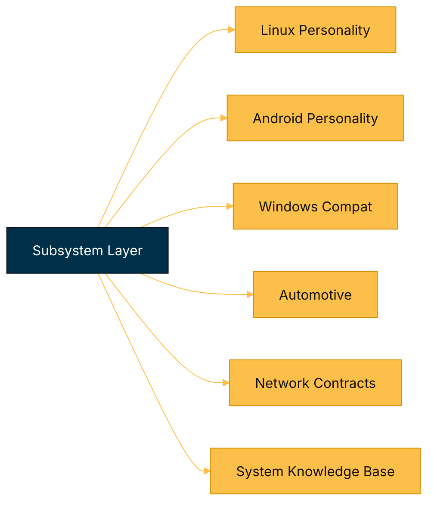
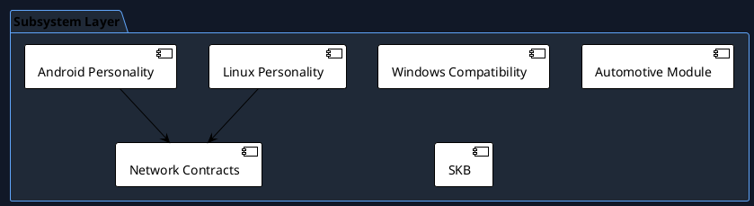

# Subsystem Subcomponents Architecture (Status + Roadmap Mapping)

This document tracks subsystem-level decomposition, status, and roadmap alignment.

## Mermaid (subsystem view)

## PlantUML (subsystem packaging)

## Subsystem status matrix

| Subcomponent | Scope | Current status | Done | To do | Roadmap linkage |
| --- | --- | --- | --- | --- | --- |
| Linux personality layer | Syscall/personality adaptation | Partial | Contract and compatibility scaffolding exists. | Syscall translation completeness and runtime conformance tests. | Phase 4 |
| Android personality layer | Android compatibility domain | Partial | Core module and architecture docs exist. | Binder/ashmem/runtime coverage expansion. | Phase 4 |
| Windows compatibility shims | API compatibility helpers | Partial | Compatibility shim structure is present. | Broader API depth and behavioral tests. | Phase 4 |
| Automotive subsystem | RT/automotive profile hooks | Partial | Module and profile intent exists. | Deterministic fault containment and RT validation suites. | Phase 2 |
| Network contracts (`subsys/network`) | Shared control/data contracts | Partial | Types/uAPI/contract headers available. | Runtime enforcement and policy integration depth. | Phase 1, Phase 3 |
| SKB and topology surfaces | Platform topology and routing hints | Partial | Base SKB direction exists in subsystem layer. | Better topology ingestion and runtime policy feedback loop. | Phase 1 |
