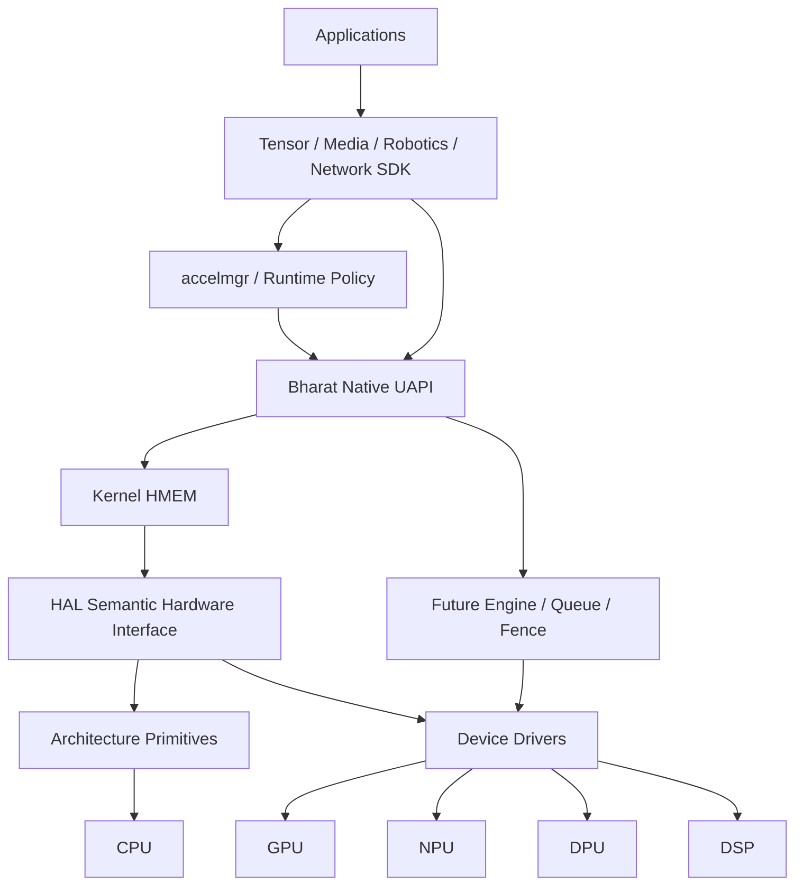
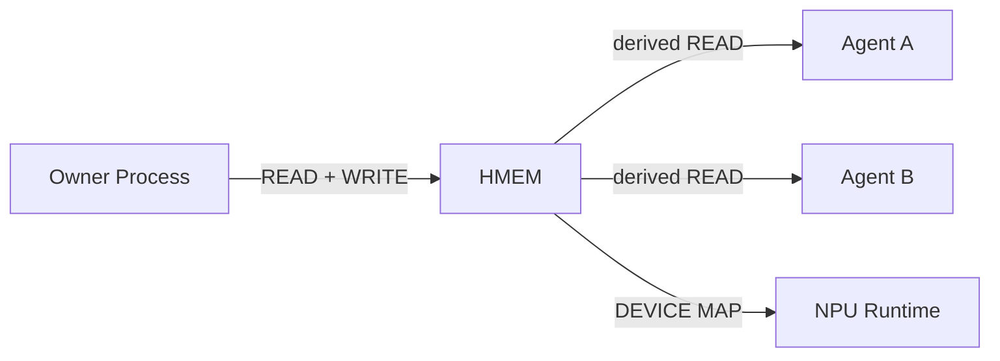

# Bharat Heterogeneous Compute Fabric Architecture

## Purpose
The purpose of this document is to explain the architecture of Bharat Heterogeneous Compute Fabric (BHCF), its layers, boundaries, and how it handles heterogenous memory processing gracefully.

## Problem
Modern systems increasingly contain many specialized processing engines beyond the CPU:

```text
CPU
GPU
NPU
DPU
DSP
video engines
crypto engines
DMA engines
FPGA/custom accelerators
```

Historically, treating every accelerator as an isolated device creates significant friction:

```text
duplicate memory management
unnecessary copies
vendor-specific memory objects
different queue models
different synchronization models
poor cross-device sharing
poor system-wide visibility
```

If a camera frame must be processed by an ISP, then an NPU, and then the CPU, a traditional application model might look like:
```text
malloc
  ↓
CPU buffer
  ↓ copy
GPU buffer
  ↓ copy
NPU buffer
  ↓ copy
CPU buffer
```

## Design

### Bharat's Approach

Bharat-OS addresses this with a unified object model via the Heterogeneous Memory (HMEM) primitive, ensuring the application operates on the same memory abstraction without redundant copying, providing hardware supports it.

```text
                 HMEM
                  │
       ┌──────────┼───────────┐
       │          │           │
      CPU        GPU         NPU
       │          │           │
       └──────────┼───────────┘
                  │
            same object
```

Hardware determines if this becomes:

```text
shared mapping
IOMMU mapping
SVA mapping
cache synchronization
peer mapping
DMA
physical migration
actual copy
```
The application does not need a different object model for each mechanism.

### Top-level architecture diagram



### Layer boundaries

*   **ARCH:** ISA-specific mechanics
*   **HAL:** portable hardware semantics
*   **Kernel:** protected object, lifetime, mappings, capability enforcement
*   **Driver:** accelerator-specific mechanisms
*   **Service:** placement/resource/QoS policy
*   **SDK/runtime:** Tensor/graph/application semantics

## Security Architecture



Capability attenuation rules apply:

```text
derived capability rights <= parent rights
```
Note: HMEM documentation should never imply global device-access authority.

## Cross-Architecture Support

HMEM means different things depending on the architecture, but application-level APIs do not change.

| Architecture | HMEM-visible architecture concerns                      |
| ------------ | ------------------------------------------------------- |
| x86_64       | coherency, barriers, IOMMU/device mappings              |
| ARM64        | cache maintenance, barriers, SMMU/device mapping        |
| ARM32        | constrained profiles, MMU-lite/MPU, noncoherent devices |
| RISC-V64     | CMO/coherency where available, IOMMU evolution          |
| RISC-V32     | constrained profiles, explicit safe fallbacks           |

The SDK API will not contain CPU/ISA checks as the abstraction layer handles this gracefully.

### MMU_FULL / MMU_LITE / MPU implications

Implementation details vary based on the MMU context:

*   **MMU_FULL:** Potential for rich VM mappings, IOMMU/SMMU, shared address-space techniques, large HMEM objects.
*   **MMU_LITE:** Potential for bounded mappings, smaller mapping tables, reduced dynamic VM behavior.
*   **MPU:** Potential for fixed/bounded regions, static HMEM pools, limited sharing/migration, fail-closed unsupported device mappings.

## Why this belongs in Bharat-OS

Bharat-OS stands out due to this specific combination of features:

```text
capability-scoped object
+
multiple memory profiles
+
heterogeneous architecture portability
+
explicit HAL coherency semantics
+
SDK Tensor abstraction
+
future unified accelerator execution
```

## Future Roadmap

```text
P0
HMEM
 │
 ▼
Tensor SDK

P1
HMEM
 │
 ├── ENGINE
 ├── FENCE
 └── QUEUE

P2
 │
 ├── DMA engine
 ├── Virtual NPU
 ├── GPU/NPU providers
 └── accelmgr

P3
 │
 ├── graph runtime
 ├── placement
 ├── QoS
 └── KV-cache service
```

*   **CURRENT**: HMEM, Tensor SDK.
*   **NEXT**: ENGINE, FENCE, QUEUE (P1).
*   **FUTURE**: DMA engine, Virtual NPU, GPU/NPU providers, accelmgr (P2). Graph runtime, placement, QoS, KV-cache service (P3).
