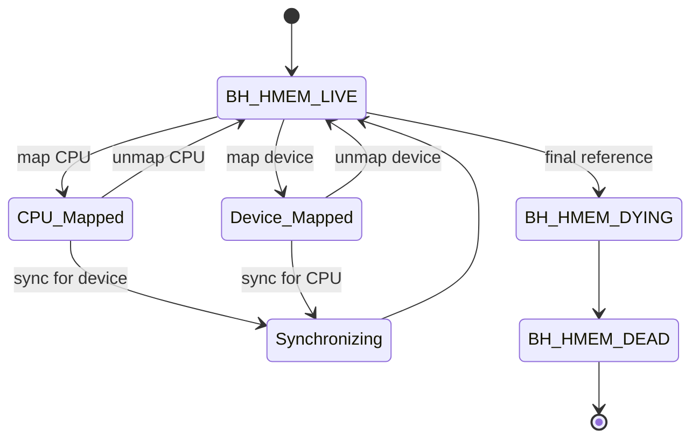
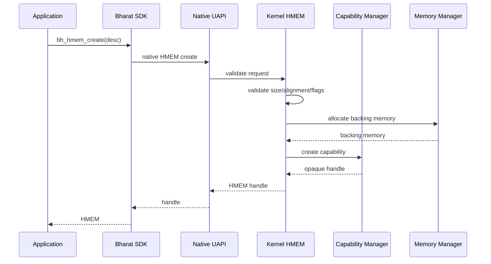
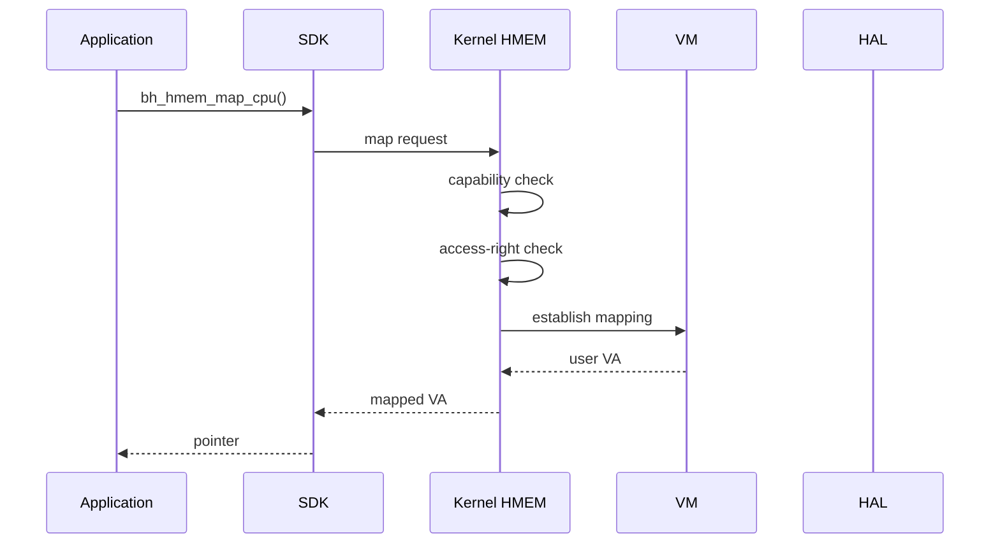
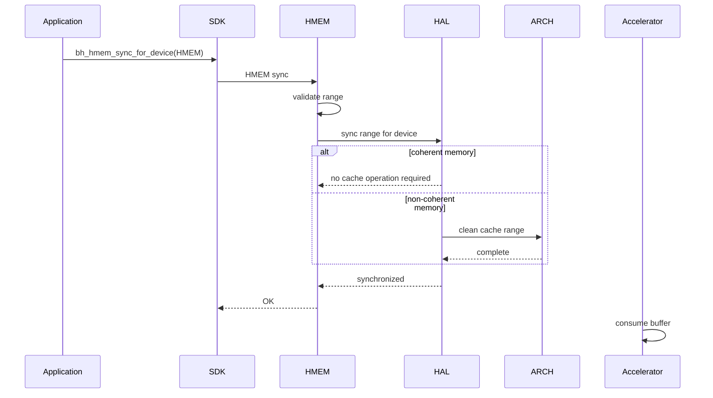

# BHCF-002: HMEM Architecture

## Purpose
This document details the HMEM architectural component of the Bharat Heterogeneous Compute Fabric (BHCF).

## What is HMEM?

HMEM is:
> A capability-protected memory object whose contents can potentially be accessed by multiple heterogeneous execution engines without changing its application-level identity.

## Object Model
HMEM represents a conceptual object:

```text
HMEM #42
│
├── size
├── alignment
├── usage
├── properties
├── memory domain
├── capability rights
├── content generation
│
├── CPU mapping
│
├── GPU mapping
│
├── NPU mapping
│
└── DPU mapping
```
**Note:** Not all mappings need to exist simultaneously.

## Lifecycle


(Using implementation state names `BH_HMEM_LIVE`, `BH_HMEM_DYING`, `BH_HMEM_DEAD` mapped conceptually to typical usage loops).

## Sequences

### HMEM Creation Sequence



### CPU Mapping Sequence



**Why userspace never receives raw addresses:**
Userspace never receives:
```text
physical address
kernel virtual address
page pointer
device MMIO address
```
This is a critical security property to prevent arbitrary DMA or direct physical memory tampering. All access happens through capability-checked opaque handles and virtual addresses mapped specifically to the requesting process.

### CPU → Accelerator Synchronization Sequence

This demonstrates one of HMEM's major performance advantages.



## Layer Ownership and Capability Checks

Why do capability checks belong above HAL?

```text
Kernel:
    Is this process allowed to map HMEM to device X?

HAL:
    How do I perform this mapping?
```

Not:

```text
HAL:
    Who owns this capability?
```
Some existing accelerator HAL code currently mixes capability authorization into HAL. HMEM establishes a cleaner model where capability authorization logic remains purely in the Kernel, and HAL strictly concerns itself with portable hardware semantics.