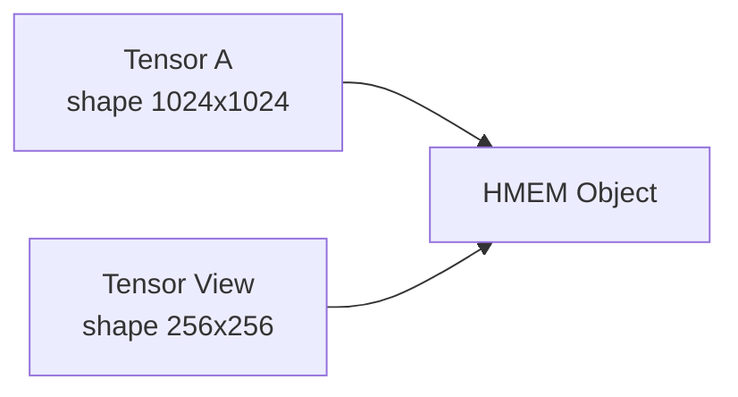
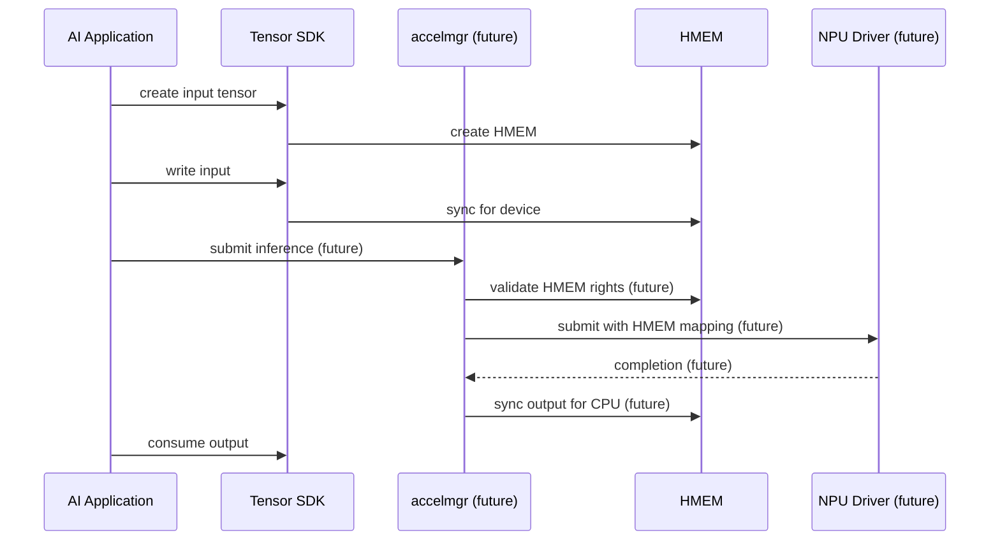

# BHCF-003: Tensor SDK Architecture

## Purpose
This document explains the Tensor SDK architecture built upon the HMEM foundation.

> **Tensor is an SDK/runtime semantic object. HMEM is the kernel memory mechanism.**
> **Tensor != kernel object**

## `bh_tensor_t` Object Model

`bh_tensor_t` is public metadata. It contains no kernel, HAL, driver, physical, GPU, or NPU pointer.

```text
bh_tensor_t
│
├── dtype
├── rank
├── shape
├── stride
├── layout
├── byte_offset
├── byte_length
│
└── HMEM handle
```

Many tensors or tensor views can reference the same HMEM object.



## Zero-Copy Tensor Views

Traditional slice operations often copy data:
```text
Large Tensor
     │
     │ memcpy
     ▼
Small Tensor Buffer
```

HMEM tensor view enables zero-copy semantics (when the implementation actually does so):
```text
Large Tensor
     │
     ├── HMEM #12
     │
     └── View:
           offset
           shape
           stride
```
No data copy is required. This is beneficial for:
```text
attention heads
image crops
channels
tensor slicing
KV blocks
video planes
batch subsets
robotics regions of interest
```

## HMEM for AI and Machine Learning

The AI and ML pipeline allows an application to keep an object identity while underlying hardware access may change.

```text
Camera/Input
     │
     ▼
 HMEM Input
     │
     ▼
Tensor View
     │
     ▼
Preprocessing
     │
     ▼
 NPU/GPU
     │
     ▼
HMEM Output
     │
     ▼
Postprocessing
```

### AI Inference Sequence Diagram

The following shows a future accelerator path. Items marked "future" are not currently implemented.



## Shared Model Weights (Future)

Model weights could be mapped into multiple processes with read-only capabilities.

```text
                  Model HMEM

              READ-ONLY MODEL WEIGHTS
                       │
           ┌───────────┼───────────┐
           ▼           ▼           ▼
        Agent A     Agent B     Agent C
```

Capability rights permit `READ` without `WRITE`, `SHARE`, or `MIGRATE`.

Potential benefits (not yet measured):
```text
avoid duplicate model copies
reduce memory pressure
reduce startup cost
safe multi-process sharing
```

## KV-Cache (Future)

The kernel does **not** manage LLM KV-cache. KV semantics remain above the kernel.

```text
AI runtime / KV service
        │
        ▼
   Tensor/HMEM
        │
        ▼
kernel memory mechanism
```

Future possibilities include:
```text
reuse across inference turns
session-affinity
memory advice
HBM/DRAM placement
shared cache blocks
eviction policies
```

## Current Implementation Status

| Component        | Status      |
| ---------------- | ----------- |
| Kernel HMEM      | Implemented |
| CPU mapping      | Implemented |
| HAL sync         | Implemented |
| Tensor SDK       | Implemented |
| Virtual NPU HMEM | Planned     |
| GPU mapping      | Planned     |
| Queue/Fence      | Planned     |
| KV service       | Future      |
