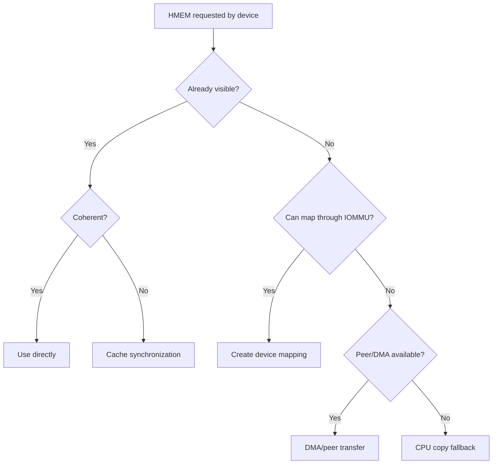

# BHCF-004: HMEM Benefits and Constraints

## Benefits of HMEM

### A. Reduced Memory Copies
Instead of:
```text
A → copy → B → copy → C
```
HMEM can enable:
```text
A/B/C → same HMEM
```
when hardware and access semantics permit.

### B. Reduced Memory Bandwidth
Memory copying consumes both read and write bandwidth:
```text
read bandwidth
+
write bandwidth
```
Reducing copies can reduce total memory traffic, which is especially relevant to:
```text
AI
video
camera
robotics
network packet processing
```

### C. Lower Allocation Churn
Long-lived HMEM objects can be reused rather than allocating buffers for every stage.
Potential benefits:
```text
lower allocator overhead
lower fragmentation
lower latency jitter
```

### D. Better Cache/Coherency Handling
The runtime asks for `sync_for_device` rather than embedding architecture-specific cache logic. HAL/ARCH can choose:
```text
no-op
barrier
cache clean
cache invalidate
```
depending on the system.

### E. Reduced Power/Energy
Reducing memory traffic and CPU participation **can** reduce energy consumption. Do not state percentage savings without hardware measurements.

### F. Portability
Provides the same SDK object model across:
```text
x86_64
ARM64
ARM32
RISC-V64
RISC-V32
```
and different accelerator configurations.

### G. Security
Capability-controlled rights can distinguish:
```text
READ
WRITE
CPU_MAP
DEVICE_MAP
SHARE
DERIVE
```
This is stronger than handing arbitrary physical/device addresses to processes.

### H. Future Heterogeneous Scheduling
HMEM provides the memory foundation needed later for:
```text
ENGINE
QUEUE
FENCE
CMD
placement
QoS
```
without redesigning application memory semantics.

## What HMEM does NOT guarantee

*   HMEM does NOT mean every operation is zero-copy.
*   HMEM does NOT imply physically shared memory.
*   HMEM does NOT make non-coherent hardware coherent.
*   HMEM does NOT automatically accelerate an application.
*   HMEM does NOT guarantee GPU/NPU support.
*   HMEM does NOT expose tensors to the kernel.
*   HMEM does NOT replace device drivers.
*   HMEM does NOT replace IOMMU/SMMU.
*   HMEM does NOT replace accelerator runtimes.
*   HMEM does NOT mean migration is always cheaper than copying.

> **HMEM provides a common object and semantic contract through which the system can select the cheapest correct mechanism available.**

## Architecture Decision Tree

This diagram shows what `prepare/sync/map` may eventually resolve to (future paths included):



## Performance Claim Discipline

Never write absolute performance claims such as:
```text
HMEM is 5x faster.
HMEM saves 70% power.
HMEM makes NPU inference 10x faster.
```
unless actual benchmark/hardware measurements support those claims.

Preferred wording:
```text
HMEM can eliminate specific intermediate copies.

In benchmark X, intermediate copies decreased from A to B.

In QEMU benchmark X, software-path latency changed from A to B.

Hardware performance remains to be validated on target device Y.
```
