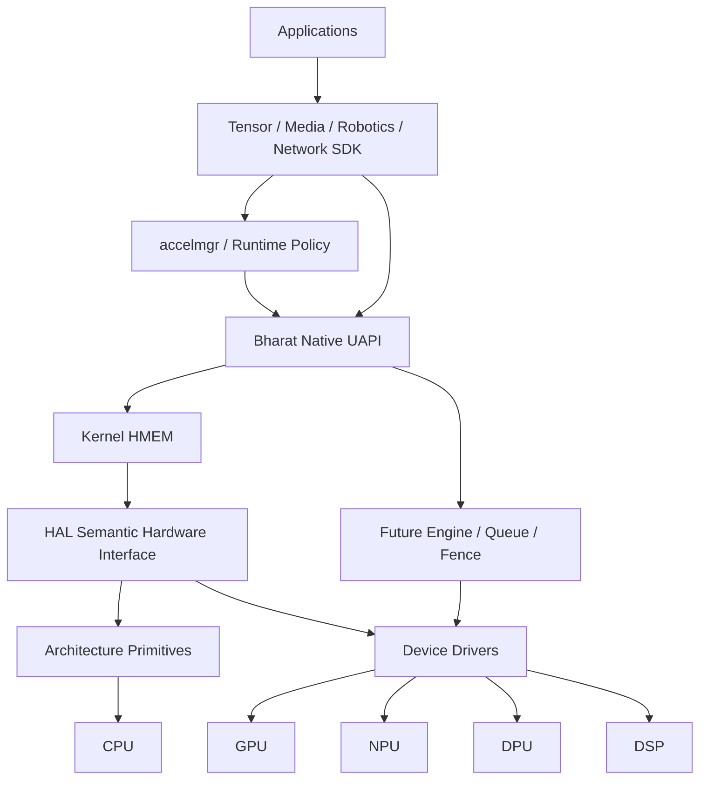

# Bharat Heterogeneous Compute Fabric Architecture

## Mission

The Bharat Heterogeneous Compute Fabric (BHCF) foundation provides the architecture for cross-accelerator memory and computation. It is composed of three distinct layers:

```text
BHCF
 │
 ├── Kernel primitive
 │      HMEM
 │
 ├── Future heterogeneous execution primitives
 │      ENGINE / QUEUE / FENCE / CMD
 │
 └── SDK/runtime abstractions
        Tensor / AI runtime / Media / Robotics / Networking
```

The most important architectural statement is:

> **HMEM is not an AI tensor object. HMEM is a capability-scoped heterogeneous memory object usable by CPU, GPU, NPU, DPU, DSP, DMA and future hardware. Tensor is an SDK/runtime abstraction built on HMEM.**

## BHCF overview

This document set outlines the design, API and architecture of BHCF.

* [BHCF Architecture](BHCF-001-architecture.md)
* [HMEM architecture](BHCF-002-hmem.md)
* [Tensor SDK](BHCF-003-tensor-sdk.md)
* Accelerator execution architecture (Planned)
* HMEM coherency and mapping (See [BHCF Architecture](BHCF-001-architecture.md) and [HMEM](BHCF-002-hmem.md))
* Security/capability model (See [BHCF Architecture](BHCF-001-architecture.md))
* AI/ML use cases (See [Tensor SDK](BHCF-003-tensor-sdk.md))
* Robotics/media/network use cases (See [Use Cases](BHCF-006-use-cases.md))
* Performance model (See [Benefits](BHCF-004-benefits.md))
* [Benchmark methodology](BHCF-005-benchmark-methodology.md)
* Developer guide ([Quickstart Guide](../../guides/bhcf-hmem-tensor-quickstart.md))

## BHCF Main Architecture



### Layer ownership

* **ARCH:** ISA-specific mechanics.
* **HAL:** portable hardware semantics.
* **Kernel:** protected object, lifetime, mappings, capability enforcement.
* **Driver:** accelerator-specific mechanisms.
* **Service:** placement/resource/QoS policy.
* **SDK/runtime:** Tensor/graph/application semantics.

## Application to Hardware Lifecycle

```text
                   APPLICATION / FRAMEWORK
                            │
          ┌─────────────────┼─────────────────┐
          │                 │                 │
          ▼                 ▼                 ▼
       AI/Tensor          Media           Robotics
          │                 │                 │
          └─────────────────┼─────────────────┘
                            ▼
                    Bharat SDK / Runtime
                            │
                     Tensor = Metadata
                            +
                         HMEM handle
                            │
                            ▼
                 ┌────────────────────┐
                 │ Kernel HMEM Object │
                 │                    │
                 │ Capability         │
                 │ Lifetime           │
                 │ Bounds             │
                 │ Mapping            │
                 │ Coherency          │
                 └─────────┬──────────┘
                           │
                           ▼
                     HAL semantics
                           │
              ┌────────────┼────────────┐
              ▼            ▼            ▼
             CPU          GPU          NPU
              │            │            │
              └──────┬─────┴─────┬──────┘
                     │           │
                    DPU         DSP
```

> **Tensor describes data. HMEM owns/share-controls data. HAL makes it hardware-correct. Drivers make accelerators execute. Services decide policy.**
