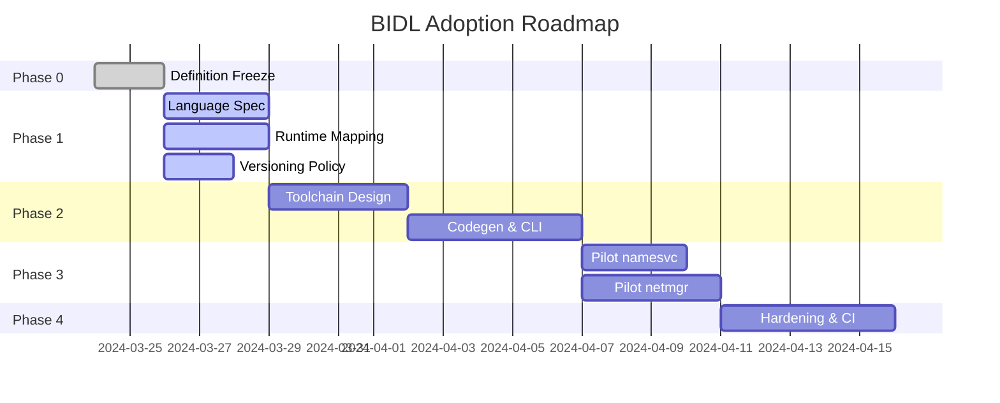

# BIDL Adoption Roadmap

This document outlines the phased execution plan for introducing the Bharat Interface Definition Language (BIDL) into Bharat-OS. It is structured as a ticket-grade program breakdown for code agents and contributors.

## Program Milestones

* **M0 – Definition Freeze:** Lock the architectural scope and purpose of BIDL.
* **M1 – Language + Runtime Spec:** Define the exact syntax, grammar, versioning rules, and runtime mappings.
* **M2 – Tooling (Parser + Codegen):** Build the actual `bidl` compiler and integrate it into the build system.
* **M3 – Pilot Adoption:** Migrate `namesvc` and `netmgr` from handwritten IPC to BIDL-generated contracts.
* **M4 – Hardening + CI Enforcement:** Add fuzzing, compatibility checks, and enforce BIDL usage for new services.

---

## EPIC 1 — BIDL Foundation & Definition (M0)

**Goal:** Lock what BIDL is and prevent scope creep.

### Task 1.1 — BIDL Charter
* **Owner:** Architecture Track
* **Deliverable:** `bidl-overview.md`
* **Acceptance Criteria:**
  * Defines purpose, scope, non-goals, and relationship to IPC/uRPC.
  * Explicitly states: "service contracts first, not kernel internals".
  * Includes pipeline diagram (BIDL → codegen → runtime).

### Task 1.2 — Scope & Non-Goals Hardening
* **Owner:** Architecture Track
* **Deliverable:** Section in overview or separate doc.
* **Acceptance Criteria:**
  * Lists at least 10 in-scope items and 10 out-of-scope items.
  * Clearly excludes: kernel internal APIs, driver-private APIs, distributed RPC.

### Task 1.3 — Canonical Error Model
* **Owner:** Kernel/ABI Track
* **Deliverable:** Section in language spec or runtime doc.
* **Acceptance Criteria:**
  * Defines `STATUS_OK` and error ranges (system/permission/validation/transport).
  * Maps to syscall-style returns or structured responses.
  * No ambiguity between transport failures vs business errors.

---

## EPIC 2 — BIDL Language Specification (M1)

**Goal:** Define syntax and semantics clearly enough for tooling.

### Task 2.1 — Core Grammar Definition
* **Owner:** Compiler Track
* **Deliverable:** `bidl-language-spec.md`
* **Acceptance Criteria:**
  * Defines: interface, method, event, struct, enum, flags, scalar types, bounded string, bounded array.
  * Example must exist for each.

### Task 2.2 — Capability & Handle Semantics
* **Owner:** Kernel Track
* **Acceptance Criteria:**
  * Define handle type, capability reference, transfer semantics.
  * Define annotation like `@requires(capability="NET_ADMIN", rights="WRITE")`.
  * Explain runtime enforcement.

### Task 2.3 — Transport Annotation Model
* **Owner:** Compiler Track
* **Acceptance Criteria:**
  * Support: `@transport(endpoint)`, `@transport(urpc)`, `@transport(auto)`.
  * Define sync vs async, request/response vs event.

### Task 2.4 — Boundedness Rules
* **Owner:** Kernel Track
* **Acceptance Criteria:**
  * All dynamic data must be explicitly bounded (no unbounded strings/arrays).
  * Include max size rules and RT-safe reasoning.

---

## EPIC 3 — Runtime Mapping (M1)

**Goal:** Map BIDL to actual Bharat-OS execution model.

### Task 3.1 — Endpoint IPC Mapping
* **Owner:** IPC Track
* **Deliverable:** `bidl-runtime-mapping.md`
* **Acceptance Criteria:**
  * Defines request/response struct layout, opcode mapping.
  * Maps to endpoint send/receive and includes dispatch flow.

### Task 3.2 — uRPC Mapping
* **Owner:** IPC Track
* **Acceptance Criteria:**
  * Defines message framing and async event delivery.
  * Explains cross-core behavior and lockless assumptions.

### Task 3.3 — Namesvc Integration
* **Owner:** Architecture Track
* **Acceptance Criteria:**
  * Define how interface is registered and version exposed.
  * Output service identity tuple: `(service, interface, version)`.

### Task 3.4 — Capability Enforcement Mapping
* **Owner:** Kernel Track
* **Acceptance Criteria:**
  * Define when checks happen (pre-dispatch).
  * Include object-scope validation.
  * Explicitly replace "allow-if-token-present" model.

---

## EPIC 4 — Versioning Policy (M1)

**Goal:** Prevent contract chaos later.

### Task 4.1 — Version Model Definition
* **Owner:** Architecture Track
* **Deliverable:** `bidl-versioning-policy.md`
* **Acceptance Criteria:**
  * Define interface version vs message version.
  * Align with repo versioning doc.

### Task 4.2 — Compatibility Rules
* **Owner:** Compiler Track
* **Acceptance Criteria:**
  * Define additive changes (allowed, minor bump) vs breaking changes (requires major bump).
  * Include field addition rules, enum extension rules.

### Task 4.3 — Reserved Fields Strategy
* **Owner:** Compiler Track
* **Acceptance Criteria:**
  * Require reserved slots in structs.
  * Define forward compatibility.

---

## EPIC 5 — Tooling (Planned, Not Implemented Now) (M2)

**Goal:** Define exactly what to build later.

### Task 5.1 — Toolchain Architecture
* **Owner:** Tooling Track
* **Deliverable:** Tools section in roadmap/architecture.
* **Acceptance Criteria:**
  * Defines parser, validator, codegen stages.

### Task 5.2 — Codegen Outputs
* **Owner:** Tooling Track
* **Acceptance Criteria:**
  * List outputs: `.h` headers, opcode enums, struct definitions, dispatch skeleton, client stub, namesvc manifest.

### Task 5.3 — CLI Design
* **Owner:** Tooling Track
* **Acceptance Criteria:**
  * Example: `bidl compile contracts/netmgr.bidl --out gen/`

---

## EPIC 6 — Pilot Contracts (M3)

**Goal:** Prove BIDL works on real services.

### Task 6.1 — namesvc Contract
* **Owner:** Services Track
* **Deliverable:** `contracts/examples/namesvc.bidl`
* **Must include:** register_service, resolve_service, list_services.
* **Acceptance Criteria:** Versioned interface, capability annotations, bounded payloads.

### Task 6.2 — netmgr Contract
* **Owner:** Services Track
* **Deliverable:** `contracts/examples/netmgr.bidl`
* **Must include:** interface query, interface config, route update.
* **Acceptance Criteria:** Replaces opcode thinking, includes capability requirements.

### Task 6.3 — Example Mapping Notes
* **Owner:** IPC Track
* **Acceptance Criteria:** Explain how BIDL maps to current netmgr dispatcher.

---

## EPIC 7 — Roadmap & Execution Plan (M0/M1)

**Goal:** Make everything executable.

### Task 7.1 — Master Roadmap
* **Owner:** Architecture Track
* **Deliverable:** `bidl-adoption-roadmap.md` (this document).
* **Must include:** Phases, dependencies, parallel tracks, risks.

### Task 7.2 — Agent Parallelization Plan
* **Owner:** Architecture Track
* **Acceptance Criteria:**
  * Divide architecture, tooling, migration, testing clearly.

### Task 7.3 — Acceptance Gates
* **Owner:** Kernel Track
* **Acceptance Criteria:**
  * Define "done" for spec, tooling, pilot, production readiness.

---

## Phase 0 Decisions Required Before Codegen

Before any tooling or generator code is written (M2), the following MUST be approved:
1. **The Exact EBNF Grammar:** The parser must not be built on vague syntax rules.
2. **Capability Check Semantics:** We must agree exactly how `sys_cap_check_rights` is emitted into the dispatcher skeleton.
3. **Fixed Buffer Allocation:** The generated C structs must guarantee predictability (e.g. no hidden `malloc` via unbounded types).

## Parallel Execution Model

| Track | Agents | Work |
| :--- | :--- | :--- |
| **Architecture** | Agent A | overview, roadmap |
| **Language** | Agent C | grammar, syntax |
| **Runtime** | Agent D | IPC/uRPC mapping |
| **Capability** | Agent B | rights model |
| **Tooling Design** | Agent E | future codegen |
| **Examples** | Agent F | namesvc, netmgr |
