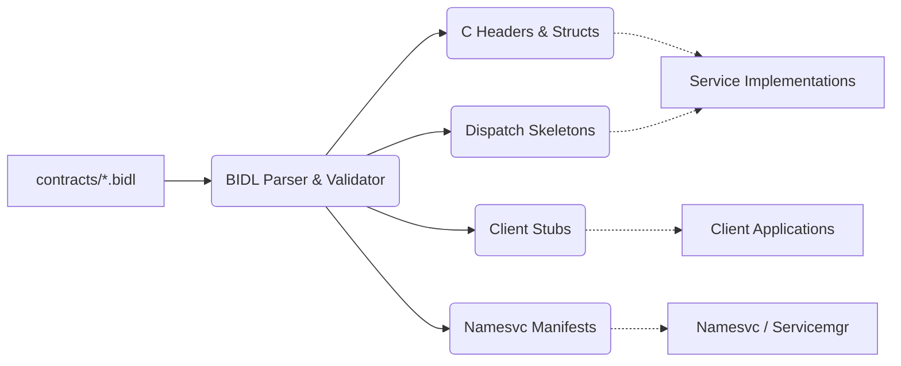

# Bharat Interface Definition Language (BIDL)

## What is BIDL?

**BIDL is Bharat-OS’s interface definition and contract system for capability-aware IPC, uRPC message schemas, service discovery metadata, and versioned cross-component APIs.**

BIDL is designed to act as the single source of truth for all cross-boundary interface contracts. It provides a formal, versioned language that sits strictly between design documents and implementation code. Instead of hand-writing brittle C structs and opcode switch-statements for every service, BIDL generates deterministic IPC layouts, dispatcher skeletons, and discovery manifests.

## Motivation: Why BIDL? Why Now?

Bharat-OS relies heavily on isolated components communicating via endpoint IPC and cross-core uRPC. However, without a contract definition layer:

1. **Interface Drift:** Ad-hoc request structs and handwritten opcode definitions lead to incompatible ABI breakages.
2. **Weak Enforcement:** In critical services (like `netmgr`), capability checks currently fail-closed without an explicit valid token, but they still fail to automatically map specific operations to the granular object rights they require. (The prior unconditional bypass was removed).
3. **Scaffolded Boilerplate:** Services like `namesvc` and `servicemgr` remain in scaffold states partially because defining their true IPC loops using raw C macros is tedious and error-prone.
4. **Discovery Disconnect:** Without a structured way to declare an interface version, `namesvc` cannot reliably match clients to compatible service endpoints.

BIDL addresses these gaps by moving IPC definitions into a declarative layer where correctness, capability constraints, and versions can be statically verified and generated.

## The Compilation Pipeline

BIDL acts as a tooling and codegen layer, not a runtime service.

## Scope & Non-Goals

To prevent scope creep, the boundary of BIDL is tightly defined.

### In Scope
* Service-to-service IPC definitions.
* App-to-service IPC definitions.
* Selected kernel-to-user ABI contracts.
* Capability and rights requirements bound strictly to operations.
* Transport class annotations (Endpoint IPC, uRPC, or auto-selected).
* Message schemas for both synchronous (request/response) and asynchronous (event) flows.
* Discovery metadata for `namesvc` registration.
* Bounded types (strings, arrays) suitable for RT/safety profiles.
* Deterministic code generation for C headers, structs, and dispatchers.

### Out of Scope (Non-Goals)
* **Kernel-internal APIs:** BIDL is not for calling `pmm_alloc` from the VMM.
* **Driver-private APIs:** Internal device driver hardware interactions are not modeled in BIDL.
* **Distributed/Network RPC:** Remote procedure calls across physical machines (e.g., gRPC) are not phase 1 concerns.
* **Complex Reflection:** Runtime schema introspection is out of scope.
* **Multi-Language Support (Initially):** Phase 1 strictly targets C. Rust/C++ generators can be added later.
* **Arbitrary Process-Local Calls:** Standard shared-library function calls.

## Design Principles

BIDL for Bharat-OS is guided by the following principles:

1. **Capability-Native:** Every method must have the ability to explicitly declare required capability rights and target object scope.
2. **Transport-Neutral:** A single interface should be mappable to local synchronous endpoint IPC or cross-core async uRPC.
3. **Versioned from Day One:** Interfaces cannot exist without a defined semantic version.
4. **Bounded and Deterministic:** To support safety and real-time (RT) profiles, unbounded dynamic lengths (like unbounded strings or lists) are forbidden.
5. **No Hidden Heap Dependence:** All generated marshalling logic must support fixed-buffer serialization.
6. **Namesvc-Integrated:** The compiler must output metadata tuples `(service, interface, version)` that integrate natively with the OS discovery layer.
7. **C-First:** Because the current kernel and service ecosystem is C.

## Security Scope

BIDL is more than a schema definitions language or codegen tool. It is the declarative authority contract for IPC, uRPC, service discovery, and restart-safe identity.

- **Mandatory Policy Enforcement:** Manual dispatcher bypasses are forbidden. BIDL generation ensures that all methods check capability requirements (`@requires`), rights, transport class validations, lease checks, and domain rules before execution.
- **Discovery Registration:** `namesvc` and `servicemgr` registrations must include security metadata, binding service identity, generation/incarnation, supported profiles, required transport classes, and exported capability classes.
- **Contract as Security Standard:** Changes to security semantics are treated as ABI breaking changes.
