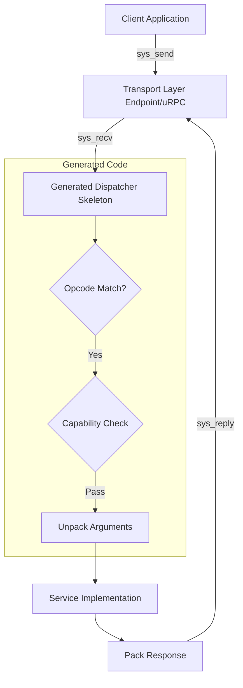

# BIDL Runtime Mapping

This document describes how the abstract Bharat Interface Definition Language (BIDL) concepts map onto the concrete Bharat-OS runtime constructs: endpoint IPC, cross-core uRPC, namesvc discovery metadata, and capability enforcement.

## 1. The Execution Path

The BIDL compiler is responsible for translating an `.bidl` contract into C headers containing request/response structures, an opcode enumeration, and a dispatch skeleton.



## 2. Endpoint IPC Mapping (Synchronous)

For synchronous interfaces (typically annotated with `@transport(endpoint)`), BIDL maps each `method` to a request and response payload transmitted over a kernel endpoint.

### 2.1 Opcode Generation
The compiler generates a unique `u32` opcode for every method within an interface, typically offset by an interface ID to prevent global namespace collisions.

```c
// Generated from: interface NameService
enum namesvc_opcodes {
    NAMESVC_OP_RESOLVE = 0x01,
    NAMESVC_OP_REGISTER = 0x02,
};
```

### 2.2 Payload Structures
BIDL defines deterministic struct layouts for the payload passed via `sys_send`. Memory padding is explicitly controlled by the compiler to prevent ABI leaks or alignment faults.

```c
// Generated for: method resolve(string<64> name) -> (handle<endpoint> port, Status status);
struct namesvc_resolve_req {
    uint32_t opcode;       // NAMESVC_OP_RESOLVE
    char name[64];         // bounded string
};

struct namesvc_resolve_resp {
    uint32_t status;
    uint32_t port_handle;  // Capability token
};
```

### 2.3 Capability Checks
If a method contains a `@requires` annotation, the generated dispatcher inserts an enforcement hook before calling the service implementation.

```c
// Generated Dispatcher Fragment
switch (req->opcode) {
    case NAMESVC_OP_REGISTER:
        // Automatically generated check
        if (!sys_cap_check_rights(caller_token, CAP_NET_ADMIN, CAP_RIGHT_WRITE)) {
            return K_ERR_DENIED;
        }
        return namesvc_impl_register(req->name, req->port_handle);
    // ...
}
```
This entirely replaces the error-prone "allow-if-token-present" model.

## 3. uRPC Mapping (Asynchronous)

For asynchronous, cross-core communication (`@transport(urpc)`), BIDL maps events to lockless ring-buffer payloads.

### 3.1 Frame Layout
Methods defined as `event` map directly to uRPC message frames. A fixed-size header contains the interface ID and opcode, followed by the strictly bounded event payload. Since uRPC messages are fire-and-forget or ACK-based, no response struct is generated.

### 3.2 Dispatch Demultiplexing
The generated uRPC dispatcher provides a demux function that reads from the `urpc_channel` and calls the registered callbacks based on the opcode, dropping or logging unknown frames.

## 4. Namesvc / Servicemgr Integration

To integrate natively with Bharat-OS's service discovery backbone, BIDL outputs registration manifests. When compiling `namesvc.bidl`, the toolchain generates a constant metadata tuple: `(service, interface, version)`.

A client looking for an interface can use this generated metadata to perform a lookup:

```c
// Generated client stub helper
kstatus_t find_namesvc(endpoint_t *out_ep) {
    return sys_namesvc_resolve("bharat.namesvc", NAMESVC_INTERFACE_VERSION, out_ep);
}
```

The service itself uses an identical generated definition to register its endpoint with `servicemgr` during boot.

## 5. Status and Error Propagation

BIDL strongly encourages the use of canonical status codes mapped to the kernel's internal `kstatus_t` (`K_ERR_*`).
If an explicit `Status` return type is used, the dispatcher propagates the return value of the service implementation directly into the response payload or uRPC ACK frame. Unhandled or out-of-bounds opcodes are trapped by the generated dispatcher, which automatically responds with `K_ERR_INVALID_OP`.
