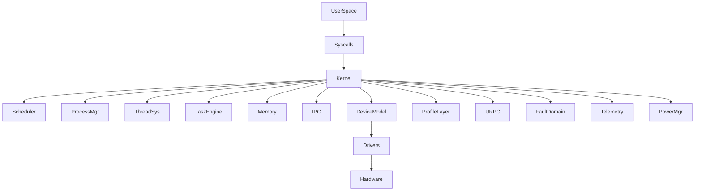

# 📘 Bharat-OS Core Architecture Alignment

**File:** `docs/architecture/core/kernel-alignment-and-gap-analysis.md`

## 1. Executive Summary

Bharat-OS already has the *right architectural direction*:

- Multikernel (per-core ownership)
- Capability-based security and isolation
- Multi-architecture (x86_64, ARM64, RISC-V)
- Mechanism vs policy separation

However, the system today is **structurally incomplete** rather than incorrect.

The next evolution is not adding features—but **formalizing contracts** so the OS behaves consistently across:

- 32-bit / 64-bit
- MMU / MMU-lite / MPU
- With / without IOMMU
- Edge → Automotive → Data-center

## 2. Current State (What Already Exists)

### 2.1 Kernel Core

| Area             | Status              | Notes                                          |
| ---------------- | ------------------- | ---------------------------------------------- |
| Scheduler        | ⚠️ Partial          | Exists but not fully per-core isolated         |
| Process/Thread   | ⚠️ Partial          | Lifecycle exists, policy separation incomplete |
| IPC / Endpoints  | ⚠️ Emerging         | Needs standardization for URPC                 |
| Capability Model | ⚠️ Strong Direction | Needs narrowing + lifecycle enforcement        |

### 2.2 Memory & MMU

| Area              | Status               | Notes                                   |
| ----------------- | -------------------- | --------------------------------------- |
| Address Spaces    | ✅ Aligned            | Unified authority via Region Trees      |
| Page Tables (HAL) | ✅ Aligned            | Enforced via strict `hal_pt` contract   |
| TLB Coordination  | ✅ Aligned            | Message-based tracking via ASIDs        |
| DMA / IOMMU       | ✅ Aligned            | Lifecycle-governed with null-fallback   |

### 2.3 Multi-Architecture Support

| Arch   | Status             |
| ------ | ------------------ |
| x86_64 | ⚠️ Medium maturity |
| ARM64  | ⚠️ Medium maturity |
| RISC-V | ⚠️ Early           |

Issue:
➡️ HAL exists, but **contracts are not uniform**

### 2.4 Multikernel Model

| Feature                    | Status         |
| -------------------------- | -------------- |
| Per-core state             | ⚠️ Partial     |
| Message-based coordination | ⚠️ Emerging    |
| Lockless design            | ⚠️ In-progress |

## 3. Core Architectural Gaps

### ❗ Gap 1: No Unified Profile Contract

Current problem:

- Behavior differs implicitly (build flags, code paths)
- No single source of truth

Impact:

- Hard to scale across edge vs server
- Code divergence risk

### ❗ Gap 2: Subsystems Not Capability-Governed

- Drivers/services load without strict authority model
- No startup filtering by profile

### ❗ Gap 3: No Standard Cross-Core Protocol

- URPC exists conceptually
- No **single message contract**

Impact:

- Fragile multikernel behavior

### ❗ Gap 4: Memory Not Policy-Aware

- No classification (RT, DMA, secure, etc.)
- Allocation is generic

### ❗ Gap 5: No Fault Isolation Model

- Failures propagate globally
- No restart/isolation policy

### ❗ Gap 6: Device Model Not Abstracted

- Hardware leaks into upper layers
- No device-class abstraction

### ❗ Gap 7: Missing System Contracts

Missing unified:

- Timer/deadline model
- Telemetry/health reporting
- Power/thermal hooks
- Network interface abstraction

## 4. Target Architecture (What We Introduce)

### 4.1 Profile Descriptor (Foundation Layer)

```c
typedef struct {
    const char* name;

    // Scheduling
    sched_policy_t default_policy;

    // Memory
    mem_model_t mem_model;     // MMU / MPU / LITE
    bool has_iommu;

    // Isolation
    isolation_mode_t isolation;

    // Performance
    bool enable_preemption;
    bool enable_tracing;

    // Power
    power_profile_t power_mode;

} bharat_profile_t;
```

### Impact

- One OS → multiple behaviors
- No code branching chaos
- Clean build/runtime alignment

### 4.2 Subsystem Registration Framework

```c
#define BHARAT_REGISTER_SUBSYSTEM(name, init_fn, profile_mask, caps)
```

Each subsystem defines:

- Required capabilities
- Supported profiles
- Init priority

### Boot Flow

```text
Boot → Profile Loaded → Subsystem Filter → Init Selected Only
```

### 4.3 Standard URPC Contract

#### Message Header

```c
typedef struct {
    uint16_t type;
    uint16_t flags;
    uint32_t src_core;
    uint32_t dst_core;
    uint64_t capability;
} urpc_msg_t;
```

#### Message Classes

- CONTROL
- DATA
- MEMORY
- POWER
- SAFETY
- TELEMETRY

### 4.4 Memory Allocation Classes

```c
typedef enum {
    MEM_NORMAL,
    MEM_DMA,
    MEM_RT,
    MEM_SECURE,
    MEM_PACKET,
    MEM_LOWPOWER
} mem_class_t;
```

### Benefits

- Deterministic RT behavior
- DMA safety
- Fragmentation control
- Profile-based tuning

### 4.5 Fault Domains

```c
typedef struct {
    int domain_id;
    fault_policy_t policy;
} fault_domain_t;
```

Policies:

- RESTART_SERVICE
- ISOLATE
- SAFE_MODE
- REBOOT

### 4.6 Device Class Model

```c
typedef enum {
    DEV_NET,
    DEV_STORAGE,
    DEV_DISPLAY,
    DEV_SENSOR,
    DEV_ACTUATOR,
    DEV_POWER
} device_class_t;
```

### 4.7 Timer & Deadline Model

- Monotonic time source
- Deadline-aware scheduling
- Timer classes:
  - HARD
  - SOFT
  - POWER-AWARE

### 4.8 Telemetry & Health Contract

```c
typedef struct {
    uint64_t cpu_usage;
    uint64_t mem_usage;
    uint64_t latency_ns;
} system_metrics_t;
```

### 4.9 Power / Thermal Hooks

```c
typedef struct {
    void (*enter_low_power)();
    void (*exit_low_power)();
} power_ops_t;
```

### 4.10 Network Interface Abstraction

```c
typedef struct {
    int (*send)(packet_t*);
    int (*recv)(packet_t*);
} netif_ops_t;
```

## 5. Architecture Diagram



## 6. Priority Implementation Roadmap

### Phase 1 (Critical Foundation)

- Profile Descriptor
- Subsystem Registration
- URPC Contract
- Memory Classes

### Phase 2 (Stability & Isolation)

- Fault Domains
- Device Class Model
- Timer/Deadline System

### Phase 3 (Production Readiness)

- Telemetry Framework
- Power/Thermal System
- Network Interface Layer

## 7. Design Principles (Non-Negotiable)

1. **Every core owns its state**
2. **No global locks across cores**
3. **All cross-core ops → message-based**
4. **Kernel provides mechanism, services define policy**
5. **Profiles define behavior—not code branches**
6. **Capabilities govern everything**

## 8. Final Positioning

Bharat-OS should not become:

- ❌ Linux-lite
- ❌ RTOS clone
- ❌ Embedded-only OS

It should become:

- ✅ A **profile-driven multikernel OS**
- ✅ A **capability-secure distributed system kernel**
- ✅ A **single OS that scales from MCU → Edge → Cloud**

## If you want next step

I can go one level deeper and:

- Convert this into **ADR documents (one per subsystem)**
- Map this directly to your **current repo folders (file-level changes)**
- Design **CMake presets + build profiles**
- Create **test matrix (x86/ARM/RISC-V × MMU/MPU × profile)**

Just tell me 👍
