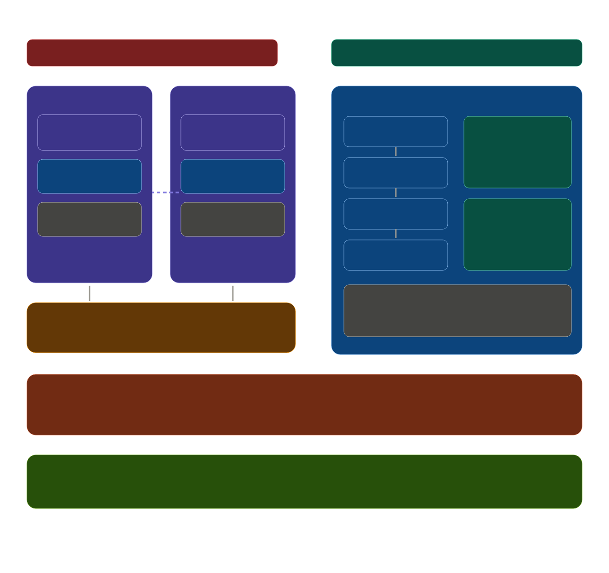

# Multikernel Memory Protection Architecture

In a multikernel architecture, there is no single shared page table that all CPUs look up under a lock. Instead, each core runs its own kernel instance with its own local page-table root. Cores communicate about memory exclusively via uRPC messages.

This document defines the Bharat-OS Memory Protection Architecture (MPA), which relies on two independent axes of memory protection unified by a single capability word and abstraction.

## Two Independent Protection Axes

Bharat-OS treats CPU memory protection and device DMA protection as two independent axes. They are unified by one caps-word and one MPA abstraction, composing at runtime instead of via compile-time "pick one" logic. The kernel above MPA simply reads capabilities without scattering hardware-specific conditionals.

1. **CPU → Memory Axis (MMU / MMU-lite / MPU)**
   Controls how the processor accesses memory.
2. **Device → Memory Axis (IOMMU)**
   Controls how peripheral devices perform Direct Memory Access (DMA).

*Figure 1: The structural architecture of the Multikernel Memory Protection model. The CPU→memory axis (MMU/MMU-lite/MPU) and the Device→memory axis (IOMMU) are abstracted behind a unified interface, while the kernel reads capability bits rather than hard-coding device-specific modes.*

## The 3-Layer Implementation Format

The implementation of the page-table model relies on three layers:

### Layer 1: The HAL Page-Table VTable
Each architecture provides exactly five functions behind a static vtable. The walker stays inside one core's kernel instance and touches no shared state.
- `make_table(level)`: Allocates a page-table node from the PMM.
- `map_page(root, va, pa, flags)`: Walks and installs one leaf entry.
- `unmap_page(root, va)`: Clears and returns the frame.
- `set_root(pa)`: Writes the architecture's root register (`CR3` on x86, `satp` on riscv64, `TTBR0` on arm64).
- `flush_tlb_local(va, asid)`: Performs local invalidation.

### Layer 2: The VMM Mapping Registry
The VMM acts as a mapping registry tracking what is mapped where. Every `vmm_map()` call invokes `hal_pt.map_page()` immediately. This makes the registry the software mirror of the hardware page table, keeping them in sync by construction. Each registry entry also records which capability token owns the backing frame, allowing `vmm_unmap()` to revoke the capability atomically with the hardware unmap.

### Layer 3: The uRPC Shootdown Protocol
When a core unmaps a frame that another core might have cached in its TLB, it posts a `SHOOTDOWN{va, asid, seq}` message into the uRPC ring buffer directed at the other core. The target core receives it in its interrupt handler, calls `flush_tlb_local()`, and ACKs back. The initiating core spins on the ACK before completing the unmap.

## The Frame Ownership Invariant

The load-bearing rule that makes everything safe: **every physical frame has exactly one owner core at any moment**. This is tracked in the capability table, not the page table. When a frame is transferred between cores, the source core revokes its local capability, sends a `FRAME_TRANSFER` uRPC message containing the physical address, and the destination core creates a new local capability. No two cores ever simultaneously hold a writable capability to the same frame. This eliminates the entire class of cross-core page-table race conditions without needing any lock on the walker itself.

## Implementation Roadmap

The implementation should proceed in small, safe steps:

Bring up and validate the single-core page-table HAL on `x86_64` first, then generalize the same contract to `arm64` and `riscv64`. Introduce URPC-based shootdown only once SMP makes cross-core TLB invalidation necessary.

1. Define the caps word and feature bits for VIRT, ASID, HUGEPAGE, NX, IOMMU, and region-only MPU mode.
2. Define `mem_protect_ops_t` split into `cpu_ops` and `iommu_ops`.
3. Add the `x86_64` `cpu_ops` backend.
4. Wire `vmm_map()` / `vmm_unmap()` so the registry uses the HAL.
5. Add `owner_core` to frame capability metadata immediately, making ownership explicit from the first frame-capability design.
6. Add the `arm64` and `riscv64` backends behind the same interface.
7. Add runtime IOMMU probe hook that may legally return NULL.
8. Later: Add the uRPC shootdown message type and ACK path (deferred until SMP relevance exists; local TLB flush is sufficient for single-core bring-up).
