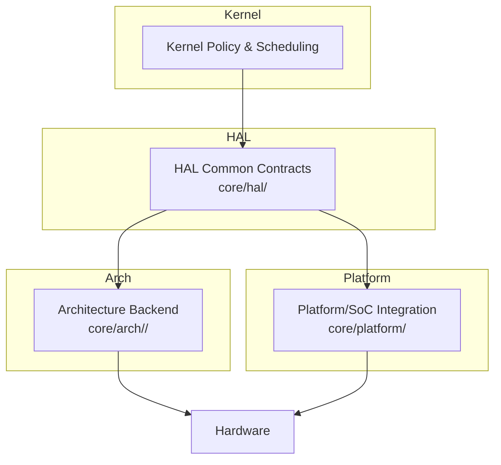
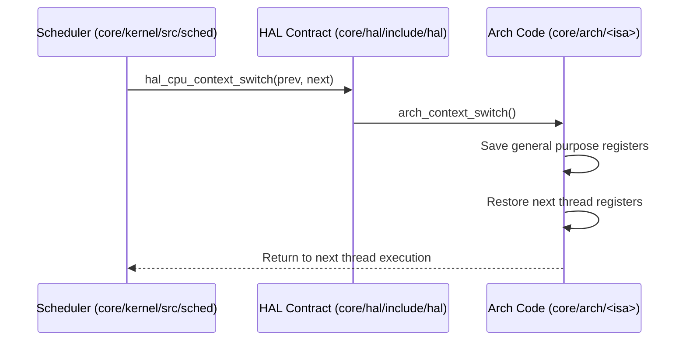
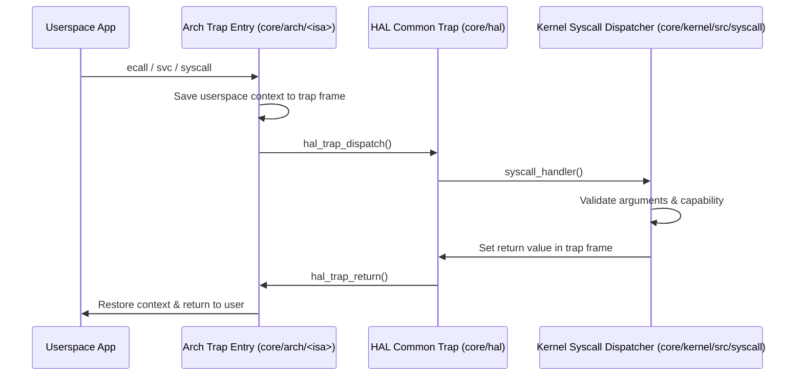
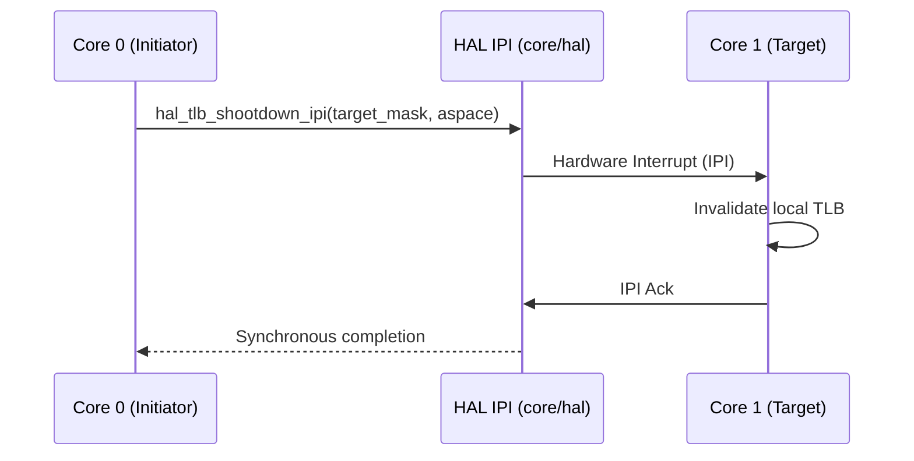

# Architecture Matrix

This matrix represents the current verified state of architecture-specific implementations across the Bharat-OS tree, backed by CMake configuration and runtime evidence.

## Core Capability Matrix

| Feature | x86_64 | ARM64 | ARM32 | RISC-V64 | RISC-V32 |
|---|---|---|---|---|---|
| **Boot entry** | `Tier 3` | `Tier 3` | `Tier 2` | `Tier 3` | `Tier 2` |
| **Privilege mode** | Supported | Supported | Supported | Supported | Supported |
| **Trap frame** | Supported | Supported | Supported | Supported | Supported |
| **Syscall entry** | `HW_ENTRY` | `HW_ENTRY` | `HW_ENTRY` | `HW_ENTRY` | `HW_ENTRY` |
| **Context switch** | Supported | Supported | Supported | Supported | Supported |
| **Timer source** | Supported | Supported | Supported | Supported | Supported |
| **Interrupt controller**| Supported | Supported | Supported | Supported | Supported |
| **IPI/core notify** | Supported | Supported | Supported | Supported | Supported |
| **MMU/MPU model** | MMU-Full | MMU-Full | MMU-Lite / MPU | MMU-Full | MMU-Lite / MPU |
| **User-mode entry** | Supported | Supported | Supported | Supported | Supported |
| **SMP/AP bring-up** | `PARTIAL` | `PARTIAL` | `PARTIAL` | `PARTIAL` | `PARTIAL` |
| **TLB invalidation** | Supported | Supported | Supported | Supported | Supported |
| **Hardware memops** | Tier 0 | Tier 0 | Tier 0 | Tier 0 | Tier 0 |
| **Current runtime tier**| Tier 3 | Tier 3 | Tier 2 | Tier 3 | Tier 2 |

*Note: All architecture-specific syscall paths currently report `BHARAT_ARCH_HAS_COMPLETE_USERSPACE` via CMake for Tier 1 and Tier 2.*

## Flow Boundaries

Bharat-OS enforces strict separation between hardware details and kernel policy.

### Context Switch Flow (IMPLEMENTED)

### Syscall Flow (IMPLEMENTED)

### TLB Shootdown IPI Flow (IMPLEMENTED)

