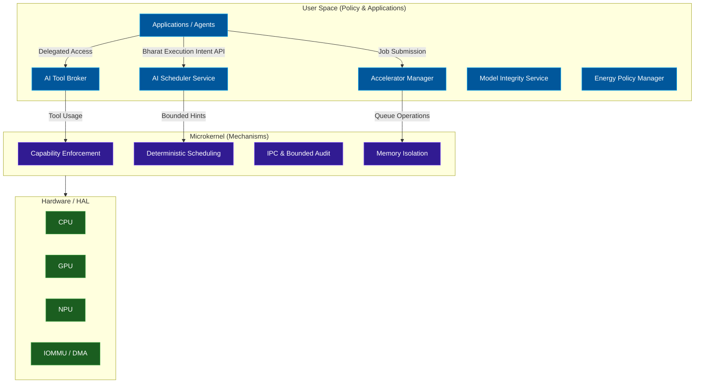
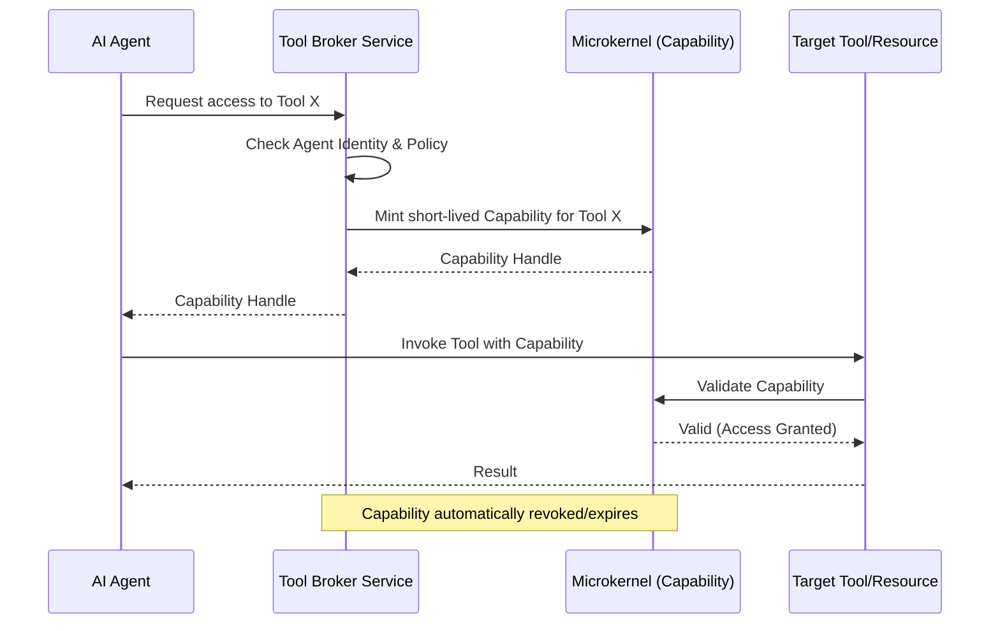
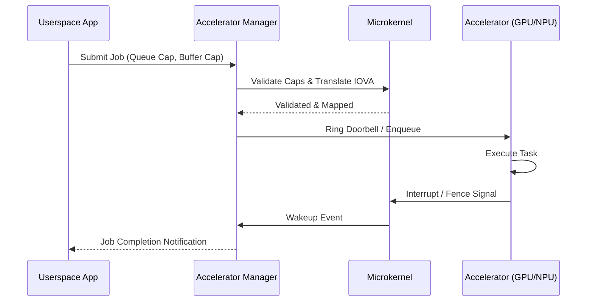
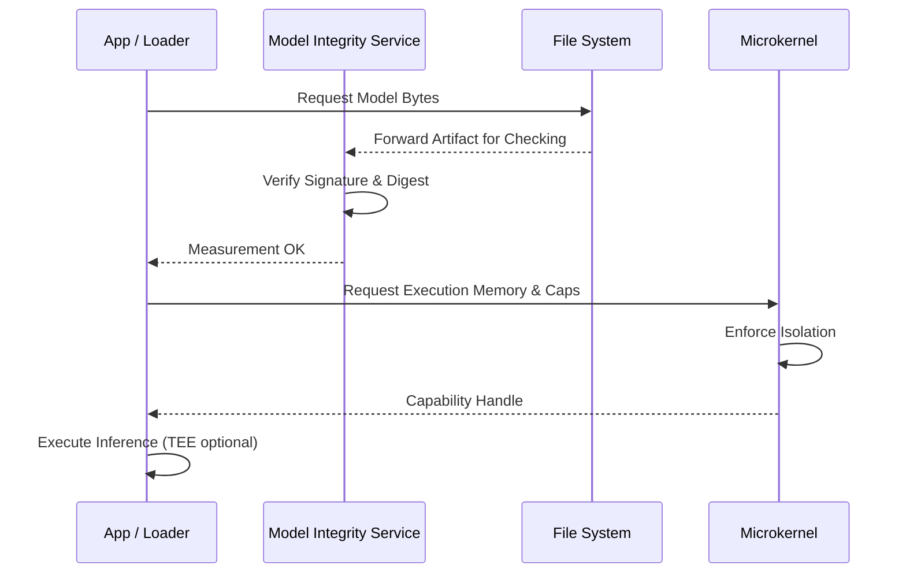
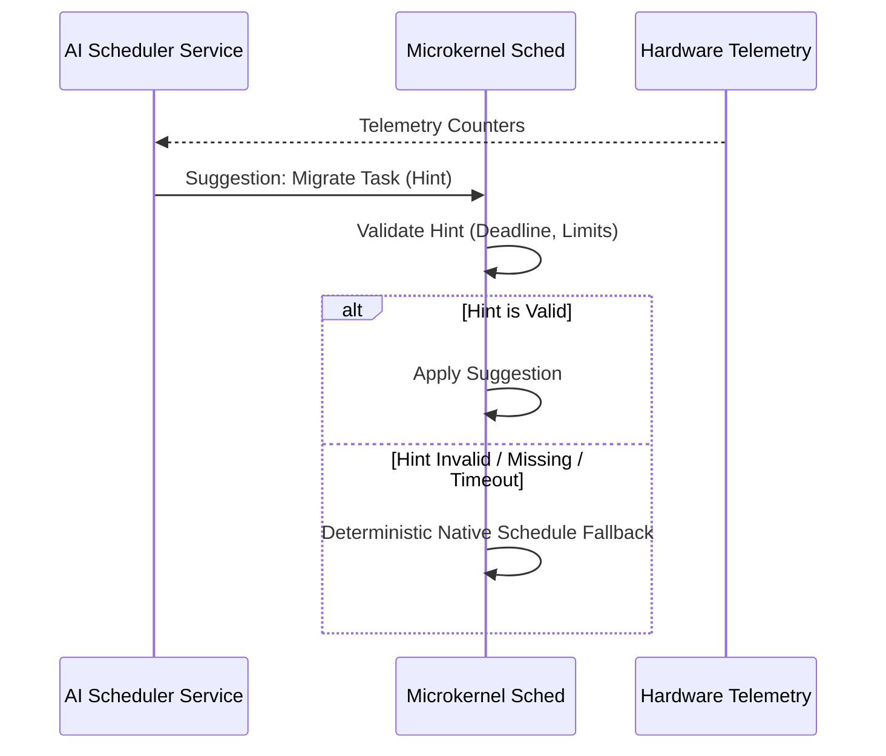

# Heterogeneous Compute and AI-Native Operating System Architecture

This document defines Bharat-OS's heterogeneous compute and AI-native architecture. It establishes common contracts and mechanisms across CPU, GPU, NPU, DSP, and domain accelerators while preserving our core design principles:

- Per-core multikernel ownership.
- Capability-first security.
- Mechanism in kernel; policy in userspace services.
- Support for GP, RT and MIX scheduling.
- Hardware-independent contracts through existing architecture/HAL boundaries.
- No machine-learning model execution in ring 0.
- Deterministic fallback when AI services become unavailable.

## 1. Unified Accelerator Resource Management

Bharat-OS treats CPUs, GPUs, NPUs, DSPs, and high-speed NICs as first-class managed compute resources.

### Architectural Abstractions

- **Hardware Discovery:** Architecture-independent HAL mechanisms expose available capability profiles (e.g., PCIe, CXL, SoC-internal buses).
- **Job Submission & Lifecycle:** Unified queue structures and generic job/fence descriptors manage task execution across heterogeneous backends.
- **Per-Tenant Isolation:** Devices are exposed to tenants via specific capability families (e.g., `CAP_TYPE_ACCEL_QUEUE`, `CAP_TYPE_ACCEL_BUFFER`). IOMMU domains enforce isolation, preventing workloads from accessing another tenant's hardware context.
- **Memory Ownership & Sharing:** Shared memory contexts can span CPU and accelerator domains (leveraging CXL.mem where supported). For architectures lacking CXL or IOMMU, capability-driven degradation paths fall back to isolated copying or software emulation boundaries.
- **Synchronization:** Capability-protected fence primitives synchronize CPU and accelerator workflows.

## 2. Capability-Bound AI Agent Sandboxing

AI agents in Bharat-OS are treated as isolated userspace workloads. They possess no ambient authority over files, tools, or networks.

### Agent Sandbox Constraints

- **Process Isolation:** Agents run in minimal, locked-down virtual address spaces.
- **Tool Brokering:** An MCP-style **Tool Broker Service** (in userspace) mediates all tool usage. The kernel provides underlying capability enforcement and minimal audit logs, but does not parse tool payloads.
- **Delegation & Attenuation:** Capabilities to invoke specific tools or access specific files are explicitly delegated to the agent, optionally attenuated (e.g., read-only access), and strictly short-lived.
- **Revocation:** Capabilities are automatically revoked upon task completion or quota exhaustion.

## 3. Model and Weight Integrity

Model execution requires a trusted loading lifecycle. Bharat-OS keeps the policy and loading mechanisms in userspace while the kernel enforces the required capability boundaries.

### Trusted Loading Lifecycle

1.  **Discovery:** Locate the signed model artifact.
2.  **Signature & Digest Verification:** Validate the artifact against a trusted manifest.
3.  **Measured Loading:** Load the artifact, potentially capturing a measurement for attestation.
4.  **Authorization:** Issue specific capability handles to access required memory buffers and accelerator queues.
5.  **Execution (Optional TEE):** Execute inference within a Trusted Execution Environment (TEE) if supported by the platform.
6.  **Revocation:** Unload the model and immediately revoke all granted capabilities.

## 4. AI-Assisted Scheduling

In accordance with ADR-005, machine learning inference never occurs in Ring-0. The kernel's core scheduling mechanism remains deterministic.

### Bounded Hint Interface

- Userspace AI services (e.g., an AI Governor daemon) collect hardware telemetry.
- These services submit **bounded scheduling recommendations** (hints) to the kernel.
- The kernel independently validates every hint against resource constraints, deadline constraints, and scheduling-class restrictions.
- **Deterministic Fallback:** If a hint is invalid, delayed, or unavailable, the kernel unconditionally relies on its deterministic native scheduling logic. AI is never a mandatory dependency.

## 5. Energy and Thermal Governance

We consolidate execution requirements, including latency, energy, and thermal constraints, into a unified model. Kernel mechanisms apply throttling or P-state adjustments based on policies defined in userspace.

---

## The Unifying Concept: Bharat Execution Intent (BEI)

Rather than designing separate scheduling interfaces for AI workloads, GPU jobs, agents, and energy governance, Bharat-OS proposes a common **Execution Intent Descriptor**. This allows workloads to express their requirements holistically.

*(Note: This is an architectural sketch; fields require capability validation and versioning before implementation.)*

```c
typedef struct {
    uint32_t version;
    uint32_t workload_class;

    uint64_t deadline_ns;
    uint64_t memory_budget_bytes;

    uint32_t latency_class;
    uint32_t energy_preference;
    uint32_t safety_class;

    uint64_t accelerator_requirements;
    uint64_t capability_handle;
} bharat_execution_intent_t;
```

---

## Architectural Diagrams

### 1. Overall Architecture


### 2. AI Agent Sandbox & Tool Broker


### 3. Accelerator Job Submission


### 4. Trusted Model Loading


### 5. AI Scheduler Fallback


### 6. Memory Ownership & Isolation
```mermaid
graph LR
    classDef mem fill:#b71c1c,stroke:#ff5252,color:#fff

    subgraph CPU Domain
        CPU_Mem["Host Physical Memory"]:::mem
    end

    subgraph Accelerator Domain
        GPU_Mem["Device VRAM / Local"]:::mem
    end

    IOMMU["IOMMU"]

    CPU_Mem --> IOMMU
    IOMMU -->|Capability Mapped| GPU_Mem

    Note over IOMMU: Enforces Per-Tenant Isolation.<br/>Degrades to copy if missing.
```

---

## Implementation Roadmap

| Phase | Scope | Dependencies / Details |
| --- | --- | --- |
| **P0** | **Architecture contracts and security invariants** | Define BEI struct, capability matrices. Finalize `AI_NATIVE_HETEROGENEOUS_COMPUTE.md`. |
| **P1** | **Hardware discovery and common accelerator descriptors** | Unify HAL discovery APIs. Affects `core/hal/common/device`. |
| **P1** | **Capability-bound agent isolation** | Introduce capability scoping for generic processes. Affects `core/services/servicemgr`. |
| **P1** | **AI scheduler hint interface hardening** | Expand `core/kernel/include/sched/ai_sched.h` validation logic. Ensure fallback tests exist. |
| **P2** | **Accelerator queues, memory mapping and isolation** | Implement `CAP_TYPE_ACCEL_QUEUE` & IOMMU mapping paths. Affects `core/drivers/accel/`. |
| **P2** | **Model-integrity service** | New userspace service for signature validation and digest checking. |
| **P2** | **Tool broker service** | New userspace service managing MCP-style capability minting. |
| **P3** | **Optional CXL/TEE and advanced power optimizations** | Hardware-specific backends for CXL coherent memory sharing and thermal trip management. |
