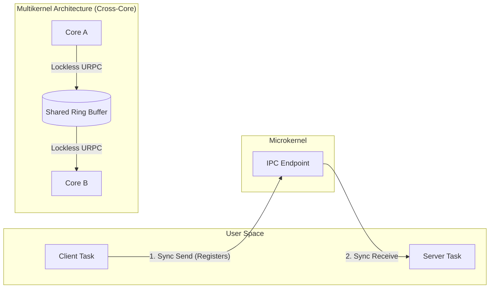

# Inter-Process Communication (IPC) Model

## Overview

Because Bharat-OS is a microkernel, almost all OS services (file systems, networking, drivers) run in isolated user-space domains. Thus, IPC performance is the most critical bottleneck.

We utilize two distinct IPC models to serve both deterministic bounds (Bharat-RT) and massive scalability (Bharat-Cloud).
The cross-core URPC path follows the multikernel principle popularized by Barrelfish: the machine is treated as a network of independent cores coordinated through explicit message passing rather than shared-kernel locks.

## 1. Synchronous Endpoint IPC (The Microkernel Standard)

Fast, blocking, unbuffered message passing used for capability delegation and strict procedural calls.

- **Endpoints (`ep_t`)**: Communication portals. A Sender invokes a Send capability on the endpoint; a Receiver invokes a Receive capability.
- **Registers**: Short messages (few words) are passed entirely within CPU registers during the context switch, completely bypassing memory to achieve ultra-low latency.

## 2. Lockless URPC (The Multikernel Spine)

Scaling synchronous IPC across 128+ cores causes shared memory bus saturation and cache thrashing. For high-core-count processors, Bharat-Cloud utilizes a Barrelfish-inspired Multikernel architecture.

- **URPC (User-level Remote Procedure Call)**: Replaces cross-core kernel locks with explicit, asynchronous message passing via shared ring buffers.
- **Core-to-Core Message Passing**: Each core runs its own kernel instance. State (like page tables) is replicated, not shared. When Core A needs to update a page table on Core B, it sends a lockless URPC message over an interconnect rather than grabbing a global spinlock.
