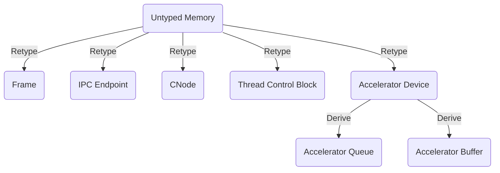

# Capability Types

## Overview
Every capability in the Bharat-OS kernel points to an underlying object and carries a specific **Type**. The Type determines what operations (Rights) can be invoked on that object.

## Core Capability Types

1.  **Untyped (`CAP_TYPE_UNTYPED`)**
    - **Description:** A block of raw physical memory that has not yet been assigned a purpose.
    - **Operations:** Retype (convert into other object types), Divide (split into smaller Untyped blocks).
    - **Rights:** `GRANT` (delegate).

2.  **Thread Control Block (`CAP_TYPE_TCB`)**
    - **Description:** Points to a thread object (`bh_thread_t`).
    - **Operations:** Suspend, Resume, Bind to IPC Endpoint, Read/Write Registers.
    - **Rights:** `SCHEDULE`, `MODIFY`.

3.  **Address Space / Page Directory (`CAP_TYPE_VSPACE`)**
    - **Description:** Points to a top-level page table structure (`address_space_t`).
    - **Operations:** Map Page, Unmap Page.
    - **Rights:** `MAP`, `UNMAP`.

4.  **Memory Frame (`CAP_TYPE_FRAME`)**
    - **Description:** A specific physical memory page (e.g., 4KB, 2MB).
    - **Operations:** Map into a VSpace.
    - **Rights:** `READ`, `WRITE`, `EXECUTE`.

5.  **IPC Endpoint (`CAP_TYPE_ENDPOINT`)**
    - **Description:** A synchronous communication portal (`bh_endpoint_t`).
    - **Operations:** Send Message, Receive Message, Grant Capability.
    - **Rights:** `SEND`, `RECEIVE`, `DELEGATE`.

6.  **CNode (`CAP_TYPE_CNODE`)**
    - **Description:** A directory of capabilities forming the task's CSpace.
    - **Operations:** Mint, Copy, Revoke, Delete.
    - **Rights:** `MODIFY`.

7.  **Interrupt / IRQ (`CAP_TYPE_IRQ`)**
    - **Description:** Authority to receive hardware interrupts.
    - **Operations:** Bind to an Endpoint, Acknowledge IRQ.
    - **Rights:** `RECEIVE`.

## Hardware / Device Capabilities
8.  **I/O Ports (`CAP_TYPE_IOPORT`)** (x86 specific)
    - Authority to use `in`/`out` instructions on a specific port range.
9.  **MMIO Device Region (`CAP_TYPE_DEVICE_MMIO`)**
    - Authority to map specific physical addresses associated with hardware devices.
    - *Note: This generic type is deprecated for complex accelerators (GPUs, NPUs, advanced DMA). Use specific accelerator capabilities instead.*

## Accelerator & DMA Capabilities (New)
To support a secure distributed kernel with complex hardware, Bharat-OS defines first-class capability families for accelerators and DMA, moving away from generic MMIO access.

10. **Accelerator Device (`CAP_TYPE_ACCEL_DEVICE`)**
    - Authority over a physical accelerator device.
    - **Rights:** `ALL`, `DERIVE`
11. **Accelerator Queue (`CAP_TYPE_ACCEL_QUEUE`)**
    - Authority to submit work to a hardware queue.
    - **Rights:** `ENQUEUE`, `CANCEL`, `QUERY`
12. **Accelerator Buffer (`CAP_TYPE_ACCEL_BUFFER`)**
    - Authority over device-mapped memory.
    - **Rights:** `MAP`, `BIND`, `SHARE`, `SYNC_CPU`, `SYNC_DEV`
13. **Accelerator Telemetry (`CAP_TYPE_ACCEL_TELEMETRY`)**
    - Authority to read performance counters and fault states.
    - **Rights:** `READ_STATS`, `READ_FAULTS`
14. **Accelerator Admin (`CAP_TYPE_ACCEL_ADMIN`)**
    - Privileged administrative authority (reset, repartition, firmware load).
    - **Rights:** `RESET`, `PARTITION`, `FW_LOAD`, `THROTTLE_OVERRIDE`
15. **DMA Domain (`CAP_TYPE_DMA_DOMAIN`)**
    - Authority over an IOMMU protection domain.
16. **DMA Grant (`CAP_TYPE_DMA_GRANT`)**
    - A temporal lease mapping host memory to a device (see `dma-grant-model.md`).
    - **Rights:** `MAP`, `UNMAP`, `REVOKE`

