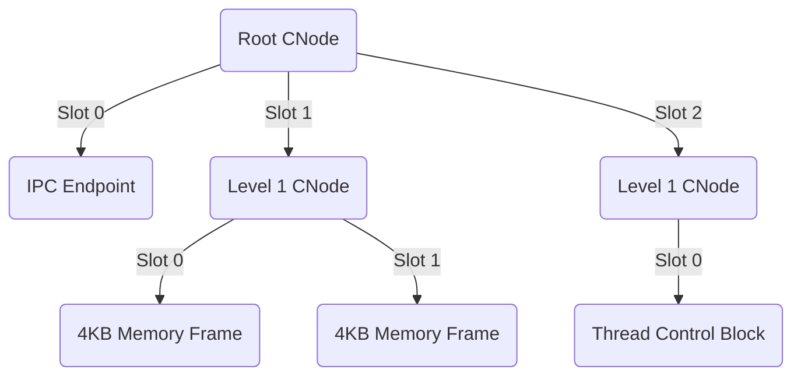

# Capability Space (CSpace)

## Overview
A **Capability Space (CSpace)** is the complete set of capabilities available to a Thread or Task. It defines the boundary of what the task is permitted to access within the entire system.

## The CNode Tree
The CSpace is not a flat array; it is a directed graph built from nodes called **CNodes**.

1.  **CNode:** A kernel object that holds a fixed-size array of "slots" (entries).
2.  **Slots:** Each slot can hold exactly one capability and tracks its state using metadata (e.g., `in_use`, `generation`).
3.  **Hierarchy:** A capability in a CNode slot can point to another CNode, creating a tree or directed graph.

To ensure strict parent/child tracking across tables (e.g., during delegation), each capability slot holds a `cap_handle_t` referencing:
- `parent`: The slot and table that created this capability.
- `first_child`: The first child capability delegated directly from this slot.
- `next_sibling`: Other capabilities derived from the same parent.

These links form the backbone of the kernel's revocation algorithm. To avoid stale pointers, a `generation` counter is tied to every handle link, verifying validity before traversal.

## Addressing Capabilities (CSpace Index)
When a user thread performs a system call to invoke a capability (e.g., `ipc_endpoint_send`), it passes a **CSpace Index (CPTR)** instead of a pointer.

- **CPTR (Capability Pointer):** A multi-level index (often an integer) that the kernel uses to traverse the CNode tree to find the correct capability slot. This is analogous to how a Virtual Address traverses a multi-level page table to find a physical frame.

For example, a 32-bit `CPTR` might use the top 10 bits to index the root CNode, the next 10 bits for a level 1 CNode, and the final 12 bits for a level 2 CNode slot.

## CSpace Construction
When a task is created (`process_create()`), the kernel allocates a root CNode and populates it with a base set of capabilities (e.g., its own TCB, its root VSpace, an IPC endpoint to its parent). All other capabilities must be explicitly granted (delegated) by other tasks or retyped from Untyped memory.