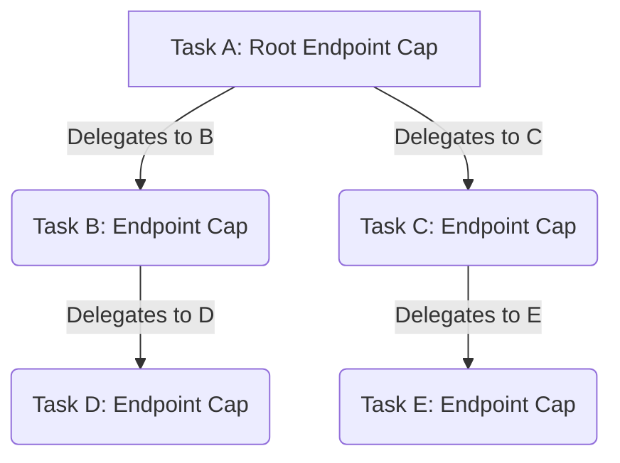

# Derivation and Revocation

## Overview
Capabilities are not static; they form a tree structure representing the flow of authority. A task holding a capability can **derive** a new one to grant to another task, and later **revoke** it.

## The Derivation Tree
When a task (Task A) delegates a capability (e.g., an IPC Endpoint) to another task (Task B), the kernel does not just copy the capability. It creates a new capability node in Task B's CSpace that points back to the original capability in Task A's CSpace.

This creates a **Derivation Tree**.

## Minting and Attenuation
When deriving a capability, a task can **mint** a new version with *fewer* rights than it currently possesses. This is known as **Rights Attenuation** and is crucial for the Principle of Least Privilege.

- **Example:** Task A holds a Memory Frame capability with `READ | WRITE | EXECUTE` rights. It wants to give Task B access, but only to read the data. Task A mints a new capability with only the `READ` right and delegates it to Task B.
- **Rule:** The rights of a derived capability must be a subset of the parent capability's rights (`cap_transfer_rights_valid`). You cannot grant rights you do not have.

## Revocation
The derivation tree allows the kernel to perform recursive revocation.

- **Operation:** When Task A decides to **revoke** its original Endpoint capability, the kernel traverses the derivation tree.
- **Effect:** The kernel recursively deletes all derived capabilities. Task B, Task C, Task D, and Task E will immediately lose access to the Endpoint, their CSpace slots will be invalidated, and any future attempts to use their capabilities will result in an error (e.g., `-BH_EPERM` or `-BH_EINVAL`).

### Revocation Guarantees (Current State)
The current capability revocation implementation guarantees:
1. **Deterministic DFS Traversal**: Recursive revocation correctly clears child and sibling chains before invalidating the parent without leaving dangling pointers.
2. **Cross-Table Revocation**: A parent capability in one table can safely revoke descendants that have been delegated into different capability tables (e.g., cross-process).
3. **Generation Safety**: Revoked slots increment their generation counters, preventing stale-handle vulnerabilities where an old ID might be reused incorrectly.

**Current Limitations**:
* **Cross-Core Transport**: Cross-core delegation and revocation currently utilize a bounded mock transport (`g_cap_delegations`) because the full multikernel URPC spine is not yet natively integrated with the CNode tree logic.
* **Sibling Structure Constraints**: To avoid complex dynamic lock-inversion deadlocks during cross-table revocation, the current model assumes sibling chains can be optimistically read and bulk-locked. Deep, highly-concurrent cross-table derivations may require a more granular epoch-based or RCU-like capability list design in the future.

## Untyped Memory Derivation
Derivation also applies to Untyped memory. When a task splits a large block of Untyped memory (e.g., 2MB) into smaller blocks (e.g., 512x 4KB blocks), the smaller blocks are derivations of the larger block. Revoking the large block reclaims all the smaller blocks (and anything they were retyped into).