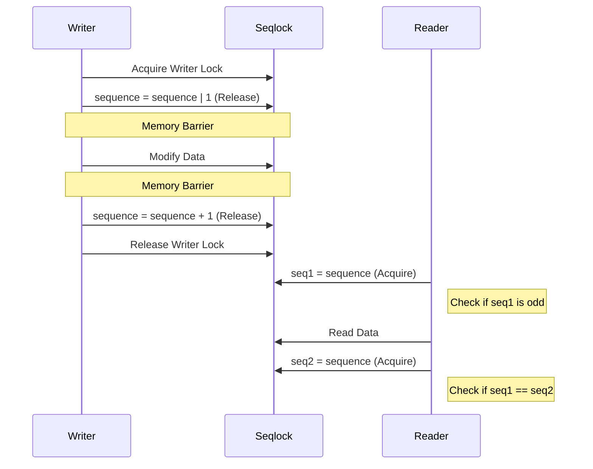

# KDS-SEQLK-002: Production Seqlock

## Context
The current seqlock implementation modifies and reads the sequence using ordinary loads and increments. It lacks acquire/release semantics and memory barriers, making it unsafe for cross-CPU synchronization.

## Design
Introduce a production-grade seqlock with proper memory ordering, atomic acquire/release semantics, and writer serialization.

### Target Semantics

#### Reader
```text
reader:
    seq = acquire(sequence)
    reject if odd
    read snapshot
    acquire(sequence)
    retry if changed
```

#### Writer
```text
writer:
    serialize writers
    publish odd
    release/barrier
    modify snapshot
    release
    publish even
```

### Data Structure

```c
typedef struct {
    atomic_u64 sequence;
    spinlock_t writer_lock;
} bh_seqlock_t;
```

### Consumer Candidates
* Scheduler load snapshots
* Global time conversion parameters
* Topology snapshots
* IRQ statistics
* Diagnostic counters

## Architecture


## Execution Plan
1. **Define `bh_seqlock_t`**: Create the structure with an atomic sequence counter and writer lock.
2. **Implement Writer Logic**: Add memory barriers and atomic increments with release semantics.
3. **Implement Reader Logic**: Add atomic loads with acquire semantics and retry loop.
4. **Migrate Consumers**: Convert existing scheduler telemetry/timekeeping snapshots to use the new seqlock.
5. **Testing**: Write adversarial concurrency tests and verify cross-CPU visibility.