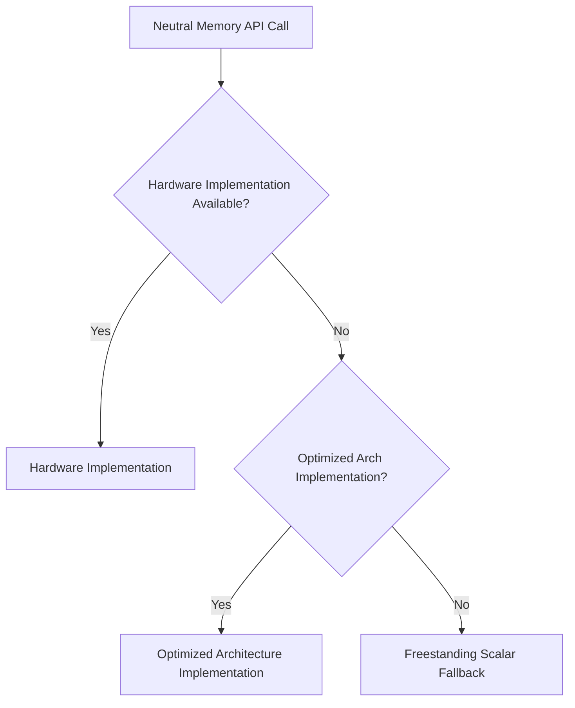

# KMEM-ACCEL-001: Hardware-Assisted Secure Zero/Copy/Cache Operations

## Context
PMM and slab allocators can benefit from hardware acceleration for zeroing and cache maintenance without exposing ISA details.

## Design
Add neutral operations dispatched through the capability layer to optimized hardware implementations.

### Neutral API

```c
void bh_mem_zero_page(void *addr);
void bh_mem_zero_secure(void *addr, size_t len);
void bh_cache_clean_range(void *addr, size_t len);
void bh_cache_invalidate_range(void *addr, size_t len);
void bh_cache_flush_range(void *addr, size_t len);
```

### ISA Mapping
* **RISC-V**: CMO extensions (Zicboz for zeroing, block clean/flush).
* **Arm**: Architectural cache zero, cache maintenance operations.
* **x86**: Optimized string memops (e.g., ERMS).

## Architecture Dispatch



## Execution Plan
1. **Define Neutral API**: Create the standard functions for zeroing and cache maintenance.
2. **Capability Hooks**: Map `hal_hw_caps_t` flags (like `cache_block_zero`) to the dispatch logic.
3. **Hardware Implementations**: Implement assembly/intrinsic routines for supported ISAs (Zicboz, ERMS, etc.).
4. **Fallback Routines**: Ensure freestanding scalar implementations exist for unsupported targets.
5. **Security Check**: Enforce that the kernel mediates all raw cache maintenance operations; do not expose directly to userspace unless explicitly authorized.
6. **Testing**: Verify cache coherency after operations and measure zeroing performance improvements.