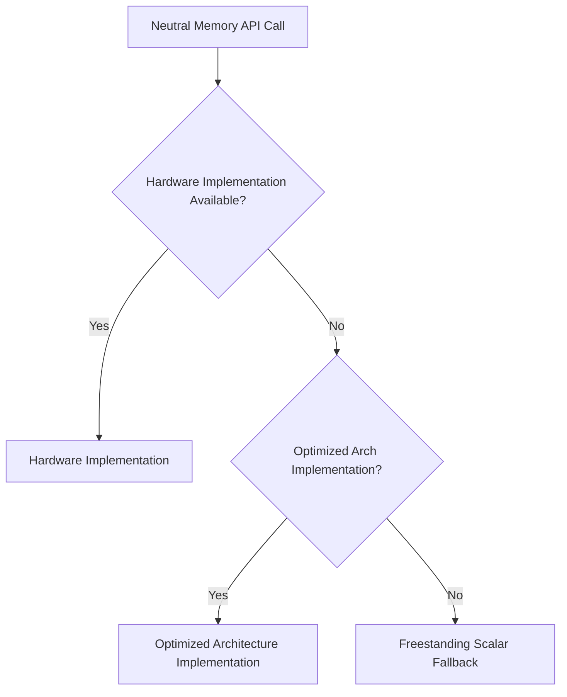

# KMEM-ACCEL-001: Hardware-Assisted Secure Zero/Copy/Cache Operations

## Context
PMM and slab allocators can benefit from hardware acceleration for zeroing and cache maintenance without exposing ISA details.

## Design
Add neutral operations dispatched through the capability layer to optimized hardware implementations.

### Neutral API

```c
void bh_mem_zero_page(void *addr);
void bh_mem_zero_secure(void *addr, size_t len);
void bh_cache_clean_range(void *addr, size_t len);
void bh_cache_invalidate_range(void *addr, size_t len);
void bh_cache_flush_range(void *addr, size_t len);
```

### ISA Mapping
* **RISC-V**: CMO extensions (Zicboz for zeroing, block clean/flush).
* **Arm**: Architectural cache zero, cache maintenance operations.
* **x86**: Optimized string memops (e.g., ERMS).

## Architecture Dispatch



### Tier-0 fallback contract

`core/hal/common/memops/mem_scalar.c` is the single architecture-neutral
Tier-0 authority. It uses only requested byte loads and stores: no prefetch,
word-sized access, SIMD/vector state, DMA, cache/topology assumptions, or calls
to another memory primitive. HAL common owns the dispatched `hal_memcpy()`,
`hal_memset()`, and `hal_memmove()` entry points. Architecture directories may
only publish immutable per-core GPR backends during serial boot.

IRQ-safe and early-boot dispatch must select Tier 0. Arm32 and RV32 use their
own integer-only providers; 64-bit objects are never reused as 32-bit
providers. Tier 0 `memmove` determines copy
direction using overflow-safe `uintptr_t` address differences and never forms
an unchecked end pointer.

The backend table and normalized CPU feature records have a one-way lifecycle:
serial publication followed by freeze. Before freeze, for an unregistered core,
or for early-boot/IRQ-safe calls, dispatch selects Tier 0.

All providers implement the complete copy/move/set/compare table. HAL validates
the table and context mask at serial registration and contains no ERMS, SIMD,
NEON, SVE, or RVV selection logic. The architecture probe alone chooses a
provider. BharatLibC has a parallel resolver and never imports HAL or kernel
headers; it consumes only the versioned, safe-on-all-schedulable-CPUs feature
descriptor from `interface/uapi/runtime/cpu_features.h`.

## Execution Plan
1. **Define Neutral API**: Create the standard functions for zeroing and cache maintenance.
2. **Capability Hooks**: Map `hal_hw_caps_t` flags (like `cache_block_zero`) to the dispatch logic.
3. **Hardware Implementations**: Implement assembly/intrinsic routines for supported ISAs (Zicboz, ERMS, etc.).
4. **Fallback Routines**: Ensure freestanding scalar implementations exist for unsupported targets.
5. **Security Check**: Enforce that the kernel mediates all raw cache maintenance operations; do not expose directly to userspace unless explicitly authorized.
6. **Testing**: Verify cache coherency after operations and measure zeroing performance improvements.
