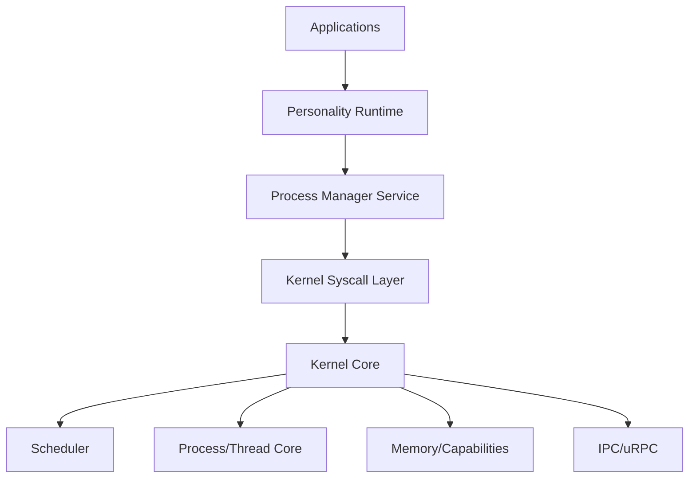
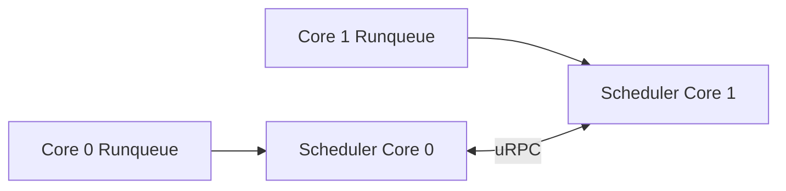
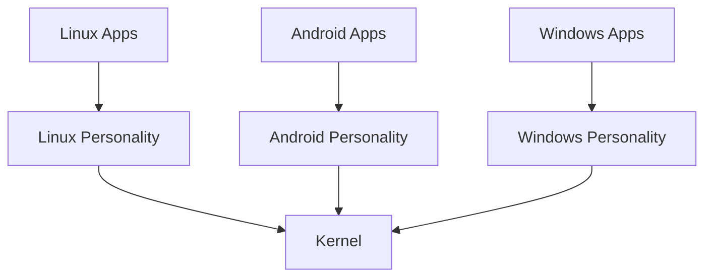
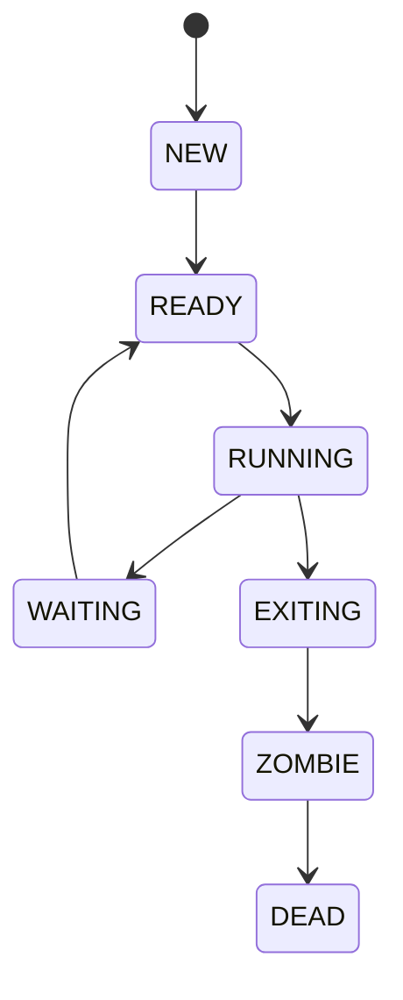
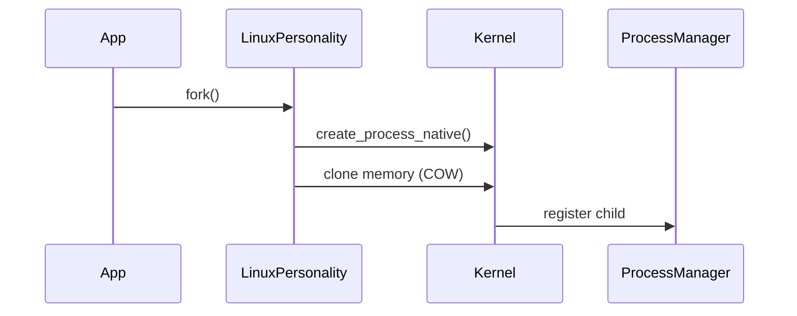
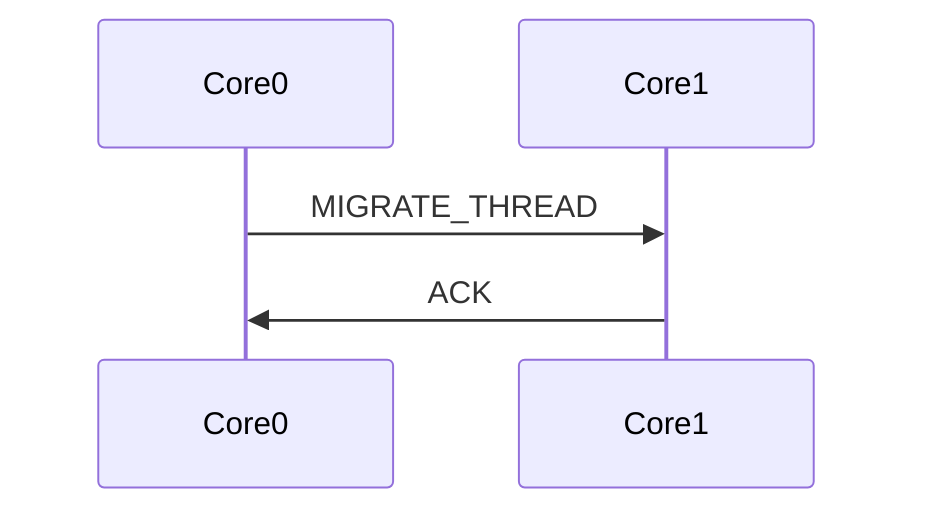

# Bharat-OS Process & Thread Management Architecture

**Version:** v1.0 (Proposed)
**Scope:** Kernel + Personality + Services
**Status:** Draft → Implementation Ready

---

## 1. Executive Summary

Bharat-OS will implement a **single, capability-driven, personality-neutral process/thread model in the kernel**, while providing **multi-personality compatibility (Linux, Android, Windows, macOS)** through a **Personality Runtime Layer**.

This ensures:
* Strong kernel correctness and minimalism
* Cross-platform compatibility without kernel bloat
* Alignment with multikernel (per-core ownership + message passing)
* Clean evolution toward distributed execution

---

## 2. Design Principles

### Core Principles

1. **Kernel = Mechanism only**
2. **Personality = Policy + ABI translation**
3. **Services = Lifecycle orchestration**
4. **No OS-specific semantics in kernel (no fork/clone/CreateProcess)**
5. **Everything capability-mediated**
6. **Per-core ownership (multikernel ready)**

---

## 3. Current State Analysis (From Repo)

| Area                    | Current State               | Gap                          |
| ----------------------- | --------------------------- | ---------------------------- |
| Scheduler               | Functional, in `sched.c`    | Mixed with lifecycle logic   |
| Process (`kprocess`)    | Basic structure             | Missing lifecycle, hierarchy |
| Thread (`kthread`)      | Rich scheduling info        | Missing TLS, signals         |
| Personality             | Minimal (`personality_ops`) | Too limited                  |
| Process Manager Service | Stub                        | Not implemented              |
| Syscall Model           | Basic                       | Not personality-aware        |
| Multikernel Hooks       | Present (core_id etc.)      | Not fully exploited          |

---

## 4. Target Architecture Overview

### 4.1 Layered Model



---

## 5. Kernel Architecture

### 5.1 Kernel Responsibilities

* Process container (kprocess)
* Thread execution (kthread)
* Scheduling
* Address space management
* Capability enforcement
* IPC
* Fault delivery

---

### 5.2 Core Objects

#### Process Object

```c
struct kprocess {
    pid_t pid;
    pid_t parent_pid;

    enum proc_state state;

    address_space_t* aspace;
    cap_table_t* cspace;

    struct kthread* main_thread;

    personality_t personality;
    void* personality_ctx;

    list_t children;
    wait_queue_t waiters;

    int exit_code;

    core_id_t owner_core;

    namespace_t* namespace;

    resource_accounting_t* resources;
};
```

---

#### Thread Object

```c
struct kthread {
    tid_t tid;
    struct kprocess* process;

    enum thread_state state;

    void* kernel_stack;
    cpu_context_t context;

    int priority;
    int base_priority;

    cpu_affinity_t affinity;

    void* tls;

    signal_state_t signals;

    wait_channel_t* wait_channel;

    core_id_t current_core;

    personality_t personality;
};
```

---

## 6. Scheduler Architecture

### 6.1 Scheduler Scope

* Per-core run queues
* Thread selection
* Preemption
* Load balancing via uRPC

---

### 6.2 Scheduler Model



---

### 6.3 Policy Abstraction

| Kernel Policy | Mapped From                  |
| ------------- | ---------------------------- |
| REALTIME      | Linux SCHED_FIFO, Windows RT |
| INTERACTIVE   | Android UI, macOS QoS        |
| BATCH         | Linux CFS                    |
| BACKGROUND    | Android bg                   |
| DEADLINE      | Linux SCHED_DEADLINE         |

---

## 7. Personality Layer Architecture

### 7.1 Concept

Personality = **ABI Translator**

---

### 7.2 Personality Stack



---

### 7.3 Personality Interface (Enhanced)

```c
struct personality_ops {
    int (*handle_syscall)(...);
    int (*handle_fault)(...);

    int (*create_process)(...);
    int (*create_thread)(...);

    int (*clone_or_fork)(...);

    int (*exec)(...);

    int (*exit_process)(...);
    int (*exit_thread)(...);

    int (*deliver_signal)(...);

    int (*wait_translate)(...);

    int (*map_sched_policy)(...);
};
```

---

## 8. Process Lifecycle

### 8.1 Native Lifecycle



---

## 8.2 Linux Compatibility Flow



---

## 9. Syscall Design

### 9.1 Kernel Neutral Syscalls

| Syscall                  | Purpose              |
| ------------------------ | -------------------- |
| process_create_native    | Create empty process |
| thread_create_native     | Create thread        |
| process_bind_personality | Attach personality   |
| process_exec             | Load image           |
| process_exit             | Terminate            |
| thread_exit              | Terminate thread     |
| wait_object              | Wait                 |
| ipc_call                 | IPC                  |
| cap_invoke               | Capability call      |

---

## 10. Multikernel Considerations

### 10.1 Core Ownership

* Each process assigned to a core
* Threads migrate via uRPC

---

### 10.2 Migration Flow



---

## 11. POSIX / Multi-OS Compatibility Mapping

| Feature       | Kernel        | Personality         |
| ------------- | ------------- | ------------------- |
| fork          | ❌             | Linux personality   |
| clone         | ❌             | Linux personality   |
| CreateProcess | ❌             | Windows personality |
| Mach tasks    | ❌             | mac personality     |
| Signals       | Generic event | Personality maps    |
| Futex         | IPC primitive | Linux personality   |
| Handles       | Capability    | Windows personality |

---

## 12. Detailed Design Decisions

### 12.1 Why No fork in Kernel

* Breaks multikernel model
* Heavy memory semantics
* Not needed for modern systems

---

### 12.2 Why Single Thread Model

* Simpler scheduling
* Easier cross-personality mapping
* Better verification

---

### 12.3 Why Personality Layer

* Avoid kernel bloat
* Support multiple OS APIs
* Enable innovation

---

## 13. Risks & Mitigation

| Risk                    | Mitigation               |
| ----------------------- | ------------------------ |
| Personality complexity  | Modular runtime          |
| Performance overhead    | Direct syscall fast-path |
| Multikernel sync issues | uRPC contracts           |
| Debug complexity        | structured tracing       |

---

## 14. Success Metrics

* Process lifecycle correctness (100% tests)
* Linux basic app support
* Thread migration working
* No kernel personality leakage
* Stable ABI

---

## 15. Final Conclusion

This architecture gives Bharat-OS:

* Linux compatibility without becoming Linux
* Windows/mac support without NT/Mach kernel complexity
* Clean research + production path
* True multikernel readiness
