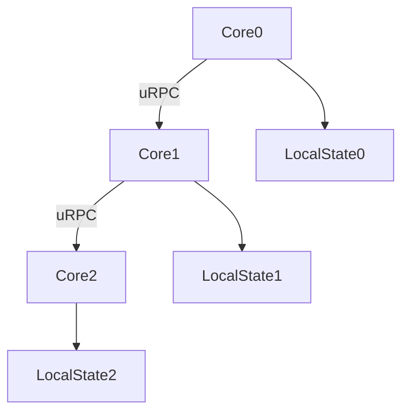
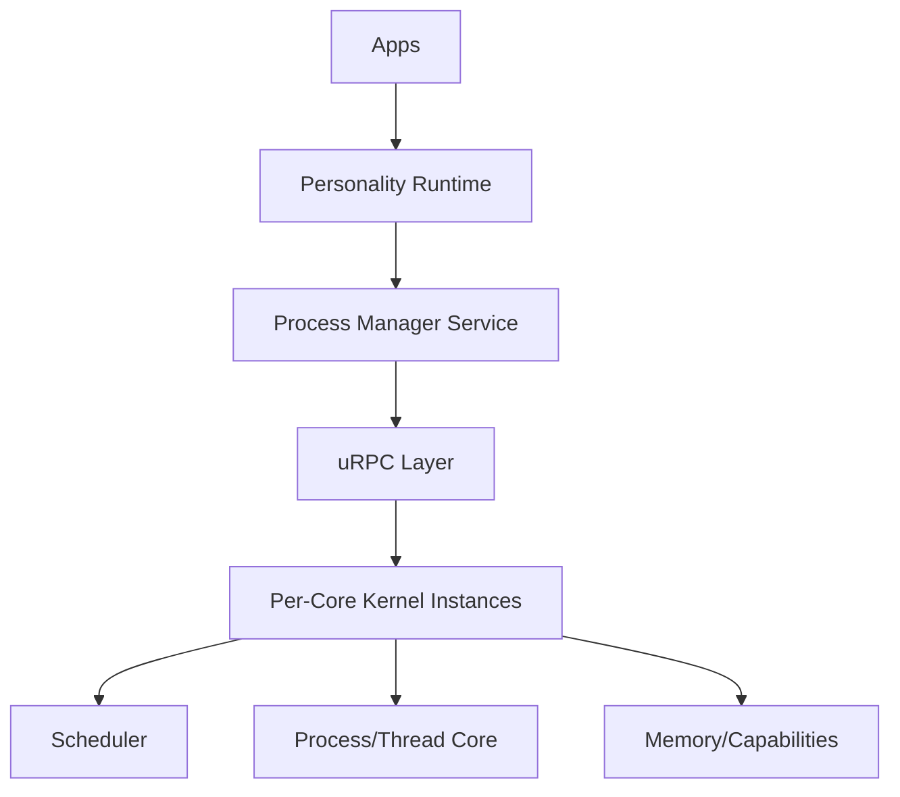
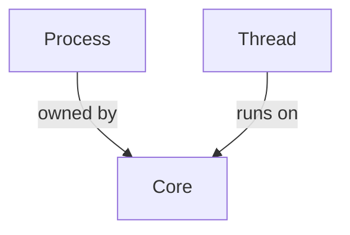
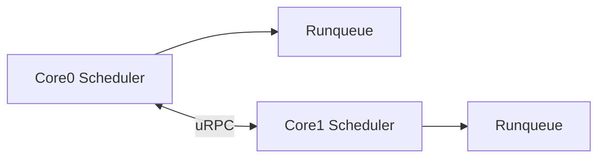
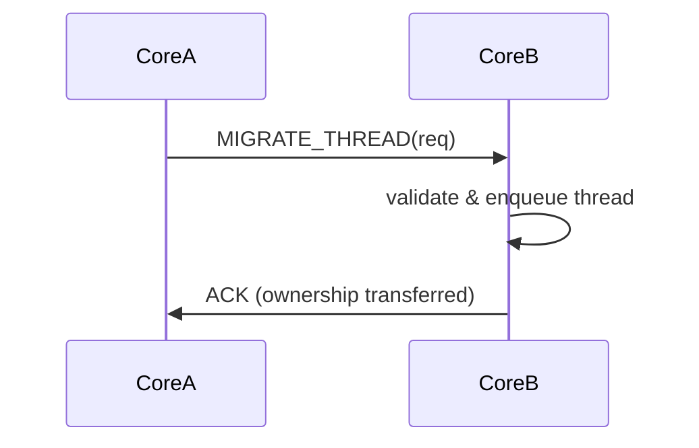
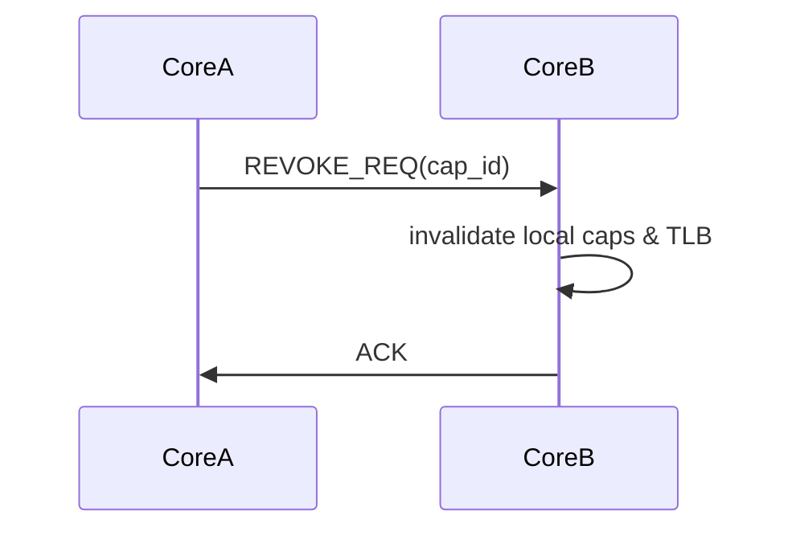
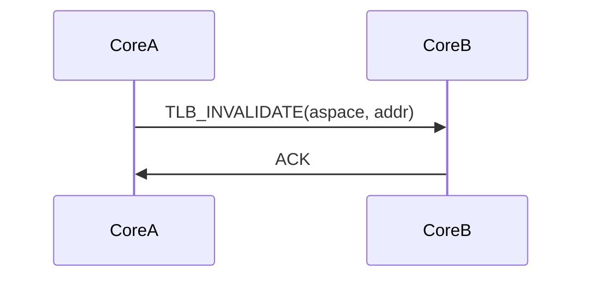
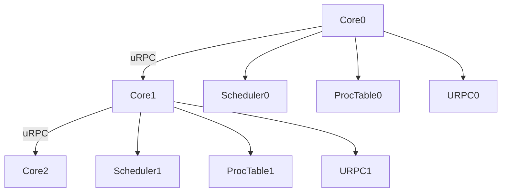

# Bharat-OS Process & Thread Management Architecture

**Version:** v2.0 (Proposed - True Multikernel)
**Scope:** Kernel + Personality + Services
**Status:** Draft → Implementation Ready

---

## 1. Executive Summary

Bharat-OS implements a **Distributed Process & Thread Model** mapped over a **Personality-Driven Compatibility Layer**.

This architecture strictly forbids global kernel state. It enforces **per-core ownership of execution**, where each CPU core acts as a mini-kernel instance. All cross-core operations (thread migration, capability revocation, TLB shootdowns) are performed strictly via **uRPC (Micro-Remote Procedure Call)** messages, ensuring no shared memory mutation or global locks (like `g_threads` or `g_processes`) compromise the system.

This ensures:
* True multikernel correctness (no hidden global state)
* Strong kernel correctness and minimalism
* Cross-platform compatibility (Linux, Android, Windows, macOS) via user-space runtimes
* Lock-free scalability

---

## 2. Core Architectural Shift

### 2.1 The Multikernel Imperative



👉 **Each core is a mini-kernel instance.**

Global structures (`g_threads`, `g_processes`, `g_urpc_states`), global locks (`g_reap_lock`), and synchronous cross-core capability revocations are **strictly prohibited**.

---

## 3. Revised Layered Architecture



---

## 4. Kernel Model (Per-Core State)

### 4.1 Local State Block

All execution tracking is bound to the core that owns the object.

```c
struct core_local_state {
    runqueue_t runqueue;

    thread_table_t local_threads;
    process_table_t local_processes;

    urpc_ring_t inbound_ring;
    urpc_ring_t outbound_ring;

    reaper_queue_t local_reaper;

    page_magazine_t local_page_cache;
};
```

---

## 5. Process Model

### 5.1 Ownership Model



👉 Each process has a **home core**. It does not exist in a global list.

### 5.2 Updated Process Structure

```c
struct bh_process {
    pid_t pid;

    core_id_t home_core; // Ownership tracking

    address_space_t* aspace;
    cap_table_t* cspace;

    struct bh_thread* main_thread;

    personality_t personality;

    proc_state_t state;

    // NO global list or lookup
    list_t local_children;

    urpc_endpoint_t proc_channel; // Cross-core signaling
};
```

---

## 6. Thread Model

```c
struct bh_thread {
    tid_t tid;

    struct bh_process* process;

    core_id_t current_core;

    thread_state_t state;

    cpu_context_t context;

    int priority;

    cpu_affinity_t affinity;

    urpc_endpoint_t control_channel; // For async suspension/migration
};
```

---

## 7. Scheduler Architecture

### 7.1 Per-Core Only

Schedulers do not lock global structures. They pick from their local `runqueue`. Cross-core load balancing is achieved exclusively by sending `MIGRATE_THREAD` uRPC messages to peer cores.



---

## 8. Thread Migration (Critical)

### 8.1 Flow

Thread migration must be asynchronous. Core A cannot mutate Core B's runqueue.



---

## 9. Capability System & Memory

### 9.1 2-Phase Async Revocation

Delegation and revocation across cores cannot block.



### 9.2 TLB Shootdown

Similarly, TLB shootdowns avoid global locks via uRPC:



---

## 10. Personality Layer (Distributed-Aware)

The Personality Runtime (Linux, Windows, Android) acts as the ABI translator, but it must be aware that execution is distributed.

When a Linux app calls `fork()`:
1. `LinuxPersonality` traps the call.
2. It calls `create_process_native()`.
3. It sets up COW (Copy-On-Write) memory mappings.
4. The user-space `Process Manager` or Kernel Policy assigns the new process to a target core via uRPC.

---

## 11. Final Unified Model

Everything ties together without shared memory mutation:



**Bharat-OS is a distributed system kernel, not a shared-memory kernel.**