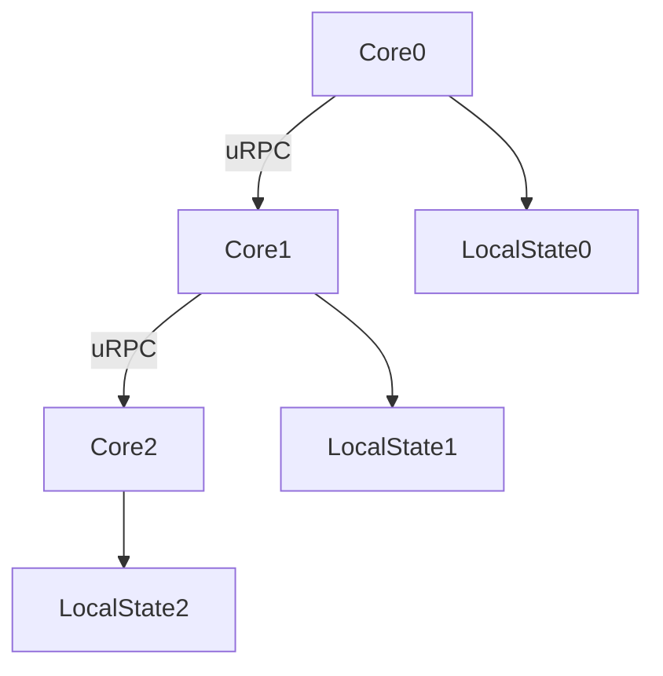
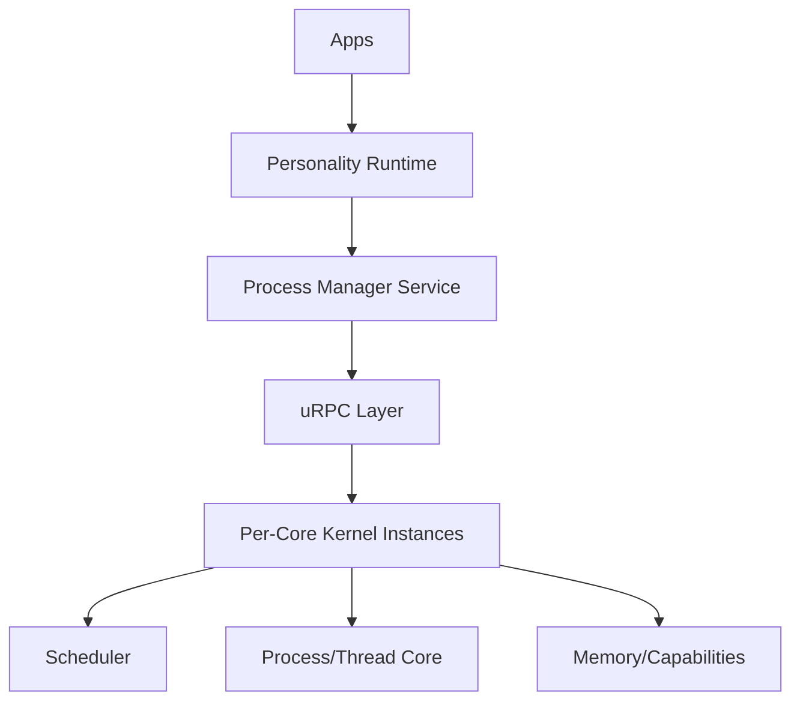
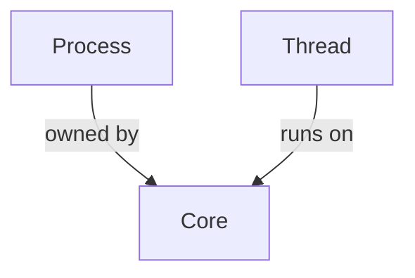
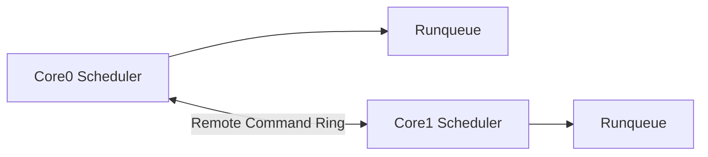
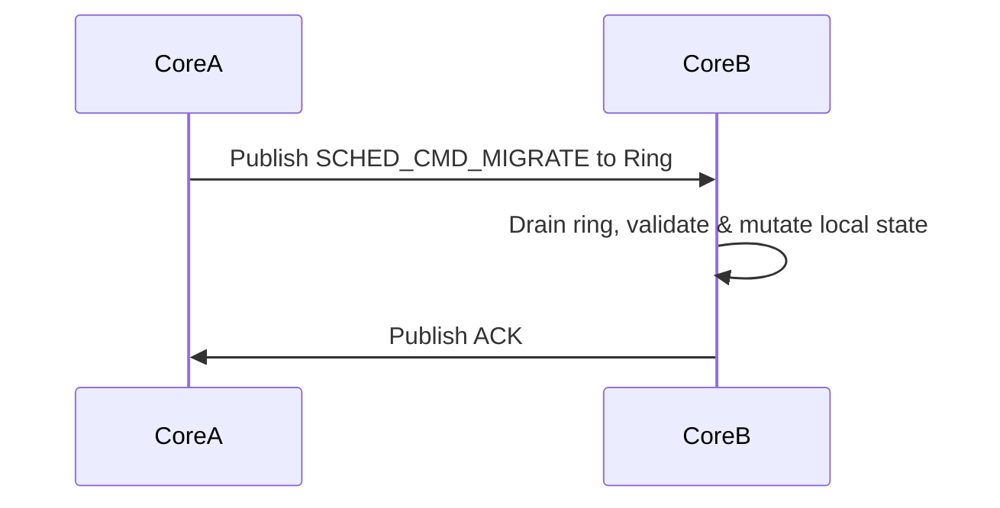
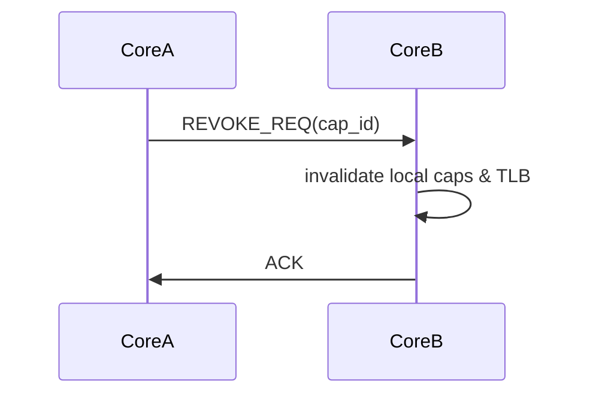
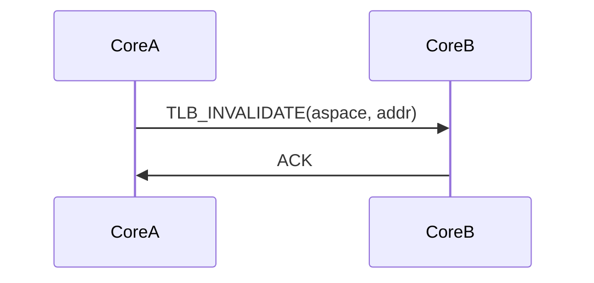
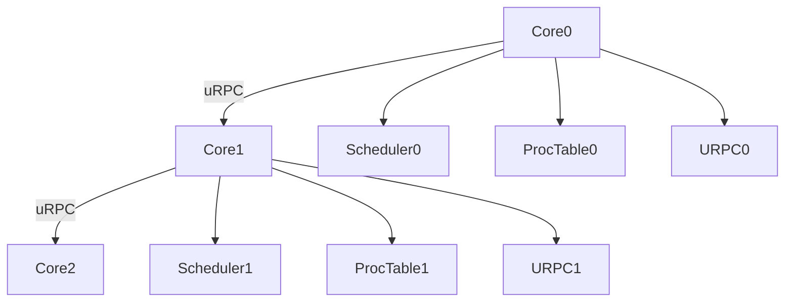

# Bharat-OS Process & Thread Management Architecture

**Scope:** Kernel + Personality + Services
**Status:** Active

## Implementation References
- `core/kernel/include/sched/sched.h`
- `core/kernel/src/sched/sched.c`

---

## 1. Executive Summary

Bharat-OS implements a **Distributed Process & Thread Model** mapped over a **Personality-Driven Compatibility Layer**.

This architecture strictly forbids global kernel state. It enforces **per-core ownership of execution**, where each CPU core acts as a mini-kernel instance. All cross-core operations (thread migration, capability revocation, TLB shootdowns) are performed strictly via **uRPC (Micro-Remote Procedure Call)** messages, ensuring no shared memory mutation or global locks (like `g_threads` or `g_processes`) compromise the system.

This ensures:
* True multikernel correctness (no hidden global state)
* Strong kernel correctness and minimalism
* Cross-platform compatibility (Linux, Android, Windows, macOS) via user-space runtimes
* Lock-free scalability

---

## 2. Core Architectural Shift

### 2.1 The Multikernel Imperative


```mermaid
graph TD
    Core0 -->|uRPC| Core1
    Core1 -->|uRPC| Core2

    Core0 --> LocalState0
    Core1 --> LocalState1
    Core2 --> LocalState2
```

👉 **Each core is a mini-kernel instance.**

Global structures (`g_threads`, `g_processes`, `g_urpc_states`), global locks (`g_reap_lock`), and synchronous cross-core capability revocations are **strictly prohibited**.

---

## 3. Revised Layered Architecture


```mermaid
graph TD
    A[Apps] --> B[Personality Runtime]
    B --> C[Process Manager Service]
    C --> D[uRPC Layer]
    D --> E[Per-Core Kernel Instances]

    E --> F[Scheduler]
    E --> G[Process/Thread Core]
    E --> H[Memory/Capabilities]
```

---

## 4. Kernel Model (Per-Core State)

### 4.1 Local State Block

All execution tracking is bound to the core that owns the object.

```c
struct core_local_state {
    runqueue_t runqueue;

    thread_table_t local_threads;
    process_table_t local_processes;

    urpc_ring_t inbound_ring;
    urpc_ring_t outbound_ring;

    reaper_queue_t local_reaper;

    page_magazine_t local_page_cache;
};
```

---

## 5. Process Model (IMPLEMENTED)

### 5.1 Ownership Model


```mermaid
graph TD
    Process -->|owned by| Core
    Thread -->|runs on| Core
```

👉 Each process has a **home core**.

### 5.2 Process Structure

```c
struct bh_process {
    uint64_t process_id;
    address_space_t* addr_space;
    bh_thread_t* main_thread;

    // Ownership and lookup metadata
    uint32_t home_core_id;
    uint32_t generation;

    // Personality tagging for subsystems (e.g., Linux, Android, Windows)
    bh_process_personality_t personality;

    // Ops mapping syscalls/faults to personality specific behavior
    const struct personality_ops* personality_ops;

    // Capability-based security context would be linked here
    void* security_sandbox_ctx;

    // Ownership tracking
    uint32_t owner_core_id;
    uint64_t object_id;
};
```

---

## 6. Thread Model (IMPLEMENTED)

```c
struct bh_thread {
    uint64_t thread_id;
    uint64_t process_id;
    bh_process_t* process;

    bh_exec_constraints_k_t constraints;

    // Ownership and lookup metadata
    uint32_t home_core_id;
    uint32_t generation;

    // CPU Architectural Context (Registers)
    void* cpu_context;

    // Kernel Stack
    virt_addr_t kernel_stack;

    thread_state_t state;
    uint32_t priority;

    // Personality tagging for subsystems (e.g., Linux, Android, Windows)
    personality_type_t personality;

    // Capability and accounting metadata
    void* capability_list;

    // ...
};
```

---

## 7. Scheduler Architecture

### 7.1 Per-Core Only

Schedulers do not lock global structures. They pick from their local `sched_rq_t`. Cross-core load balancing is achieved exclusively by pushing commands to the target core's remote command ring.


```mermaid
graph LR
    A[Core0 Scheduler] --> A1[Runqueue]
    B[Core1 Scheduler] --> B1[Runqueue]

    A <-- Remote Command Ring --> B
```

---

## 8. Thread Migration (Critical) (IMPLEMENTED)

### 8.1 Flow

Thread migration must be asynchronous. Core A cannot mutate Core B's runqueue.


```mermaid
sequenceDiagram
    participant CoreA
    participant CoreB

    CoreA->>CoreB: Publish SCHED_CMD_MIGRATE to Ring
    CoreB->>CoreB: Drain ring, validate & mutate local state
    CoreB->>CoreA: Publish ACK
```

---

## 9. Capability System & Memory

### 9.1 2-Phase Async Revocation

Delegation and revocation across cores cannot block.


```mermaid
sequenceDiagram
    participant CoreA
    participant CoreB

    CoreA->>CoreB: REVOKE_REQ(cap_id)
    CoreB->>CoreB: invalidate local caps & TLB
    CoreB->>CoreA: ACK
```

### 9.2 TLB Shootdown

Similarly, TLB shootdowns avoid global locks via uRPC:


```mermaid
sequenceDiagram
    participant CoreA
    participant CoreB

    CoreA->>CoreB: TLB_INVALIDATE(aspace, addr)
    CoreB->>CoreA: ACK
```

---

## 10. Personality Layer (Distributed-Aware)

The Personality Runtime (Linux, Windows, Android) acts as the ABI translator, but it must be aware that execution is distributed.

When a Linux app calls `fork()`:
1. `LinuxPersonality` traps the call.
2. It calls `create_process_native()`.
3. It sets up COW (Copy-On-Write) memory mappings.
4. The user-space `Process Manager` or Kernel Policy assigns the new process to a target core via uRPC.

---

## 11. Final Unified Model

Everything ties together without shared memory mutation:


```mermaid
graph TD
    Core0 -->|uRPC| Core1
    Core1 -->|uRPC| Core2

    Core0 --> Scheduler0
    Core1 --> Scheduler1

    Core0 --> ProcTable0
    Core1 --> ProcTable1

    Core0 --> URPC0
    Core1 --> URPC1
```

**Bharat-OS is a distributed system kernel, not a shared-memory kernel.**