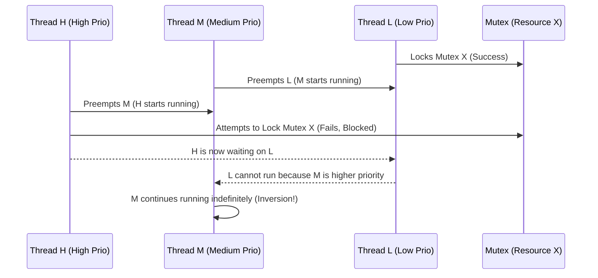

# Priority & Priority Inversion

## Overview
Threads (`bh_thread_t`) in Bharat-OS have an assigned priority level that determines their relative importance to the system. Higher-priority threads receive more CPU time or preempt lower-priority threads.

## Static vs. Dynamic Priority
-   **Static Priority (RT):** Threads with a hard real-time profile (`BHARAT_KERNEL_PROFILE_RT`) have a static priority (e.g., 0 to 99, where 99 is highest). This priority *never changes* during normal execution unless explicitly modified by a capability-authorized system call.
-   **Dynamic Priority (GP):** General-purpose threads have a base priority (e.g., a "nice" value). The scheduler (CFS or MLFQ) dynamically adjusts their *effective* priority based on their recent CPU usage. Interactive threads (GUI) that frequently block on I/O are temporarily boosted to remain responsive, while CPU-bound threads (compilers, video encoders) are penalized to prevent starving the system.

## The Priority Inversion Problem
Priority inversion occurs when a high-priority thread (H) is forced to wait for a low-priority thread (L) because L holds a mutually exclusive resource (a mutex) that H needs. This becomes a severe problem if a medium-priority thread (M) preempts L, effectively delaying H indefinitely.

## Solutions in Bharat-OS

### 1. Priority Inheritance (PI) Protocol (Real-Time Profile)
For RT-profile tasks using kernel-managed synchronization primitives (e.g., a PI-Mutex), Bharat-OS implements the Priority Inheritance Protocol.

-   **Mechanism:** When Thread H blocks on a mutex held by Thread L, the kernel temporarily *boosts* Thread L's effective priority to match Thread H's priority.
-   **Effect:** Thread L now runs at priority H, preventing Thread M from preempting it. Thread L quickly finishes its critical section, unlocks the mutex, and its priority is immediately returned to its original low value. Thread H is then unblocked and acquires the mutex.
-   **Chain of Inheritance:** If Thread L was blocked on a second mutex held by Thread X, Thread X would also be boosted to priority H (transitive inheritance). This is complex to manage locklessly and is typically restricted to the RT profile.

### 2. Fast User-Space Mutexes (Futex-like)
For GP-profile tasks using the standard user-space fast-path mutexes (futexes), priority inheritance is *not* enabled by default because it requires a system call on every lock acquisition, defeating the purpose of the fast path.
-   **Alternative:** The user-space library must explicitly use a "PI-Aware" futex variant (requiring kernel involvement on contention) if priority inversion is a concern for that specific workload.

### 3. AI Governor Monitoring
The AI Governor service monitors context switches and thread blocking states (`ai_sched_update_telemetry()`). If it detects a long-running priority inversion scenario (a high-priority thread blocked for an excessive duration), it can issue an `AI_ACTION_ADJUST_PRIORITY` IPC message to manually boost the blocking thread, acting as a coarse-grained, asynchronous PI mechanism for non-RT tasks.