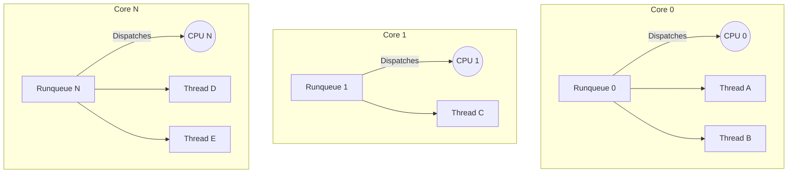

# Runqueue Design

## Overview
In the Bharat-OS multikernel design, scheduling is fundamentally decentralized. There is no single global lock or global runqueue for the entire system, as this would become a massive bottleneck on 64+ core machines.

## Per-CPU Runqueues
Every CPU core maintains its own completely independent `runqueue_t` structure.

-   **Locality:** A thread (`kthread_t`) is assigned to a specific CPU's runqueue when it becomes `Ready`.
-   **Locking:** Because only the local CPU accesses its own runqueue during a context switch, the scheduler can operate locklessly (or with a very fast, uncontended local spinlock disabled with local IRQs off) in the fast path.
-   **Cache Affinity:** Keeping a thread on the same CPU maximizes the L1/L2 cache hit rate, improving performance.

## Remote Enqueue and Cross-Core Wakeup

When a thread must be awakened or migrated to a core different from the one currently executing (e.g., Core X enqueuing to Core Y), Bharat-OS utilizes a decoupled, asynchronous enqueue mechanism to preserve local runqueue ownership:

1. **Pending Inbox:** Core X briefly acquires the remote runqueue lock of Core Y, places the newly runnable thread into a specialized `pending_inbox` list, and sets a `resched_pending` flag.
2. **Inter-Processor Interrupt (IPI):** Core X issues an IPI to Core Y.
3. **Local Dispatch:** Core Y receives the IPI, triggering a `sched_reschedule()`. Core Y then drains its `pending_inbox` natively, evaluates priorities, and potentially preempts its currently running thread.

This architecture ensures that the remote core always retains ultimate authority over its local `ready_queue` and preemption decisions, maintaining strict multikernel isolation boundaries while minimizing cross-core lock duration. Successive remote enqueues before the inbox is drained are coalesced into a single IPI to prevent interrupt storms.

## Load Balancing (Cross-Core Migration)
While per-CPU runqueues are fast, they can lead to imbalance (e.g., Core 0 has 10 busy threads, Core 1 is idle). Bharat-OS addresses this through periodic load balancing.

### 1. Periodic Rebalancing (Timer-Driven)
During the timer tick (or periodically), a CPU checks the length of its runqueue against the system average (or its NUMA node average).

-   **Pull Migration:** If a CPU is idle (or lightly loaded), it can attempt to "steal" a thread from a heavily loaded sibling CPU. This requires briefly acquiring the remote CPU's runqueue lock.

### 2. AI Governor Directed Migration (Control-Plane)
The user-space AI Governor service has a global view of all cores' telemetry (IPC, CPI, cache misses, thermal status).

-   **Push Migration:** The AI Governor sends a suggestion (`AI_ACTION_MIGRATE_TASK`) to the kernel to move Thread A from Core 0 to Core 1 (perhaps because Core 1 is a "big" performance core and Thread A is compute-bound, or Core 0 is getting too hot).
-   **Execution:** The kernel validates the capability, dequeues the thread from Core 0's runqueue, updates the thread's CPU affinity mask, and enqueues it on Core 1's runqueue.

### 3. URPC and Multikernel Invariants
Because Bharat-OS is a multikernel, migrating a thread across cores is more complex than in a monolithic SMP kernel.

-   **Capability Table Replication:** The thread's Task relies on a capability table (`CSpace`). If the task has never run on Core 1 before, Core 1's local replica of the capability table must be synchronized (via a URPC message) before the thread can execute safely.
-   **Page Table Roots:** The thread's `ASpace` root must be loaded into the hardware MMU (e.g., CR3 on x86, TTBR0 on ARM) of the new core.